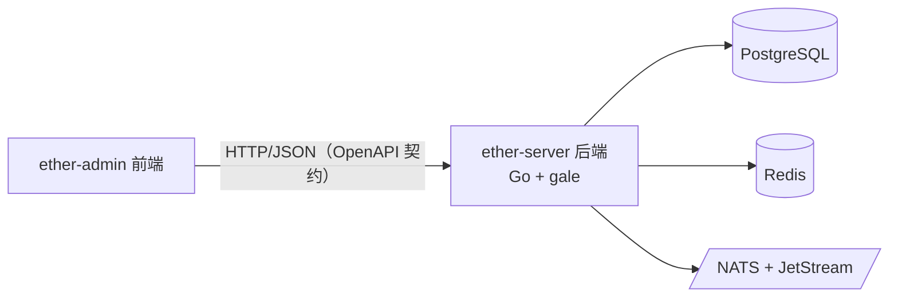

# 架构总览

高层架构（mermaid，便于 diff 与 agent 阅读）：

## 组件

- **ether-admin（前端）**：管理端 UI，按 `contracts/openapi` 契约对接后端。
- **ether-server（后端）**：Go 服务，基于私有框架 **gale**（封装 gin / gorm-PG / go-redis /
  watermill-NATS / JWT 等）。
- **PostgreSQL / Redis / NATS+JetStream**：数据、缓存、消息，均经 gale 封装访问。

> 契约即真理：前后端从 `contracts/openapi` 出发并行开发。后端框架选型见
> [decisions/0002-backend-framework-gale.md](decisions/0002-backend-framework-gale.md)。
