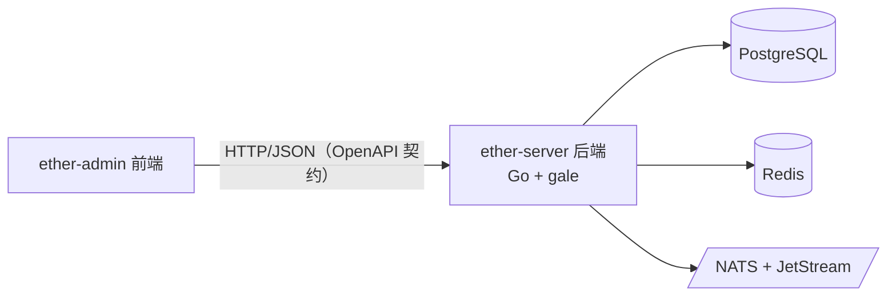
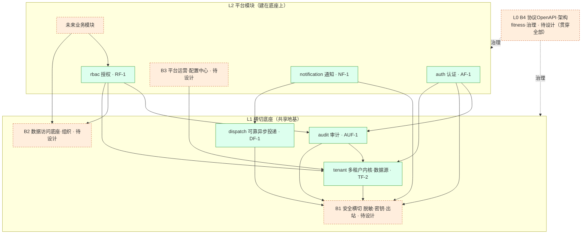

# 架构总览

高层架构（mermaid，便于 diff 与 agent 阅读）：

## 组件

- **ether-admin（前端）**：管理端 UI，按 `contracts/openapi` 契约对接后端。
- **ether-server（后端）**：Go 服务，基于私有框架 **gale**（封装 gin / gorm-PG / go-redis /
  watermill-NATS / JWT 等）。
- **PostgreSQL / Redis / NATS+JetStream**：数据、缓存、消息，均经 gale 封装访问。

> 契约即真理：前后端从 `contracts/openapi` 出发并行开发。后端框架选型见
> [decisions/0002-backend-framework-gale.md](decisions/0002-backend-framework-gale.md)。

---

## 平台底座 · 模块依赖分层（6 已冻结 + 4 待设计底座）

> 平台底座按"地基 → 模块"分层；箭头 = **依赖/复用**方向（A → B 表示 A 用 B）。
> 绿实线框 = 已冻结 spec；橙虚线框 = 待设计底座（B1~B4）。**已冻结模块当初已"指向"这些底座（密钥/出站/数据级权限/脱敏），B1~B4 就是把这些悬空指向补实**。

**已冻结（6）**：`tenant`(TF-2 多租户内核·数据源)、`auth`(AF-1)、`rbac`(RF-1)、`audit`(AUF-1)、`notification`(NF-1)、`dispatch`(DF-1)。
**待设计底座（4，见 [breakdown 重组说明](../changes/2026-06-platform-foundation/breakdown.md)）**：B1 安全横切（脱敏/密钥/出站）、B2 数据访问·组织、B3 平台运营·配置中心、B4 协议·治理。**设计顺序 B1 → B2/B3 → B4**。

**关键依赖（冻结模块已引用待补底座）**：tenant DSN 口令加密→B1 密钥；auth LDAP→B1 出站、bind 口令→B1 密钥；notification SMTP→B1 出站·密钥；audit 脱敏→B1 脱敏、跨平面写→复用 tenant §9；rbac 数据级权限留口→B2、dept 维度→B2 组织。
