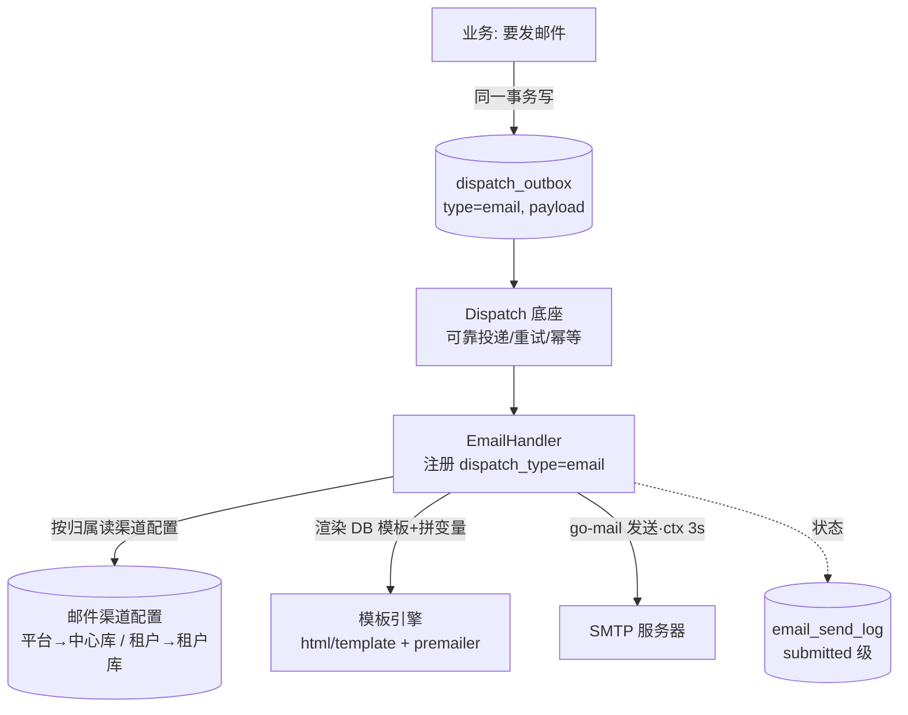

# 块10 · 对外集成与通知（一期：邮件）设计（在途）

> 🔒 **已冻结为 NF-1（2026-06-21）**：经三方两轮审计修正后封版，汇总成自包含的 [`specs/notification.md`](../../specs/notification.md)（accepted）。**以 specs 为权威基线**；本在途稿仅留作过程记录。冻结同批已走 TF-1 解冻闸门：tenant.md 升 TF-2、§10 该行 🔶→✅。

> 在途设计：尚未冻结。标记：✅已定 · 🔶建议(待确认) · ⏭️后续。本版已纳入逻辑/架构/安全三方审计的修正。
> **本模块建在已冻结的 [Dispatch 底座（DF-1）](../../specs/dispatch.md) 之上**——可靠投递(重试/幂等/状态/跨租户隔离)全由 Dispatch 负责，本模块只管"业务语义 + 渲染 + 发送 + 邮件特有安全"。

> **术语**：**SMTP**＝发邮件的标准协议；**multipart/alternative**＝一封邮件同时带 HTML 版和纯文本版，客户端自选；**inline CSS(内联 CSS)**＝把样式写进每个标签的 `style` 属性(Gmail 剥 `<head>` 里的 `<style>`，故必须内联)；**MJML**＝把语义标签编译成跨客户端兼容嵌套表格 HTML 的工具(编译期用)；**SPF/DKIM/DMARC**＝三条 DNS 记录，证明邮件确为该域名授权发出，不配会进垃圾箱/被拒；**Message-ID**＝邮件头里的唯一标识；**SSTI**＝服务端模板注入(把用户输入当模板代码执行)；**CRLF 注入(邮件头注入)**＝在收件人/主题等头字段塞换行符注入额外邮件头(偷加 Bcc、伪造 From)；**MTA**＝Mail Transfer Agent，邮件传输代理服务器。

---

## 1. 定位与职责边界
- **通知模块 = Dispatch 的第一个消费者(handler)**；一期只做 **Email**。
- 职责划分：

| 层 | 谁管 | 内容 |
|---|---|---|
| **Dispatch 底座**(DF-1，已冻结) | 已有 | outbox、内联+兜底、行锁、幂等(outbox.id)、四态、重试退避、**跨租户归属断言**、3s 外部超时 |
| **通知模块**(本设计) | 本次 | Channel 抽象、两平行邮件渠道(租户可自助配 SMTP)、EmailHandler、DB 模板渲染、SMTP 发送、send_log、**邮件特有安全(头注入/收件人授权/PII/SSRF)**、可达性合规 |

> ⚠️ **Dispatch 管不到的、必须本模块自己负责的**：邮件头 CRLF 注入、收件人是否属于该租户、PII/令牌脱敏、SMTP host 的 SSRF——这些是 handler 层语义，底座的归属断言只保证"用对渠道"，不保证"发对人"。
- **gale 关系**：gale 无邮件模块 → 自建用 `wneessen/go-mail`；SMTP 连接走底层封装的 **3s 硬超时**(项目约束)。

---

## 2. 架构总览


---

## 3. 两平行邮件渠道（✅ 平台/租户并列同级、各自独立）
- **不是"平台默认 + 租户覆盖"**，而是**两个平行渠道**：平台邮件走**平台渠道**(中心库)、每租户邮件走**该租户渠道**(各租户库，db-per-tenant 一致)。**平台不代发租户、租户间互独立**。
- **配置表 `email_channel`**(平台一份在中心库；每租户一份在各租户库)：
```sql
CREATE TABLE email_channel (
  id            BIGSERIAL PRIMARY KEY,
  smtp_host     TEXT NOT NULL,          -- 保存前过网段校验(见下)
  smtp_port     INT  NOT NULL,          -- 白名单 465/587
  smtp_user     TEXT NOT NULL,
  smtp_pwd_enc  BYTEA NOT NULL,         -- 加密存；遵循 Dispatch §16 密钥4条
  smtp_pwd_key_id TEXT NOT NULL,        -- 密钥版本(对齐 Dispatch §16 预留 key_id)
  tls_mode      TEXT NOT NULL,          -- ssl(465)/starttls(587)；InsecureSkipVerify=false
  from_addr     TEXT NOT NULL,          -- 发件地址(平台域名/租户自己域名)
  from_name     TEXT,                   -- 发件显示名(进头前过 CRLF 校验)
  enabled       BOOLEAN NOT NULL DEFAULT true,
  updated_at    TIMESTAMPTZ NOT NULL DEFAULT now()
);
```
- **✅ 每租户可自助配置自己的 SMTP(一期即支持)**；平台也有自己的渠道。两渠道并列独立、不代发、租户互独立。是否对"租户自定义渠道"做权益门控(付费)由块2 C5 定(🔶)。
- **🚨 SSRF(租户自填 host = 不可信输入，必须防"连之前确认不指向内网")——不自建，复用底层共享"安全拨号器"**：与 3s 超时同一个底层调用封装层提供一个安全拨号器(`net.Dialer.Control` 在**连接时拿到真实解析 IP** 校验，天然防 DNS 重绑定)：拒私网/loopback/元数据段(RFC1918 / 127.0.0.0/8 / 169.254.0.0/16 / ::1) + 端口白名单(465/587)。SMTP(go-mail)、LDAP、webhook 出站**注入同一个拨号器**，SSRF 一处实现、处处强制；与 [auth.md](../../specs/auth.md) §5、Dispatch §16 共用同一组件。
- **`from_addr`/`from_name`/`smtp_user` 保存时校验**：保存配置时过 `net/mail.ParseAddress`(地址类) / CRLF 校验(进 `From` 头、显示名、AUTH 用户名)。
- **🔑 配置写入路径(✅ 必须写死,否则越权改别租户 SMTP = 令牌劫持)**：① 由**租户管理员**经租户管理后台写,需 RBAC 权限点(如 `notification:channel:write`);② **写操作走该租户的绑定连接写自己库**,严禁凭请求 `tenant_code` 取库(对齐 Dispatch §16);③ **过状态门、仅租户"正常"态允许**写(对齐 tenant.md §7 真值表);④ 写入记块6 审计(before/after 中 `smtp_pwd_enc` **脱敏**);⑤ 性质上是**租户自助业务写**,非 tenant.md §9 平台高权穿透,**不走双人复核**。
- **配置变更对在途任务**：handler **每次执行时现读 `email_channel`**(非任务创建时快照)→ 配置变更对在途 pending 任务**下一轮重试即生效**(这正是 AUTH 失败归 InfraUnavailable·改配后自动恢复的依据)；同一任务跨 attempt 的 `from_addr`/`Message-ID` 可能随配置变更而变,属可接受(Message-ID 仅追溯、不作正确性依赖)。
- ⏭️ 二期：租户**自定义模板**(改模板体，需沙箱/受限引擎)。

---

## 4. EmailHandler（接入 Dispatch 的纯消费者）
- 注册 `dispatch_type = "email"`；处理某条 outbox 行时，**用 Dispatch 注入的绑定连接读"该行所属库"的 `email_channel`**(平台行→中心库；租户行→该租户库)——机制一套、配置随归属，复用 Dispatch §2 归属断言，无串扰。
- **两条独立读连接(勿混)**：渠道配置/收件人归属 → **底座注入的租户绑定连接**(读所属库)；**模板 → 中心库只读连接**(平台全局资源，handler 向连接管理器按 `platform` 取，**不接收任何 payload 输入作为路由参数**)。读中心库模板不违反 Dispatch §2"禁凭 tenant_code 重取租户库"(中心库连接归属固定 platform、建池时权威绑定)。
- 流程：**校验收件人归属 → 校验头字段 → 渲染模板(读中心库) → go-mail 发 SMTP →（同事务/绑定连接）写 send_log + 标 success**。
- **幂等**：`outbox.id` 作邮件 **`Message-ID`**(主要用于**可追溯/排障**；去重是 MTA 尽力而为，**不作正确性依赖**——自建无服务商幂等键，重复属 at-least-once 已接受代价)。

### 4.1 错误分类映射（✅ 必守，对齐 Dispatch 五分类，否则空转或发坏邮件）
| 情况 | 分类 | 后果 |
|---|---|---|
| `email_channel` 读不到 / `enabled=false` | **Permanent** | 立即 failed + 审计(配置错误，重试无意义) |
| `template_slug` 未找到 / 必需变量缺失 | **Permanent** | 立即 failed + 审计(**绝不带 `<no value>` 发出**) |
| 收件人非法/不属该租户 / 头注入 | **Permanent** | 拒绝 + 审计(见 §4.2) |
| SMTP **连接层失败**(连接被拒/TLS 握手失败/DNS 失败/网络不可达，无应答码) | **Retryable** | attempts+1 退避(瞬时网络) |
| SMTP **4xx 临时**(421/450/451 等所有 4xx) | **Retryable** | attempts+1 退避 |
| SMTP **AUTH 认证失败**(535 等) | **InfraUnavailable** | 配置/密钥源(密码轮换未同步/key_id 失配)，不烧 attempts、留巡检(**勿误判 Permanent 烧死可恢复任务**) |
| SMTP **5xx 收件人/内容永久拒投**(550/554 等) | **Permanent** | 立即 failed |
| 读渠道/解密密钥时库或密钥不可用 | **InfraUnavailable** | 不烧 attempts，留可巡检信号 |

> 注：本表只列 **handler 产出**的三类(Permanent/Retryable/InfraUnavailable)；`Paused`(状态门暂停)/`Timeout`(看门狗)由**底座前置判定**、非 handler 返回值——对齐 Dispatch §10 五分类。

### 4.2 邮件特有安全（✅ Dispatch 管不到、本模块必做）
- **🚨 邮件头 CRLF 注入防护**：所有进入邮件头的值(`to`/`cc`/`subject`/`from_name`/被插入头的变量)——地址类必过 `net/mail.ParseAddress` 严格解析；文本类必剥离/拒绝 `\r`/`\n`(含编码绕过 `%0a/%0d`、Unicode 行分隔符 `U+2028/U+2029`)。任一失败 → **Permanent** + 审计。**`html/template` 只转义正文、完全不管头**，头注入必须发送层显式挡。
- **🚨 收件人归属校验**：`payload.to` 必须命中"该 outbox 所属租户库的合法用户邮箱"——用底座注入的绑定连接查证(禁止凭 tenant_code 重取库)；不属该租户 → Permanent + 审计。**防"把某租户的激活/重置令牌发到攻击者邮箱"**(Dispatch 归属断言只保证用对渠道、不保证发对人)。
- **PII/令牌脱敏**：`send_log` 与失败日志对 `to` **掩码**(`u***@x.com`)、**绝不落 `variables` 明文**(含 ActivationURL/令牌)；outbox payload 里的令牌类变量保留期应更激进(呼应 auth.md token 禁久留)。**解密失败 / SMTP AUTH 失败的错误文案也须脱敏**(不得带密钥/口令片段、smtp_user，对齐 Dispatch §16② 密钥禁入错误)。

---

## 5. payload 契约（业务怎么触发）
```json
{
  "dispatch_type": "email",
  "tenant_code": "<在 outbox 行上，决定走哪个渠道>",
  "payload": {
    "to": "user@example.com",
    "template_slug": "tenant_admin_invite",
    "locale": "zh-CN",
    "variables": { "UserName": "张三", "ActivationURL": "https://..." }
  }
}
```
- **✅ 一期单收件人**(一封 outbox = 一个收件人)——让 `outbox.id ↔ 一次投递`一一对应，幂等才成立；群发(多收件人)二期再议。
- **subject 来源**：由 `template_slug + locale` 的**主题模板**生成，与正文**共用同一份 `variables` + 同一变量白名单**；subject 渲染后同样过 §4.2 CRLF 校验。
- **fallback**：`locale` 缺失 → 默认 `zh-CN`；`template_slug` 未找到 → Permanent；**`slug + 最终 locale`(含兜底后的 zh-CN)仍无对应模板 → Permanent**(与 slug 未找到同类)；必需变量缺失 → 渲染前校验(白名单同时声明"必填集")，缺失即 Permanent。
- `to` 由后端业务给且经 §4.2 归属+格式校验；`variables` 值由后端拼好(如先生成激活链接、查用户名)再放进 payload。

---

## 6. 邮件发送栈
- **库** `wneessen/go-mail`(活跃、连接复用、TLS、multipart)。
- **multipart/alternative**：每封同时带 HTML + 纯文本兜底。
- **inline CSS**：渲染后 `go-premailer` 内联(Gmail 剥 `<head>` style)。
- **TLS**：`ssl(465)`/`starttls(587)`；**`InsecureSkipVerify=false`、校验证书**，禁止任何"跳过校验"开关进生产。
- **Message-ID = `<outbox.id@发信域名>`**(域名取 `from_addr` 的域)；字符集 UTF-8。
- **连接策略(✅ 一期每封新建、发完即关)**：邮件是低频异步(走 outbox 调度、非请求路径)，省握手延迟无收益，而每租户 SMTP 池化要管失效检测/空闲回收/最多 50 套池，复杂度不值——一期用 go-mail 默认的 per-send 连接。SMTP 连接是**外部连接**，不占 Dispatch 的 DB 连接预算。
- **3s 硬超时**：连/发 SMTP 走底层封装 3s ctx；超时由 Dispatch 当失败、退避重试。⚠️ 完整 SMTP 握手(EHLO→STARTTLS→AUTH→MAIL→DATA)+发送对慢 MTA 可能偏紧，**3s 余量待实测**；若部分慢 MTA 触顶，再议"该外部调用放宽超时(作 §10 例外显式记录)或池化"。

---

## 7. 模板系统（✅ 模板存数据库 + 后端拼变量，相同业务逻辑）
- **模板存数据库**(`email_template` 表)，**平台统一定义、一期不开放租户改**；渲染走**同一套业务逻辑**：按 `slug+locale` 取模板 → `html/template` 填变量。
```sql
CREATE TABLE email_template (
  slug         TEXT NOT NULL,           -- 模板标识，如 tenant_admin_invite
  locale       TEXT NOT NULL DEFAULT 'zh-CN',
  subject_tpl  TEXT NOT NULL,           -- 主题模板
  html_tpl     TEXT NOT NULL,           -- HTML(MJML 编译产物，含 {{.Var}} 占位)
  text_tpl     TEXT NOT NULL,           -- 纯文本兜底版
  variables    JSONB NOT NULL,          -- 变量白名单 + 必填集声明
  updated_at   TIMESTAMPTZ NOT NULL DEFAULT now(),
  PRIMARY KEY (slug, locale)
);
```
- **放置**：平台模板是**全局只读参考数据 → 只存中心库**(单一事实源)；**租户库不放此表**(故租户连接物理上够不到模板写入)。EmailHandler 渲染时读，渠道配置仍读绑定的所属库。⏭️二期租户自定义模板覆盖存各租户库。
- **写入授权(✅ SSTI 不变量的地基)**：`email_template` **仅平台运营面可写**(高权 + 块6 审计)；**模板读用参数化查询**(`slug+locale` 作参数，对齐 Dispatch §16)。这两条保证"模板源恒为平台可信内容"——SSTI 不变量才成立。
- **缓存一致性**：进程内缓存 key = `slug+locale`(**不含 tenant_code**，天然无串租户)；**TTL 定期刷新(默认 5min，config)**；多实例各持一份 → 改模板后**最长约 1 个 TTL 跨实例不一致**——对低频模板变更 + 已声明"submitted≠送达+带外兜底",**接受为已接受风险**;紧急改可重启或留手动 invalidate 入口(🔶)。缓存未命中回源加 **singleflight**(同 slug 并发只回源一次)，防中心库冷启动惊群。
- **🔒 SSTI 不变量(必守)**：**模板源 = 平台维护的 DB 模板(一期租户不可编辑)，绝不把 `variables` 内容拼进模板字符串再 `template.Parse`**——杜绝 SSTI 根因。⏭️二期开"租户自定义模板"(模板源变为用户输入)时须改用沙箱/受限模板引擎，不能沿用本不变量。
- **渲染**：HTML 版 `html/template`(上下文自动转义)；纯文本/主题 `text/template`(变量值仍过 §4.2 CRLF 校验)。变量白名单(+必填集)渲染前校验。
- **MJML 编译期**：写 `.mjml` → CI 编译生成 HTML → **写入 `email_template.html_tpl`**(产物入库、可溯)；运行期纯 Go 填变量、不依赖 Node。无前端则手写 HTML table + premailer。
- **i18n**：`slug + locale` 选模板(含主题)；一期至少 `zh-CN`。

---

## 8. 测试邮件功能（✅ 独立、可选、受控）
- 不在保存配置时自动测；提供独立"发送测试邮件"功能(管理员手动触发)，**可选、可不测**。
- **落地路径**：测试邮件**经 Dispatch enqueue 直接入口写一条 outbox**(`dispatch_type=email`，可带 `__test__` 标识)，由底座正常调度——**因而自动过状态门、拿底座注入的绑定连接、入审计(§13 块6⑥)**；**不另建连接、不开绕过状态门的同步旁路**。
- **收件人限定为触发管理员本人已验证邮箱**(不可任填，防当垃圾/钓鱼发信通道)——该校验同样走**绑定连接**查"本租户库的管理员邮箱"，不凭请求 tenant_code 取库；**记审计 + 频率限制(默认如每管理员每分钟 ≤3 封，config 可调)**。失败文案**统一化**(不回显 `connection refused`/`timeout` 之别)，防被当公网/内网时序探测器。

---

## 9. handler 层发送状态 `email_send_log`
```sql
CREATE TABLE email_send_log (
  id            BIGSERIAL PRIMARY KEY,
  outbox_id     UUID NOT NULL,          -- 关联 dispatch_outbox.id
  to_masked     TEXT NOT NULL,          -- 收件人掩码，禁明文/禁令牌
  template_slug TEXT NOT NULL,
  state         TEXT NOT NULL,          -- queued|submitted|failed
  smtp_resp     TEXT,                   -- SMTP 响应(脱敏，剥 user/AUTH 细节)
  attempt       INT  NOT NULL DEFAULT 0,
  trace_id      TEXT,                   -- 从 outbox headers 透传，端到端追踪
  created_at    TIMESTAMPTZ NOT NULL DEFAULT now()
);
CREATE INDEX ON email_send_log (outbox_id);   -- 排障按 outbox 聚合(一次投递可能多 attempt 记录)
```
- **状态映射(✅ 显式声明)**：`SMTP 250 → send_log=submitted → handler 返 nil → Dispatch=success`；`SMTP 5xx/连接失败 → send_log=failed → handler 返 Retryable/Permanent → Dispatch 据分类处理`。
- **一期 Dispatch success 的语义 = 已成功交给 SMTP(submitted)，不含最终送达**，与 Dispatch §11 at-least-once 一致。
- **🔑 一致性**：`send_log` 写入与 handler 标 outbox `success` **用同一绑定连接、同一事务**(DB 型副作用，对齐 Dispatch §11"DB 写+标 success 同事务=精确一次")——**不新增 at-least-once 之外的不一致窗口**。
- ⚠️ **自建无 Webhook → 看不到 delivered/bounced/blocked**；一期到 **submitted 级**。退信解析 ⏭️二期(状态位已预留)。

---

## 10. 可达性合规（SPF/DKIM/DMARC）
- 自建 SMTP **必配 SPF/DKIM/DMARC**；**DMARC 先 `p=none`**。平台渠道由平台配；租户渠道由租户自己域名负责(平台不代发)。
- **⚠️ 关键邮件带外兜底(必声明)**：`submitted ≠ 送达`——SPF/DKIM/DMARC 不全或 IP 信誉低时可能静默进垃圾箱，而 send_log 仍显示 submitted。**激活/邀请这类阻断性邮件**(收不到 → 租户卡在"待激活")**依赖带外补救**：平台运营在 tenant.md §6 已有的「待激活→重发设密链接」高权通道下重发。一期接受"是否真送达不可知 + 带外兜底"。
- 退信/投诉/抑制名单 ⏭️二期。

---

## 11. Channel 抽象（一期只 Email，留多渠道位）
```go
type NotificationChannel interface {
    Type() string                                   // "email"(未来 "sms"/"feishu"/"dingtalk"/"inapp")
    Send(ctx context.Context, msg ChannelMessage) error
}
```
- 一期只实现 `EmailChannel`；每 Channel 对应一个 Dispatch `dispatch_type`。飞书/钉钉/站内信/短信 ⏭️二期插入，**不改业务触发方式**(都写 outbox)。

---

## 12. 一期 做 / 不做
**一期做**：平台/租户两平行邮件渠道(**租户可自助配自己 SMTP + 完整 SSRF 防护**) + EmailHandler(接 Dispatch + 错误分类 + 头注入/收件人归属/PII 治理) + **模板存 DB(平台定义)+ 后端拼变量**(html/template+MJML+premailer+multipart+SSTI 不变量) + 单收件人 + Message-ID 追溯 + send_log(submitted，同事务) + SPF/DKIM/DMARC + 关键邮件带外兜底 + 独立受控测试邮件。
**⏭️ 二期**：**租户自定义模板**(改模板体，需沙箱) + 退信解析/抑制名单 + 站内信/飞书/钉钉/短信 + **每租户/渠道发信限速**(一期预留占位)。

---

## 13. 与其他模块衔接
- **Dispatch(DF-1)**：作 `dispatch_type=email` 消费者；重试/幂等/状态/跨租户隔离全由它。
- **块7 合规**：`smtp_pwd_enc` **沿用 Dispatch §16 密钥4条**(密钥≠密文同库 / 不入仓库·config·日志·dump / AES-256-GCM / 预留 `key_id`)；密钥管理后期同步。
- **块2 C5 权益**：租户自定义渠道/模板(二期)作付费功能、权益门控。
- **块6 审计**：发送成功/失败、改渠道、测试邮件、头注入/越权拦截 → 接审计。
- **关闭 tenant.md §10 悬空门（须走 TF-1 解冻流程，不可顺手改冻结件）**：[tenant.md](../../specs/tenant.md) §10 把"租户通知渠道配置"标为🔶范围待定，且 tenant.md 已 TF-1 冻结(改动须经"解冻：changes 变更说明 → 评审 → 升冻结版本号")。本设计认领的实质结论是"租户渠道配置存租户库、**租户可自助配自己的 SMTP**(一期)"。**这构成对已冻结 tenant.md 的语义变更**，故：**本 change(2026-06-notification)即作为 TF-1 所需的"变更说明"**。冻结本设计时,**在同一批提交内原子完成**以下闸门清单(防"通知冻了、tenant.md 忘改"漂移)：
  - (a) 留评审记录(本轮三方审计);
  - (b) 改 tenant.md **三处**：front-matter `last_reviewed`、顶部冻结声明块追加一行 `TF-2(日期)：因 2026-06-notification 解冻，租户通知渠道配置定为"存租户库 + 租户自助配 SMTP"`、§10 边界表那行 🔶→✅;
  - (c) **且**记一条 tenant ADR(记动机)**且**升 TF 版本号 TF-1→TF-2(标基线);
  - (d) **机器可判定信号**：冻结后 `grep` 断言 tenant.md §10 那行不再含🔶——不过不放行。
- **安全拨号器/出站封装层 owner**：本模块只**复用**,不实现。其 owner 归 **块9 工程底座(统一出站封装层：3s 超时 + SSRF 安全拨号器 + 限速 + egress)**;auth §5 / Dispatch §16 / 本模块三处均指向这唯一 owner(块9 须正式认领该子能力,否则三处引用悬空)。

---

## 14. 出处（权威）
- go-mail：[github.com/wneessen/go-mail](https://github.com/wneessen/go-mail)
- 邮件头注入：[OWASP Testing for IMAP/SMTP Injection](https://owasp.org/www-project-web-security-testing-guide/latest/4-Web_Application_Security_Testing/07-Input_Validation_Testing/11-Testing_for_IMAP_SMTP_Injection)
- multipart/alternative：[RFC 2046 §5.1.4](https://datatracker.ietf.org/doc/html/rfc2046#section-5.1.4)
- inline CSS / premailer：[go-premailer](https://github.com/vanng822/go-premailer)
- MJML：[mjml.io](https://mjml.io/)
- html/template 转义：[pkg.go.dev/html/template](https://pkg.go.dev/html/template)
- SPF/DKIM/DMARC：[Mailgun 认证指南](https://www.mailgun.com/blog/deliverability/email-authentication-your-id-card-sending/)

---
↑ [返回 changes 索引](../README.md)
