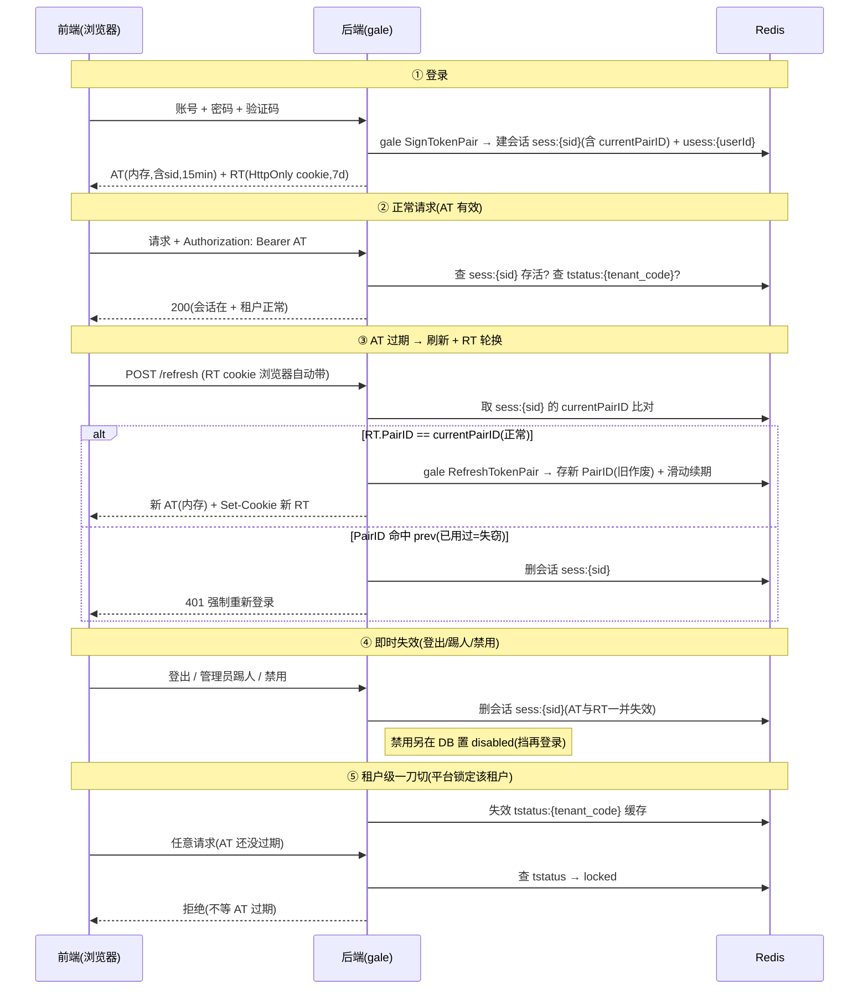
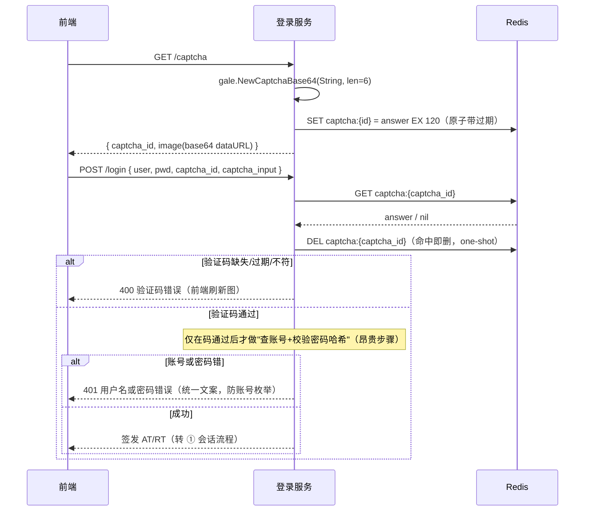
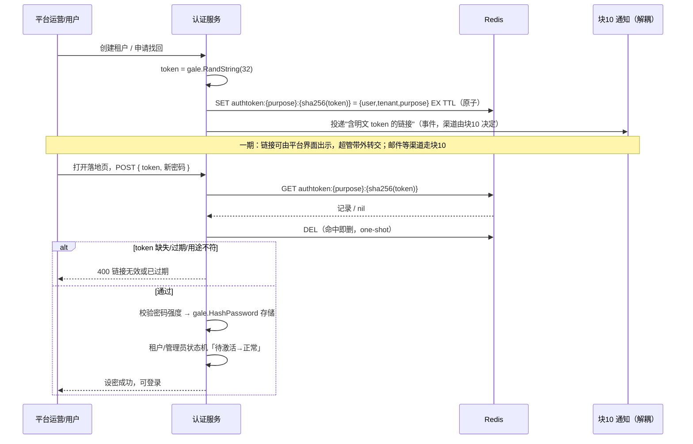
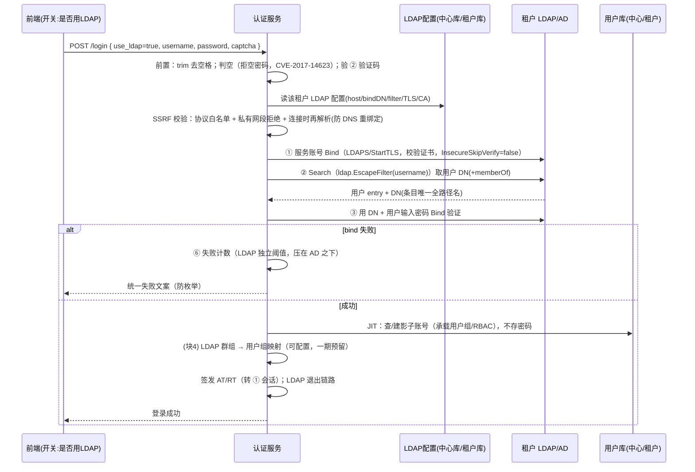
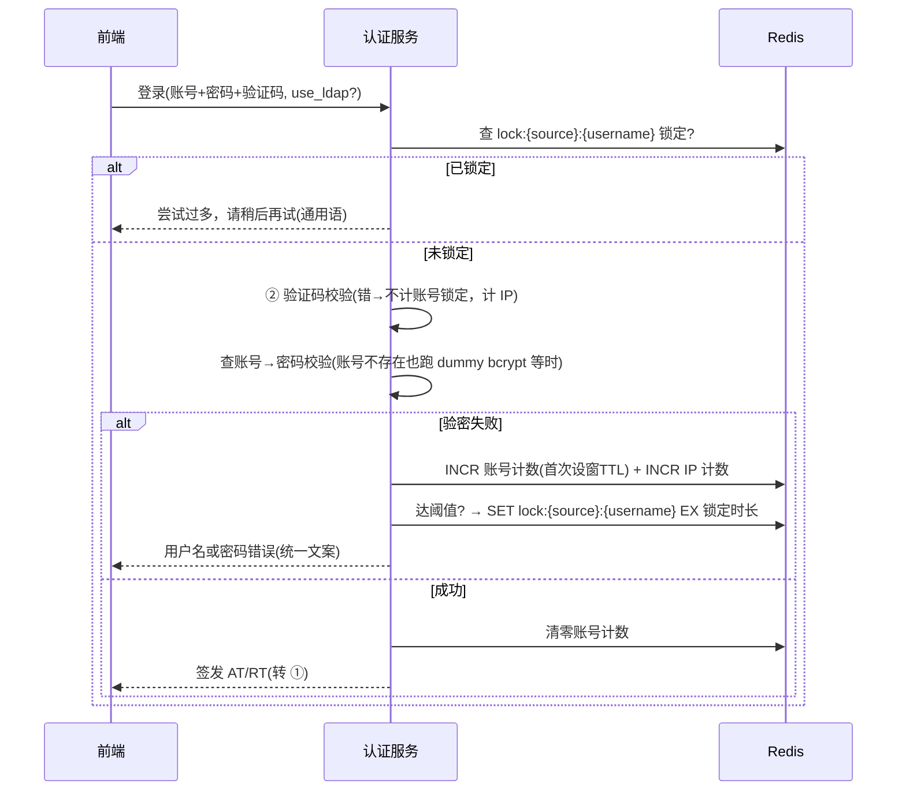

# 块3 · 身份与认证 设计（在途）

> 在途设计：块3 尚未冻结。本文件随"一个个过"逐项累积；冻结后并成 `specs/auth.md`（自包含）。
> 标记：✅已定（已拍板） · 🔶待确认（我提的方案，未拍板）。
> 与租户相关的登录部分已随 TF-1 冻结（路径式定位、本地+LDAP+验证码、账号租户内独立、JWT 内嵌 tenant_code、状态门），见 [../../specs/tenant.md](../../specs/tenant.md)。
> 命名约定：租户标识统一用 **`tenant_code`**（不用 `tid`，避免与 jwt id/`jti` 混）。

---

## ① 会话与 JWT（AT/RT）✅A 方案（会话中心化）

### 统一建模：租户用户 + 平台超管同一套会话
- **租户用户**与**平台运营/超管**共用同一套 Session/AT/RT/撤销机制，只分 **plane（平台面 / 租户面）**：
  登录入口不同（`/{tenant_code}` vs `/admin`），机制一致，仅 Redis key 命名空间不同（`t:{tenant_code}:…` vs `platform:…`）。

### AT / RT 分工
- **AT（access token，访问令牌）**：每次请求携带证明身份；**短命**（如 15 分钟）。**内含 `sid`（会话 ID）**。
- **RT（refresh token，刷新令牌）**：**长命**（如 7 天滑动），AT 过期时静默换新 AT，免重复登录。

### 会话中心化撤销（重评估：取代"只拉黑 jti"）
- **缺陷**：只把 AT 的 `jti` 加黑名单**不够**——AT 过期后，有效 RT 仍能刷出新 AT（新 jti 不在黑名单）→ 踢人被绕过。**撤销必须同时杀 RT**。
- **方案**：AT 带 `sid`；每请求**查会话是否存活**。**撤销 = 删会话记录** → AT（请求查不到会话→拒）+ RT（刷新查不到会话→拒）**一次性全死**。**不再用 `atblk:{jti}`**。
- 代价：每请求多一次 Redis 查会话；但本就要每请求查租户状态（G8），无额外负担。

### 基于 gale 落地（用框架自带 JWT，不自建）
> 已读 `gale@v0.1.1/docs/design/modules/jwt.md` 自行核对其能力。

- **直接用 gale 的 API**：
  - `gale.SignTokenPair(claims)` → 一次签 **AT+RT**（都是 JWT，共享 `PairID`）；登录用。
  - `gale.RefreshTokenPair(at, rt, newClaims)` → 验 RT+AT、签**新一对**（新 PairID）；轮换用。
  - `gale.JWTMiddleware(factory)` → 验签 + 注入 claims；**自带 30s 宽限期 + `X-Token-Expiring` 响应头**（前端据此**静默续签**）。
  - `gale.ParseToken` / `GetClaims` / `GetUserID` → 解析与取值。
- **算法与密钥（gale 已定，无需再选）**：**仅 HS256**（不支持 RS256/none）；单 secret（`GALE_JWT_SECRET` ≥32 字节、环境变量注入）；**无 `kid` 多密钥**（撤销之前 kid 的设想）。配置：`jwt.access_ttl`（建议 15–30min）/`refresh_ttl`（7d）/`grace_period`（30s）/`cookie_name`。
- **撤销层 = 我们补**：gale 文档 §9 明示"框架不做撤销，业务自行实现"——**本文的会话中心化正是这层**：gale 负责签发/验证/续签（无状态），**撤销 / 单次使用 / 重用检测由我们用 Redis 会话补**。

**AT / RT 的 claims 结构（扩展 gale `BaseClaims`）**：
```go
// gale.BaseClaims = RegisteredClaims(sub=userId, exp, iat, iss, ID=jti) + PairID + Type(access/refresh)
type AuthClaims struct {
    gale.BaseClaims
    SID        string `json:"sid"`         // ★稳定会话ID(跨轮换不变)——撤销锚
    Plane      string `json:"plane"`        // t | platform
    TenantCode string `json:"tenant_code"` // 租户码(平台面=platform)；用 tenant_code 避免与 jti 混
    RoleID     int    `json:"role_id"`      // 可选；AT 不放完整权限,按需查
}
func (c *AuthClaims) GetBaseClaims() *gale.BaseClaims { return &c.BaseClaims }
```
- `sub`=userId（gale 标准）；`PairID`=gale 生成、**随轮换变**；`sid`=我们生成、**稳定**。
- **轮换时把同一个 `sid` 传进 `RefreshTokenPair` 的 newClaims**，使会话跨轮换连续。

**sid ↔ PairID 配合**：`sid` 是稳定会话锚（撤销 / 查活按它）；`PairID` 是每对 token 的 id（随轮换变，存进会话做重用检测）。会话记录 `sess:{sid}` 存 `currentPairID / prevPairID`；刷新时 RT 的 PairID ≠ current 且 ≠ prev（过宽限）→ 判失窃删会话。

**校验链**：`gale.JWTMiddleware`（验签+宽限）→ **业务中间件**（查 `sess:{sid}` 在不在 + PairID 对不对 + 查 `tstatus`）→ 放行。

**前端落地（已定 AT 内存 + RT HttpOnly）**：AT 走 `Authorization: Bearer`（gale 读 Header）；RT 放 HttpOnly cookie（**业务在 handler 用 `c.SetCookie` 写**，gale 不接管 cookie 写）。刷新端点读 cookie 的 RT + AT，调 `RefreshTokenPair`，再 `Set-Cookie` 新 RT。

### 流转逻辑（登录 / 请求 / 刷新轮换 / 即时失效 / 租户一刀切）



### RT 轮换 + 重用检测（PairID 记入会话记录）
- **轮换**：每次刷新调 gale `RefreshTokenPair` 签新一对（新 `PairID`），**新 PairID 写进会话记录** `sess:{sid}`、旧的移到 `prevPairID`。
- **重用检测**：会话记录存 `currentPairID / prevPairID`；若来的 RT 的 `PairID` **命中 prev**（已作废）且**过了宽限期** → 判失窃 → **删会话、强制重登**（一个 `sid` 会话即一个"令牌家族"）。
- 注：gale 自身无状态、不作废旧 RT，**单次使用 / 重用检测靠我们这层会话记录实现**（gale 文档 §9 指定）。

### 重要：正常刷新无感，重登是例外
- **AT 过期（15min）→ 前端自动后台刷新 → 无感知、不重登**。流转图 ③ 的"401 强制重登"**只在失窃分支**（已用过的旧 RT 被再用）触发，**不是常态**。
- **只有这些才真需重新登录**：① RT 过期（见滑动续期）；② 检测到 RT 失窃；③ 主动登出/改密；④ 平台锁定/销毁该租户。

### RT 寿命策略 🔶建议
- **滑动续期（sliding）**：每次轮换给新 RT 一个**全新 7d TTL** → 只要 7 天内有活动就一直续、**活跃用户不掉线**；连续 7 天不动才过期。
- **绝对上限（可选）**：单次登录最长封顶（如 30d），到顶强制重登（更安全）。是否启用待定。

### 并发刷新的误伤与缓解 🔶建议
- **坑**：严格 RT 单次使用时，**多标签页/网络重试** 可能两个请求几乎同时拿同一条 RT → 第二个变"旧 RT"被误判失窃 → 误踢下线。
- **缓解**：① 给"刚换下来的上一对"留 **~10s 宽限期**仍接受（会话已存 `prevPairID`，宽限内命中=放行而非判窃）；② 前端 **刷新串行化/加锁**（同一刻只发一个 refresh）。

### Redis 命名空间 + Key 规则
> 单 Redis、控制平面共享，必须 **应用前缀 + 租户段** 分层：防冲突、可按租户批量清理、区分平台面/租户面。
> 约定：`{域}:{…}`；**租户作用域 key 统一带 `t:{tenant_code}` 段**。

| 用途 | Key 模式 | Value | TTL | 写入 / 失效时机 |
|---|---|---|---|---|
| **会话记录**（撤销 / 轮换核心） | `{plane}:sess:{sid}` | `{subject, plane, tenant_code, userId, deviceId, currentPairID, prevPairID, 签发时间}` | = RT 滑动寿命（如 7d） | 登录建；轮换更新 PairID+续期；撤销/踢人/登出删 |
| **每用户会话索引** | `{plane}:usess:{userId}` | Redis SET：`{sid…}` | 滑动续期 | 登录加入；并发控制/禁用按索引批量删；登出移除 |
| 租户状态缓存（G8 一刀切） | `tstatus:{tenant_code}` | `active/locked/pending_destroy…` | 短（30–60s） | 状态门读；平台改状态主动失效 |
| 设密/激活 token（一次性） | `setpw:{tokenHash}` | `{tid, userId, 用途}` | = 链接有效期 | 发链接写；用后即删 |
| 登录失败计数 / 锁定 | `{plane}:loginfail:{userId|ip}` / `…:lock:{…}` | 计数 / 锁定标记 | = 窗口 / 锁定时长 | 失败累加；超阈值置 lock；成功清零 |
| 验证码（②会用） | `captcha:{captchaId}` | 答案/校验态 | 短（2–5min） | 生成写；校验后即删 |

> `plane` = `t:{tenant_code}`（租户面）或 `platform`（平台面，超管/运营）——统一建模、命名空间区分。

- **校验请求**：验 AT 签名+过期 → 查 `sess:{sid}` 存活 → 查 `tstatus:{tenant_code}` → 都过才放行。
- **租户销毁**：`SCAN t:{tenant_code}:*` 批量删该租户全部 redis 痕迹。

### 撤销 / 禁用 / 并发：同一套会话操作，不同范围
| 操作 | 本质 | 范围 | 额外 |
|---|---|---|---|
| 登出 | 删会话 | 当前 `sid` | — |
| 踢人下线 / 拉黑 | 删会话 | 指定的 `sid`（一个 / 多个） | — |
| 禁用用户 | 删会话 | 该用户**全部 sid**（经 `usess`） | **+ DB 置 disabled**（挡再登录） |
| 改密 | 删会话 | 该用户全部 sid（可留当前） | — |
| 设备会话唯一 / 并发控制 | 删会话 | 该用户**其它 sid**（或限 N） | 登录时按 `usess` 触发；等保三级要求 |

> 关键：**踢人 ≠ 禁用**——踢人只删会话（用户能重新登录）；禁用必须**额外在 DB 打标记**挡住再登录。

### 前端方案 🔶待确认
> HttpOnly cookie = JS 读不到的 cookie，**防 XSS 偷 token**，但带来 CSRF（需 SameSite + CSRF token）。
> RT 轮换与存储位置无关：HttpOnly 下新 RT 靠 **`Set-Cookie`** 回写、JS 全程不见 RT。

| 方案 | AT | RT | 防 XSS 偷 token | CSRF |
|---|---|---|---|---|
| 🔶推荐 | **内存** | **HttpOnly+Secure+SameSite cookie**，`Path=/{tenant_code}` 限定刷新接口 | RT 偷不走、AT 短命 | 仅刷新接口需防 |
| 备选 | HttpOnly cookie | HttpOnly cookie | 都偷不走、前端不碰 token | **所有写接口都要防** |

- 同源多租户：cookie `Path=/{tenant_code}` 隔离；AT/RT 均绑 tenant_code（服务端校验）。
- 纵深防御：HttpOnly 只挡"偷 token"，挡不住 XSS 就地操作 → CSP + 输出转义仍要做。

### JWT 安全 / 防滥用 / 审计（对齐 gale）
- **签名算法**：✅**HS256**（gale 已定、只支持它；其 keyFunc 强制拒 `none`/RS256，防算法混淆攻击）。单 secret `GALE_JWT_SECRET`（≥32 字节、环境变量注入）、按密钥管理（连块7）、**不入代码 / 日志**；**无 `kid`**（gale 单密钥，撤销之前 kid 设想）。
- **Claims 校验**：gale `JWTMiddleware` / `ParseToken` 自带验签 + `exp`/`nbf`/`iss`；我们的 claims 含 `tenant_code` + `sid` + `plane`，业务侧再校验 plane / tenant_code 一致。
- **刷新端点限流**：`/refresh` 与登录端点一样限流（用 gale 自带限流），防 RT 滥用 / 暴力。
- **认证事件审计**：登录成功/失败、登出、刷新、撤销、踢人、禁用 → 接块6 审计（等保要求覆盖每用户重要行为）。

---

## ② 登录图形验证码 ✅（基于 gale genx，Redis 自管校验）

### 选型结论（已确认）
一期登录**强制携带图形验证码**，类型默认 **`String` 6 位**（gale 内置安全字符集，已排除
`0/1/i/l/o/I/L/O` 等易混字符）。**直接复用 gale 自带能力，不自建滑块、不接外部云验证码**——
gale 图形验证码纯进程内生成、零外部依赖、可内网、数据不出境，正合本项目地基约束。

### gale 能力边界（我已读源码 + `genx` 文档确认）
| 能力 | gale | 我们要自补 |
|---|---|---|
| 生成图形验证码 | ✅ `gale.NewCaptchaBase64()` → `(id, answer, dataURL, err)` | — |
| 安全字符集（防混淆） | ✅ `String` 型内置 | — |
| **存储 id→answer** | ❌ 明确不做 | **业务用 `gale.Redis()` 自存**（见下 key/TTL） |
| **校验比对** | ❌ 明确不做 | **业务自读 Redis 比对 + 用后即删** |
| 滑块/行为/云验证码 | ❌ 无 | 留 `CaptchaProvider` 扩展位，二期再实现 |

> ⚠️ gale 底层 `base64Captcha.DefaultMemStore` 是**进程内**存储，多副本部署 ID 不能跨实例校验——
> 故我们**必须**用 `gale.Redis()` 存答案，**禁用其内存 store**。我们会话本就在 Redis，无额外成本。

### 生成与校验流程


### Redis key 与 TTL 设计（防无限扩张）
| 用途 | key | value | TTL | 写入/清除 |
|---|---|---|---|---|
| 验证码答案 | `captcha:{id}` | answer（6 字符） | **120s** | 生成时 `SET … EX 120`；校验命中即 `DEL`，否则到期自动驱逐 |

**为什么不会无限膨胀（多层兜底）**：
1. **TTL 自动回收是根本**：每个 key 生成即带 120s 过期，Redis 到期**自动驱逐**——
   无需任何定时清理任务，存量天然有上界。
2. **原子带过期写入**：必须用单命令 `SET key val EX 120`，**不可** `SET` 后再 `EXPIRE`——
   否则两条命令间进程崩溃会留下**无 TTL 的孤儿 key 永不回收**（这是常见事故，特别标注）。
3. **用后即焚（one-shot）**：登录校验读取后立即 `DEL`，**不论对错**。单个验证码只能用一次——
   既防重放/暴力试同一张码，也让 key 往往**早于 TTL** 就释放。
4. **生成接口限流**：`GET /captcha` 套 gale 自带限流，按 IP（如 10 次/分钟），
   防脚本狂刷生成接口在 TTL 窗口内堆 key。
5. **容量可估**：内存上界 ≈ 峰值生成速率 × 120s × 单条(key+value≈100B)，**收敛有限**，可监控告警。
6. **TTL 取值权衡**：120s 比 gale 示例的 300s 更紧——更少存量、更高安全；又够用户看图输入。
   过短伤体验、过长增存量与被试空间，**折中取 120s**（可配 90–180s）。

### 校验规则与防枚举（顺序不可换，注释已说明）
1. **先验码、后验密码**（顺序有强要求）：在做账号查库 / 密码哈希校验（昂贵）**之前**先验证码，
   挡掉脚本流量，省资源且收窄被试面。
2. **大小写不敏感比对**：`String` 型用 `strings.EqualFold` 比对，降低用户输入摩擦
   （代价是熵略降，6 位仍足够一期）。
3. **错误文案分层**：
   - 验证码错 → **明确**返回"验证码错误"，前端据此刷新图（这不泄露账号是否存在，可区分）；
   - 账号不存在 / 密码错 → **统一**返回"用户名或密码错误"，**不区分二者**，防账号枚举。
4. **验证码 ≠ 防撞库主力**：图形码抗 OCR 弱，作用是"挡自动化、抬成本"；
   真正防撞库靠 **⑥ 登录失败锁定 + 限流**，验证码是叠加层。
5. **审计**：验证码校验失败计入登录失败链路（接块6 审计、连 ⑥ 锁定计数）。

### 扩展位：`CaptchaProvider`（二期再落地，先留抽象）
将验证码抽象为 provider 接口，一期只实现 `gale 图形码` 一个实现；二期可按租户切换
滑块/行为验证码、云厂商（腾讯/阿里，公网租户可选）、Turnstile（出海）。一期**不实现**，仅在设计上留位，避免后续返工。

### 已知坑与二期清单
- 🆕 **无障碍**：纯图形对视障用户不友好——一期可接受，**二期补音频/字符降级通道**。
- 🆕 **多实例**：禁用 gale 内存 store，强制 Redis（上文已强调）。
- 🆕 **风险驱动加强**（二期）：一期"每次登录必带"是你已拍的；二期可叠加"失败 N 次/异地/新设备
  才升级为更强验证"，但**不弱化**一期的强制要求。

---

## ③ 激活 / 设密 / 重置密码 token ✅（基于 gale encryption + genx，Redis 自管，参数归 C2 配置中心）

### 覆盖场景（同构：一次性带外凭证 out-of-band token）
| 场景 | 触发 | 终态 |
|---|---|---|
| 租户管理员**首次激活 + 设密** | 平台创建租户后 | 设密 → 账号激活 → 可登录 |
| **重置管理员密码** | 平台超管操作（见 G2：控制平面→租户库唯一高权写通道，双人复核） | 设新密 |
| 终端用户**自助找回密码** | 用户点"忘记密码" | 设新密 |

### gale 能力边界（我已读门面 `gale.go` + `encryption` 模块确认）
| ③ 需要 | gale | 我们自补 |
|---|---|---|
| 高熵随机 token | ✅ `gale.RandString(32)`（crypto/rand） | — |
| 密码哈希（设密产物） | ✅ `gale.HashPassword` / `CheckPassword`（bcrypt） | — |
| token 指纹（存哈希不存明文） | ✅ `gale.SHA256String(token)` | — |
| 存储 + 一次性 + 时效 | ✅ `gale.Redis()` SET EX / DEL | 业务自管 key/TTL（见下） |
| 单飞作废旧 token（并发安全） | ✅ `gale.WithLock(ctx,key,ttl,fn)` | 按 user 加锁删旧 |
| 申请接口限流 | ✅ `gale.RateLimitMiddlewareIP` | — |
| **邮件 / 通知发送** | ❌ **gale 无邮件模块** | **解耦到块10**（见下） |

> gale 模块清单已逐个核对，确无邮件/SMTP 模块。

### 核心安全设计（成熟方案完整清单）
1. **高熵随机**：`gale.RandString(32)`，62 字符集 ≈190 bit，不可猜举。
2. **🔑 存哈希、不存明文**：Redis 只存 `SHA256(token)`，**明文 token 仅出现在发给用户的链接里**。即便 Redis 被读，泄露的是哈希、无法还原成可用链接；校验时把用户带回的 token 现哈希再比对。
3. **一次性（one-shot）**：设密成功立即 `DEL`，防重放。
4. **时效 TTL**（✅ 已采纳建议值，**具体值由 C2 配置中心可调**，下为默认兜底）：
   - 激活 token：**默认 24h**（邮件/处理可能延迟）；
   - 重置密码 token：**默认 30 分钟**（自助找回应短命，收窄被攻击窗口）。
5. **绑定主体 + 用途**：token 记录 `{user_id, tenant_code, purpose}`，跨账号/跨用途不可重用。
6. **单飞作废旧 token**：同一用户重新申请时旧 token 立即失效（`gale.WithLock` 按 user 加锁 + owner 索引删旧 key），避免多个有效 token 扩大被攻击面。
7. **设密产物 bcrypt**：`gale.HashPassword`；设密时校验**密码强度**（长度/字符类，策略由 C2 配置中心下发，连等保2.0）。
8. **防账号枚举**："忘记密码"接口无论账号是否存在都返回同一句"若存在将发送邮件"，不泄露账号存在性。
9. **申请接口限流**：发起重置/重发激活按 **IP + 账号双维度**限流（`gale.RateLimitMiddlewareIP`）。
10. **审计**：申请、设密成功/失败、token 过期 → 块6 审计。
11. **激活闭环对接租户状态机**：验 token → 设密 → 把管理员/租户从「待激活」流转「正常」（对接已冻结 [../../specs/tenant.md](../../specs/tenant.md) 9 态机）→ `DEL` token。
12. **链接传输**：仅 HTTPS；token 走**落地页 POST 提交**而非长留 URL query（query 易进服务端日志/Referer）。

### Redis key 与 TTL 设计（沿用 ② 防膨胀纪律）
| 用途 | key | value | TTL | 清除 |
|---|---|---|---|---|
| token 主记录 | `authtoken:{purpose}:{sha256(token)}` | `{user_id, tenant_code, purpose}` | 激活 24h / 重置 30m（C2 可调） | 设密成功即 `DEL`；否则到期自动驱逐 |
| 单飞索引 | `authtoken:owner:{purpose}:{user_id}` | 当前 token 的 sha256 | 同上 | 发新 token 时据此删旧主记录 |

- **原子 `SET … EX`**（不可先 SET 后 EXPIRE，防孤儿 key，同 ②）；TTL 自动驱逐为根本，**无需定时清理**。

### 激活 + 设密流程


### 已确认 / 归口 / 待你确认
- ✅ **邮件通道解耦到块10**：auth 只产出"token + 链接"并投递**通知事件**，**不含发送实现**。块10 这类"对外能力"后续可演进为**通用通知总线**（事件驱动，类比审计横切）。
- ✅ **TTL 取值**采纳建议（激活 24h / 重置 30m）。
- 🔶 **建议（待你确认）：可调安全参数归口块2 C2 系统配置中心**——token TTL、密码强度策略、验证码类型/位数/TTL、（后续）登录失败锁定阈值等,统一由 C2 配置中心下发,**代码内置安全默认值兜底**;平台级基线 + 按租户可收紧（呼应 D4 合规"全局基线+按租户收紧不放松"）。一期 C2 仅做"基础配置读取"，安全参数纳管范围请你拍。

---

## ④ LDAP / AD 登录 ✅（可复用认证器，配置驱动，不存密码）

> gale 优先核对：**gale 无 LDAP 能力**（源码 0 命中、模块清单无、go.mod 无依赖）。
> 按"gale 没有"分支自建：用社区事实标准 `github.com/go-ldap/ldap/v3`，作为业务模块接入 gale 生命周期；
> **LDAP 只负责"验一次密码"**，验通过后走 **① 的会话签发（gale JWT）**，之后请求不再接触 LDAP。
> 本节结论均有社区/权威出处佐证（见末尾）。

### 设计目标（按你的决策）
1. **可复用认证器**：一套统一 LDAP 认证逻辑，行为全由配置决定；平台与各租户走同一套代码。
2. **每租户一份配置**：平台侧 LDAP 配置存**中心库**（控制平面）；各租户 LDAP 配置存**各自租户库**（数据平面，db-per-tenant 一致）。
3. **平台/租户都不存 LDAP 用户密码**：直接用租户 LDAP 服务验证（Search+Bind），密码不落地。
4. **前端单个"是否用 LDAP 登录"开关**：默认关=本地；勾上=走 LDAP。请求带布尔 `use_ldap`，**解决本地与 LDAP 同名账号冲突**（由用户显式指明这次走不走 LDAP，不靠猜测/回退；无需 local/ldap 两个按钮）。
5. **用户组映射 LDAP 群组**：用户组（group）模型与 LDAP 群组映射规则**归块4 RBAC**，本节只留对接点。

### 认证流程：Search + Bind（社区绝对主流）+ 前端 use_ldap 开关


> 术语：**Search+Bind**=先用只读服务账号搜出用户条目、再用用户密码二次绑定验证的两步认证模式；
> **JIT**（Just-In-Time，即时建账）=首次 LDAP 登录成功时即时在本地建一条"影子账号"承载用户组/RBAC 角色，不写入密码；
> **DN**（Distinguished Name）=目录中一个条目的唯一全路径名；**OU**（Organizational Unit，组织单元）=目录里的分组容器。

### 安全清单（每条都有权威出处）
1. **🔒 强制加密 LDAPS / StartTLS + 校验证书**：明文 389 会让 bind 密码明文过网；`InsecureSkipVerify=false`；**私有 CA 支持租户上传 CA 证书**（Authentik 做法）。
2. **🚨 拒空密码（CVE-2017-14623, CVSS 8.1）**：旧版 go-ldap 空密码 `Bind()` 返回 nil 被误判成功。除依赖新版 `AllowEmptyPassword` 默认 false 外，**我们前置 `trim` 后主动判空拒绝**（防被后人误改）。
3. **LDAP 注入转义**：用户名拼 filter/DN 前必过 `ldap.EscapeFilter()` 与 `ldap.EscapeDN()`（OWASP LDAP Injection）。
4. **必须 Search+Bind，不拼 DN**：AD 用户分布在不同 OU，固定 DN 模板覆盖不全；Direct Bind 还有 DN 注入面、无法附加 `accountStatus`/`memberOf` 过滤。
5. **SSRF 防护**（租户可填 LDAP 地址 = 攻击面）：协议白名单（只 `ldap(s)://`）+ 私有网段黑名单（RFC1918 / `127.0.0.0/8` / `169.254.0.0/16` / `::1`）+ **连接时再次解析校验 IP（防 DNS 重绑定）**+ 可选预注册白名单（最强）+ 禁用 referral 跟随（referral：LDAP 服务器返回的"去别处查"重定向，跟随会触发额外连接、扩大 SSRF 面）（OWASP SSRF Cheat Sheet）。
6. **服务账号凭据保护**：bind DN 密码用 `gale.Encrypt` 加密存、环境/密钥管理注入、不入日志。
7. **超时 + fail-closed**：LDAP 查询设超时；LDAP 不可达即**拒绝登录**，绝不放行；**不缓存密码**（不做离线登录）。连接池用外挂（go-ldap 无内置，如 `go-ldapool`），按 `tenant_code` 复用。

### ⑥ 失败锁定可否复用 LDAP —— 判断：可复用，独立阈值
- **机制复用**：锁定本质是"Redis 按账号计数 → 超阈值锁 → TTL → 解锁"，与验密方式无关。key 加"来源"维度（local / ldap，由 `use_ldap` 决定）即可，本地与 LDAP 共用同一套锁定原语（详见 ⑥）。
- **本地阈值与 LDAP 阈值各自独立**：两者无大小关系。本地登录只有"我们一个计数器"，阈值随我们定（等保常见 5 次）。
- **LDAP 阈值要小于的对象是"租户那台 AD 服务器自己的锁定策略"，不是本地阈值**：LDAP 登录存在**两层计数器**——① 我们自己的；② **AD 服务器内置的账号锁定策略**（我们控制不了）。**我们每发一次失败 bind，AD 那层计数就 +1**。若我们的阈值 ≥ AD，则在我们锁人之前，**AD 已先把该域账号在 AD 侧锁死**（波及该员工所有用 AD 的系统，不只本平台）。把我们的阈值设到**低于 AD**，就能**先于 AD 把登录挡在平台外**、不再继续向 AD 发失败 bind，**反而保护这个 AD 账号不被锁死**，也防被利用做 DoS（Netwrix / Microsoft 建议）。
- **两个阈值都做成配置项，纳入 C2 配置中心**：**本地账号锁定阈值** 与 **LDAP 锁定阈值** 均为可调参数，**平台侧一份基线配置 + 按租户可调**（呼应 D4"全局基线 + 按租户收紧不放松"）。代码内置安全默认值兜底：本地默认 5（等保常见）、LDAP 默认保守 3–5，并提示租户把 LDAP 阈值设到低于其 AD 锁定策略。锁定窗口 / 解锁时长同为 C2 配置项。

### 配置与存储（每租户一份）
| 配置归属 | 存储位置 | 关键字段 |
|---|---|---|
| 平台侧 LDAP | 中心库（控制平面） | host/port、tls(ldaps/starttls)、ca_cert、bind_dn、**bind_pwd_enc**、base_dn、user_filter、attr_map、group_map、lock_threshold |
| 各租户 LDAP | 各自租户库（数据平面） | 同上 |

- bind 密码字段加密存（`gale.Encrypt`）；属性映射（`sAMAccountName`/`uid`/`mail` 等方言）每租户可配。

### 与其他块的衔接
- **① 会话**：LDAP 仅认证；**AD 中禁用账号**后已签发 JWT 仍有效 → 由同步 Job 检测禁用 → **删 `sess:{sid}`**（复用 ① 的会话中心化撤销，比 JWT 黑名单干净）。
- **块4 RBAC**：用户组模型 + LDAP 群组→用户组映射规则在块4 定义；一期"只认证、授权用本地 RBAC 手工分配"，**群组映射逻辑一期预留接口、配置化，二期落地**（待块4 确认排期）。
- **块2 C2 配置中心**：LDAP 各项、**本地 + LDAP 锁定阈值/窗口/解锁时长**、TLS/CA 等可调参数归 C2，平台级基线 + 按租户可调。
- **C5 权益门控**：LDAP 为商业功能，按租户权益开关启用（你定过"LDAP 收费"）。

### 决策状态
- ✅ 已定：可复用认证器；每租户一份配置（平台中心库 / 租户各自库）；不存密码；前置 trim+判空；前端单个 `use_ldap` 开关（解决同名冲突）；Search+Bind；锁定机制复用 + LDAP 独立阈值（小于租户 AD 策略）；fail-closed 不缓存。
- 🔶 待块4 确认：用户组模型形态与 LDAP 群组映射的一期/二期排期。

### 出处（权威）
- go-ldap/v3：[pkg.go.dev](https://pkg.go.dev/github.com/go-ldap/ldap/v3)；空密码修复 [PR #126](https://github.com/go-ldap/ldap/pull/126)、[CVE-2017-14623 / GHSA-x27w-qxhg-343v](https://github.com/advisories/GHSA-x27w-qxhg-343v)
- OWASP：[LDAP Injection](https://cheatsheetseries.owasp.org/cheatsheets/LDAP_Injection_Prevention_Cheat_Sheet.html)、[SSRF Prevention](https://cheatsheetseries.owasp.org/cheatsheets/Server_Side_Request_Forgery_Prevention_Cheat_Sheet.html)、[Multi-Tenant Security](https://cheatsheetseries.owasp.org/cheatsheets/Multi_Tenant_Security_Cheat_Sheet.html)
- 平台实现参考：[Grafana LDAP](https://grafana.com/docs/grafana/latest/setup-grafana/configure-access/configure-authentication/ldap/)、[GitLab LDAP](https://docs.gitlab.com/ee/administration/auth/ldap/)、[Keycloak LDAP](https://www.keycloak.org/docs/latest/server_admin/index.html)、[Authentik LDAP](https://docs.goauthentik.io/users-sources/sources/protocols/ldap/)
- AD 锁定叠加：[Netwrix Account Lockout Best Practices](https://netwrix.com/en/resources/guides/account-lockout-best-practices/)

---

## ⑥ 登录失败锁定 / 防枚举 ✅（gale 限流复用 + 失败锁定自建于 Redis）

> gale 优先核对：**接口粗限流**用 gale `RateLimitMiddlewareIP`（固定 1 秒窗口、计所有请求）直接复用；
> **账号失败锁定**（只计失败、长窗口、锁账号）gale 限流语义不覆盖，**自建于 `gale.Redis()`**（`INCR`+`EXPIRE` 原子计数）。两者叠加：限流挡"接口被刷"，锁定挡"针对账号撞库"。

### 合规取舍：等保要求锁定 vs NIST 警告锁定即 DoS
- **等保2.0 三级**：强制"登录失败处理"——限非法次数、超限锁定（**必须有锁定**）。
- **NIST 800-63B**：永久硬锁本身是 DoS 面（攻击者故意错几次即锁死目标账号），建议 throttling + 验证码 + 短时解锁。
- **化解**：**短时锁定 + 自动解锁**（满足等保"有锁定"、不留永久 DoS 面）+ ②验证码每次必带 + IP 粗限流，共同抬高撞库成本。

### 双维度计数（缺一不可）
- **按账号**：防针对单账号撞密码；key 带"来源"维度（local/ldap，复用 ④ 的 `use_ldap`）。
- **按 IP**：防一个 IP 撞**多个**账号（账号维度拦不住分布式撞库）。

### Key 设计（无项目名前缀，沿用功能域前缀）
| 用途 | Key 模式 | Value | TTL | 写/清 |
|---|---|---|---|---|
| 账号失败计数 | `{plane}:loginfail:{source}:{username}` | 计数 | = 统计窗口（本地 5min / LDAP 5min） | 失败 `INCR`（首次设窗 TTL）；成功登录清零 |
| IP 失败计数 | `loginfail:ip:{ip}` | 计数 | = 统计窗口 | 失败 `INCR`；防撞多账号 |
| 锁定标记 | `{plane}:lock:{source}:{username}` | 锁定态 | = 锁定时长（本地 10min / LDAP 15min） | 达阈值置；到期**自动解锁**；管理员可手动删 |

### 计数 / 锁定 / 解锁规则
1. 登录先查 `lock:{…}`：存在 → 直接拒（通用语），不进验密。
2. 失败 → 账号、IP 双计数 `INCR`（首次 `INCR` 后设窗口 TTL，保证原子；或用 Lua）。达阈值 → 置 `lock` 键（TTL=锁定时长，到期自动解锁）。
3. **成功登录清零**该账号计数。
4. **管理员可手动解锁**（删 `lock` 键）+ 审计。
5. **验证码错不计入账号锁定**（验证码每次先挡、还没到验密），但**计入 IP 计数**防刷。
6. **阈值/窗口/解锁时长 = C2 配置**（本地、LDAP 各一套，平台基线 + 租户可调；LDAP 阈值压在租户 AD 策略之下，见 ④）。

### 防枚举（account enumeration）
1. **统一错误文案**：账号不存在 / 密码错 → 同一句"用户名或密码错误"。
2. **🔑 响应时间等长**：账号不存在时也跑一次 **dummy bcrypt**（假哈希比对），消除"账号是否存在"的时间侧信道（否则响应快慢可枚举账号）。LDAP 侧 search 无果也走统一返回。
3. **锁定提示用通用语**："尝试过多，请稍后再试"——与账号存在性无关，不泄露"该账号存在且被锁"。
4. 找回 / 激活接口同样统一文案（③ 已定）。

### 流程


### 默认值（代码内置兜底，C2 可改）
| 来源 | 阈值 | 统计窗口 | 锁定时长 |
|---|---|---|---|
| 本地 | 5 次 | 5 min | 10 min |
| LDAP | 3 次 | 5 min | 15 min（且不超过租户 AD 锁定前，见 ④） |

### 衔接
- ② 验证码（先挡、错不计账号锁定）、④ LDAP（来源维度 + 阈值 < AD）、① 会话（锁定只挡**新登录**，不影响已签发会话）、块6 审计（失败/锁定/自动解锁/手动解锁）、C2 配置（阈值/窗口/解锁时长）。

### 决策状态
- ✅ 已定：双维度（账号+IP）；短时锁定+自动解锁；本地 5/5min→10min、LDAP 3/5min→15min；dummy bcrypt 等时；锁定通用语；验证码错不计账号锁定；阈值/窗口/解锁归 C2。

---

## 待续（按"一个个过"逐项补）
- ~~② 验证码~~ ✅ 已完成（gale 图形码 String 6 位 + Redis 自管校验 + TTL 120s 防膨胀，见上）
- ~~③ 激活 / 设密 token 安全属性~~ ✅ 已完成（gale RandString+bcrypt+SHA256，存哈希不存明文，单飞，TTL 归 C2，邮件解耦块10，见上）
- ~~④ LDAP 安全~~ ✅ 已完成（可复用认证器/每租户配置/不存密码/Search+Bind/SSRF/锁定复用，见上）
- ⑤ MFA（**二期**，TOTP / Passkey）— 一期不做，等保三级"双因素"缺口二期由此补
- ~~⑥ 登录失败锁定 / 防枚举~~ ✅ 已完成（双维度计数 + 短时锁定自动解锁 + dummy bcrypt 等时防枚举，见上）

## 相关
- 租户模块（已冻结）：[../../specs/tenant.md](../../specs/tenant.md)
- 决策门与各 D 决策：[design.md](design.md)
