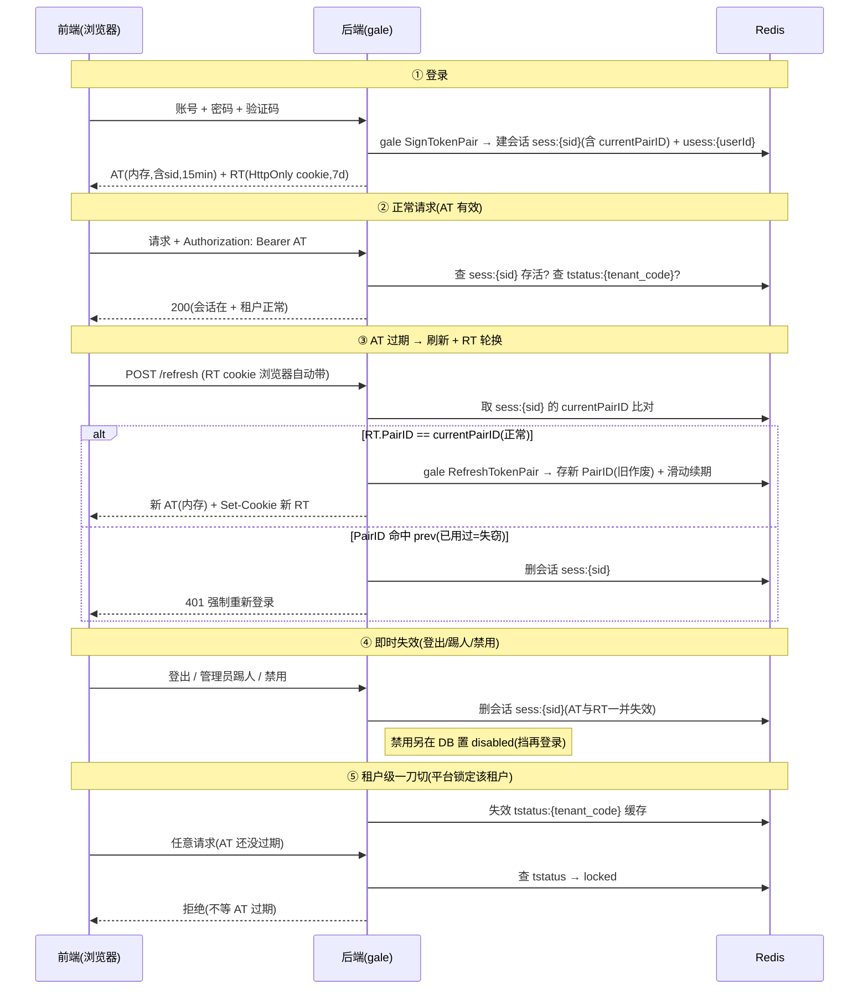

# 块3 · 身份与认证 设计（在途）

> 在途设计：块3 尚未冻结。本文件随"一个个过"逐项累积；冻结后并成 `specs/auth.md`（自包含）。
> 标记：✅已定（已拍板） · 🔶待确认（我提的方案，未拍板）。
> 与租户相关的登录部分已随 TF-1 冻结（路径式定位、本地+LDAP+验证码、账号租户内独立、JWT 内嵌 tenant_code、状态门），见 [../../specs/tenant.md](../../specs/tenant.md)。
> 命名约定：租户标识统一用 **`tenant_code`**（不用 `tid`，避免与 jwt id/`jti` 混）。

---

## ① 会话与 JWT（AT/RT）✅A 方案（会话中心化）

### 统一建模：租户用户 + 平台超管同一套会话
- **租户用户**与**平台运营/超管**共用同一套 Session/AT/RT/撤销机制，只分 **plane（平台面 / 租户面）**：
  登录入口不同（`/{tenant_code}` vs `/admin`），机制一致，仅 Redis key 命名空间不同（`ether:t:{tenant_code}:…` vs `ether:platform:…`）。

### AT / RT 分工
- **AT（access token，访问令牌）**：每次请求携带证明身份；**短命**（如 15 分钟）。**内含 `sid`（会话 ID）**。
- **RT（refresh token，刷新令牌）**：**长命**（如 7 天滑动），AT 过期时静默换新 AT，免重复登录。

### 会话中心化撤销（重评估：取代"只拉黑 jti"）
- **缺陷**：只把 AT 的 `jti` 加黑名单**不够**——AT 过期后，有效 RT 仍能刷出新 AT（新 jti 不在黑名单）→ 踢人被绕过。**撤销必须同时杀 RT**。
- **方案**：AT 带 `sid`；每请求**查会话是否存活**。**撤销 = 删会话记录** → AT（请求查不到会话→拒）+ RT（刷新查不到会话→拒）**一次性全死**。**不再用 `atblk:{jti}`**。
- 代价：每请求多一次 Redis 查会话；但本就要每请求查租户状态（G8），无额外负担。

### 基于 gale 落地（用框架自带 JWT，不自建）
> 已读 `gale@v0.1.1/docs/design/modules/jwt.md` 自行核对其能力。

- **直接用 gale 的 API**：
  - `gale.SignTokenPair(claims)` → 一次签 **AT+RT**（都是 JWT，共享 `PairID`）；登录用。
  - `gale.RefreshTokenPair(at, rt, newClaims)` → 验 RT+AT、签**新一对**（新 PairID）；轮换用。
  - `gale.JWTMiddleware(factory)` → 验签 + 注入 claims；**自带 30s 宽限期 + `X-Token-Expiring` 响应头**（前端据此**静默续签**）。
  - `gale.ParseToken` / `GetClaims` / `GetUserID` → 解析与取值。
- **算法与密钥（gale 已定，无需再选）**：**仅 HS256**（不支持 RS256/none）；单 secret（`GALE_JWT_SECRET` ≥32 字节、环境变量注入）；**无 `kid` 多密钥**（撤销之前 kid 的设想）。配置：`jwt.access_ttl`（建议 15–30min）/`refresh_ttl`（7d）/`grace_period`（30s）/`cookie_name`。
- **撤销层 = 我们补**：gale 文档 §9 明示"框架不做撤销，业务自行实现"——**本文的会话中心化正是这层**：gale 负责签发/验证/续签（无状态），**撤销 / 单次使用 / 重用检测由我们用 Redis 会话补**。

**AT / RT 的 claims 结构（扩展 gale `BaseClaims`）**：
```go
// gale.BaseClaims = RegisteredClaims(sub=userId, exp, iat, iss, ID=jti) + PairID + Type(access/refresh)
type AuthClaims struct {
    gale.BaseClaims
    SID        string `json:"sid"`         // ★稳定会话ID(跨轮换不变)——撤销锚
    Plane      string `json:"plane"`        // t | platform
    TenantCode string `json:"tenant_code"` // 租户码(平台面=platform)；用 tenant_code 避免与 jti 混
    RoleID     int    `json:"role_id"`      // 可选；AT 不放完整权限,按需查
}
func (c *AuthClaims) GetBaseClaims() *gale.BaseClaims { return &c.BaseClaims }
```
- `sub`=userId（gale 标准）；`PairID`=gale 生成、**随轮换变**；`sid`=我们生成、**稳定**。
- **轮换时把同一个 `sid` 传进 `RefreshTokenPair` 的 newClaims**，使会话跨轮换连续。

**sid ↔ PairID 配合**：`sid` 是稳定会话锚（撤销 / 查活按它）；`PairID` 是每对 token 的 id（随轮换变，存进会话做重用检测）。会话记录 `sess:{sid}` 存 `currentPairID / prevPairID`；刷新时 RT 的 PairID ≠ current 且 ≠ prev（过宽限）→ 判失窃删会话。

**校验链**：`gale.JWTMiddleware`（验签+宽限）→ **业务中间件**（查 `sess:{sid}` 在不在 + PairID 对不对 + 查 `tstatus`）→ 放行。

**前端落地（已定 AT 内存 + RT HttpOnly）**：AT 走 `Authorization: Bearer`（gale 读 Header）；RT 放 HttpOnly cookie（**业务在 handler 用 `c.SetCookie` 写**，gale 不接管 cookie 写）。刷新端点读 cookie 的 RT + AT，调 `RefreshTokenPair`，再 `Set-Cookie` 新 RT。

### 流转逻辑（登录 / 请求 / 刷新轮换 / 即时失效 / 租户一刀切）



### RT 轮换 + 重用检测（PairID 记入会话记录）
- **轮换**：每次刷新调 gale `RefreshTokenPair` 签新一对（新 `PairID`），**新 PairID 写进会话记录** `sess:{sid}`、旧的移到 `prevPairID`。
- **重用检测**：会话记录存 `currentPairID / prevPairID`；若来的 RT 的 `PairID` **命中 prev**（已作废）且**过了宽限期** → 判失窃 → **删会话、强制重登**（一个 `sid` 会话即一个"令牌家族"）。
- 注：gale 自身无状态、不作废旧 RT，**单次使用 / 重用检测靠我们这层会话记录实现**（gale 文档 §9 指定）。

### 重要：正常刷新无感，重登是例外
- **AT 过期（15min）→ 前端自动后台刷新 → 无感知、不重登**。流转图 ③ 的"401 强制重登"**只在失窃分支**（已用过的旧 RT 被再用）触发，**不是常态**。
- **只有这些才真需重新登录**：① RT 过期（见滑动续期）；② 检测到 RT 失窃；③ 主动登出/改密；④ 平台锁定/销毁该租户。

### RT 寿命策略 🔶建议
- **滑动续期（sliding）**：每次轮换给新 RT 一个**全新 7d TTL** → 只要 7 天内有活动就一直续、**活跃用户不掉线**；连续 7 天不动才过期。
- **绝对上限（可选）**：单次登录最长封顶（如 30d），到顶强制重登（更安全）。是否启用待定。

### 并发刷新的误伤与缓解 🔶建议
- **坑**：严格 RT 单次使用时，**多标签页/网络重试** 可能两个请求几乎同时拿同一条 RT → 第二个变"旧 RT"被误判失窃 → 误踢下线。
- **缓解**：① 给"刚换下来的上一对"留 **~10s 宽限期**仍接受（会话已存 `prevPairID`，宽限内命中=放行而非判窃）；② 前端 **刷新串行化/加锁**（同一刻只发一个 refresh）。

### Redis 命名空间 + Key 规则
> 单 Redis、控制平面共享，必须 **应用前缀 + 租户段** 分层：防冲突、可按租户批量清理、区分平台面/租户面。
> 约定：`ether:{域}:{…}`；**租户作用域 key 统一带 `t:{tenant_code}` 段**。

| 用途 | Key 模式 | Value | TTL | 写入 / 失效时机 |
|---|---|---|---|---|
| **会话记录**（撤销 / 轮换核心） | `ether:{plane}:sess:{sid}` | `{subject, plane, tenant_code, userId, deviceId, currentPairID, prevPairID, 签发时间}` | = RT 滑动寿命（如 7d） | 登录建；轮换更新 PairID+续期；撤销/踢人/登出删 |
| **每用户会话索引** | `ether:{plane}:usess:{userId}` | Redis SET：`{sid…}` | 滑动续期 | 登录加入；并发控制/禁用按索引批量删；登出移除 |
| 租户状态缓存（G8 一刀切） | `ether:tstatus:{tenant_code}` | `active/locked/pending_destroy…` | 短（30–60s） | 状态门读；平台改状态主动失效 |
| 设密/激活 token（一次性） | `ether:setpw:{tokenHash}` | `{tid, userId, 用途}` | = 链接有效期 | 发链接写；用后即删 |
| 登录失败计数 / 锁定 | `ether:{plane}:loginfail:{userId|ip}` / `…:lock:{…}` | 计数 / 锁定标记 | = 窗口 / 锁定时长 | 失败累加；超阈值置 lock；成功清零 |
| 验证码（②会用） | `ether:captcha:{captchaId}` | 答案/校验态 | 短（2–5min） | 生成写；校验后即删 |

> `plane` = `t:{tenant_code}`（租户面）或 `platform`（平台面，超管/运营）——统一建模、命名空间区分。

- **校验请求**：验 AT 签名+过期 → 查 `sess:{sid}` 存活 → 查 `tstatus:{tenant_code}` → 都过才放行。
- **租户销毁**：`SCAN ether:t:{tenant_code}:*` 批量删该租户全部 redis 痕迹。

### 撤销 / 禁用 / 并发：同一套会话操作，不同范围
| 操作 | 本质 | 范围 | 额外 |
|---|---|---|---|
| 登出 | 删会话 | 当前 `sid` | — |
| 踢人下线 / 拉黑 | 删会话 | 指定的 `sid`（一个 / 多个） | — |
| 禁用用户 | 删会话 | 该用户**全部 sid**（经 `usess`） | **+ DB 置 disabled**（挡再登录） |
| 改密 | 删会话 | 该用户全部 sid（可留当前） | — |
| 设备会话唯一 / 并发控制 | 删会话 | 该用户**其它 sid**（或限 N） | 登录时按 `usess` 触发；等保三级要求 |

> 关键：**踢人 ≠ 禁用**——踢人只删会话（用户能重新登录）；禁用必须**额外在 DB 打标记**挡住再登录。

### 前端方案 🔶待确认
> HttpOnly cookie = JS 读不到的 cookie，**防 XSS 偷 token**，但带来 CSRF（需 SameSite + CSRF token）。
> RT 轮换与存储位置无关：HttpOnly 下新 RT 靠 **`Set-Cookie`** 回写、JS 全程不见 RT。

| 方案 | AT | RT | 防 XSS 偷 token | CSRF |
|---|---|---|---|---|
| 🔶推荐 | **内存** | **HttpOnly+Secure+SameSite cookie**，`Path=/{tenant_code}` 限定刷新接口 | RT 偷不走、AT 短命 | 仅刷新接口需防 |
| 备选 | HttpOnly cookie | HttpOnly cookie | 都偷不走、前端不碰 token | **所有写接口都要防** |

- 同源多租户：cookie `Path=/{tenant_code}` 隔离；AT/RT 均绑 tenant_code（服务端校验）。
- 纵深防御：HttpOnly 只挡"偷 token"，挡不住 XSS 就地操作 → CSP + 输出转义仍要做。

### JWT 安全 / 防滥用 / 审计（对齐 gale）
- **签名算法**：✅**HS256**（gale 已定、只支持它；其 keyFunc 强制拒 `none`/RS256，防算法混淆攻击）。单 secret `GALE_JWT_SECRET`（≥32 字节、环境变量注入）、按密钥管理（连块7）、**不入代码 / 日志**；**无 `kid`**（gale 单密钥，撤销之前 kid 设想）。
- **Claims 校验**：gale `JWTMiddleware` / `ParseToken` 自带验签 + `exp`/`nbf`/`iss`；我们的 claims 含 `tenant_code` + `sid` + `plane`，业务侧再校验 plane / tenant_code 一致。
- **刷新端点限流**：`/refresh` 与登录端点一样限流（用 gale 自带限流），防 RT 滥用 / 暴力。
- **认证事件审计**：登录成功/失败、登出、刷新、撤销、踢人、禁用 → 接块6 审计（等保要求覆盖每用户重要行为）。

---

## 待续（按"一个个过"逐项补）
- ② 验证码（结合国内可能内网/数据出境的取舍）
- ③ 激活 / 设密 token 安全属性
- ④ LDAP 安全（LDAPS / 注入转义 / SSRF）
- ⑤ MFA（二期，TOTP / Passkey）
- ⑥ 登录失败锁定 / 防枚举

## 相关
- 租户模块（已冻结）：[../../specs/tenant.md](../../specs/tenant.md)
- 决策门与各 D 决策：[design.md](design.md)
