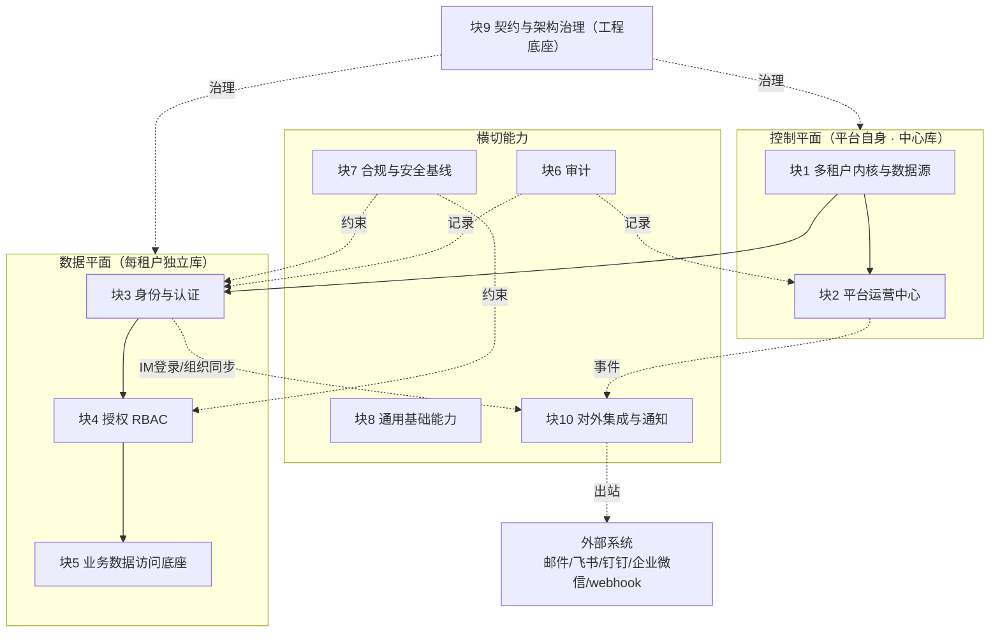

# 平台底座 · 模块拆分与边界（breakdown）

> 目的：自顶向下、**从大到小**把平台底座拆成几个**大块（bounded context，界限上下文）**，
> 每块给出 **职责 / 子能力 / 边界（做与不做）/ 已定决策 / 待讨论点**，作为后续**以块为单位系统讨论**的底图。
> 完整性由本拆分驱动（而非靠临时想到），避免散点式决策。承接 [proposal.md](proposal.md) / [design.md](design.md)。

## 拆分方法与约束锚点

- **约束（决定怎么拆）**：gale（单库门面 + gin/gorm/redis/nats/jwt，仅 HTTP/JSON）；
  **db-per-tenant + 数据驻留客户侧**（[ADR-0004](../../architecture/decisions/0004-multi-tenant-db-per-tenant.md)）；
  **控制平面 / 数据平面分层**；spec-first；合规锚**等保 2.0 三级**（[ADR-0007](../../architecture/decisions/0007-compliance-baseline-dengbao.md)）。
- **层级**：大块（本文 9 块）→ 子能力 → 功能点 / 边界（后续逐块细化）。
- **状态标记**：✅已定（含决策引用）；🔶待讨论（需要定）；⛔不做（out of scope）。

## 全景：9 大块与所属平面

---

## 块1 · 多租户内核与数据源（控制平面）

- **职责**：租户建模、注册、按租户动态连库、请求级租户解析——整个平台的地基。
- **子能力**：租户注册表（中心库）；每租户**连接配置 DSN**（加密存储）；**自建数据源管理器**（惰性连接池、接入 gale 生命周期）；
  **租户解析中间件**（路径式 `/{tenantCode}`，`platform` 为保留字）；**拓扑无关**（远程客户库 / 独立实例 / 同实例不同库）。
- **边界**：✅做 db-per-tenant 连接与隔离；⛔不做 RLS（物理隔离已够）；⛔不做跨租户聚合查询。
- **已定**：✅ D1 [ADR-0004]；✅ D5 路径式解析 [ADR-0008]；✅ **租户状态机**（见 [design.md](design.md)）；
  ✅ **数据源故障治理（一期基线）+ 取连接 ctx 唯一入口 + tenantCode 保留字/永久占用**（见 [review-blocks-1-2.md](review-blocks-1-2.md) F4/F5/F10）。
- **🔶待讨论**：故障治理参数（池上限/超时阈值，实现期调）；DSN 密钥方案细化（信封加密，归块7）。

## 块2 · 平台运营中心（控制平面）

- **职责**：平台运营人员管理租户全生命周期与商业化（与"租户自助管理"分属两面）。
- **子能力（一期）**：租户 CRUD + 生命周期（按状态机）；**租户开通自动化（provisioning）**：远程幂等建库/初始化/建租户管理员/种子；
  **系统设置 / 配置中心 / 基础功能开关**；**平台级 RBAC** + 平台管理员账号（跨租户）；重置租户管理员密码（高危·双人复核）。
- **🏷️ 商业化子域（块2 内，本轮不展开详细设计）**：**额度·坐席·资源额度、功能权益 / 套餐**（SSOT=平台中心库；与上面"租户运营"子能力分属块2 的两个子域）。
- **边界**：✅一期做租户运营与生命周期；⛔不做**计费 / 收款 / 账单**（out of scope，后续立项），权益层预留接口。
- **已定**：✅ 运营中心 [ADR-0005]；✅ **租户生命周期状态机**（含初始化失败/销毁中/销毁失败，见 [design.md](design.md)）；
  ✅ C1 平台统一远程 SQL 模板初始化；✅ C2 系统设置/配置中心（一期，基础）。
- **⏭️移至「运营/盈利模块」、一期暂不做**：**C3 套餐、C5 功能权益、额度/坐席**（**唯一事实源在平台中心库**）。
- **🔶待讨论**：**C4 销毁数据处理细节**（导出/物理销毁/解绑/crypto-shredding）；配置优先级。
  （重置租户管理员密码 = 平台经该租户数据源对其库写，非"神秘跨平面"，仅需不可达处理，见 [review-blocks-1-2.md](review-blocks-1-2.md) F2/F4。）

## 块3 · 身份与认证（数据平面 + 平台侧）

- **职责**：用户登录与会话；认证方式按租户可配。
- **子能力**：本地账密登录；**LDAP/AD 登录**；**强制验证码**；会话（超时/并发，JWT + redis）；**每租户认证配置**；
  账号体系（租户内独立）；〔二期〕**MFA 双因素**、完整 **SSO（OIDC/SAML）**。
- **边界**：✅一期 本地 + LDAP + 验证码；🔶二期 MFA / SSO；⚠️**等保三级"双因素"一期缺口、二期由 MFA 补**。
- **已定**：✅ D6（本地+LDAP+验证码）；✅ D5（路由）；🔶 D7（账号体系，倾向租户内独立，**待确认**）。
- **🔶待讨论**：D7 确认；验证码形态（图形 / 短信）；会话策略（单点登录 / 踢人 / 续期）；LDAP 受 C5 权益门控的落地；与块7 口令策略联动。

## 块4 · 授权 RBAC（数据平面 + 平台侧）

- **职责**：判断"谁能对什么做什么"。
- **子能力**：用户-角色-权限（**资源+动作**）；角色继承（可选）；**接口层强制中间件** + Redis 缓存；
  **平台级 RBAC**（运营/超管）与**租户级 RBAC**两套作用域；**data_scope 预留字段 + 中间件挂载点**。
- **边界**：✅自研、一期资源+动作；🔶数据级权限 / ABAC 预留不实现。
- **已定**：✅ D2 [ADR-0005]。
- **🔶待讨论**：权限点（资源+动作）建模规范与清单；预置角色模板；菜单/按钮权限与前端联动契约。

## 块5 · 业务数据访问底座（数据平面）

- **职责**：为业务模块提供统一数据访问与扩展点，并为"数据级权限"留种。
- **子能力**：**仓储层统一范围注入口**（gorm scope）；业务实体**归属属性**（owner/部门）；软删除/事务上下文（gale）；
  **业务孵化扩展契约**（业务模块如何注册路由、复用 租户/鉴权/审计 中间件）。
- **边界**：✅一期建口子与扩展点（T6b）；⛔不实现具体业务。
- **已定**：✅ D2 扩展评估的关键预留。
- **🔶待讨论**：扩展契约形态（模块注册 / 插件 / 目录约定）；组织/部门模型（扁平 vs 树）与数据级权限的关系。

## 块6 · 审计（横切）

- **职责**：面向合规、可追责、对外不可改的事件记录。
- **子能力**：**审计模块 + 事务内钩子 API**；gin 自动采集；**统一事件模板**；**分层落点**（租户库/中心库）；
  对外只读 / 内部唯一写；按维度查询 + CSV 导出；〔二期〕**outbox → JetStream 统一流**。
- **边界**：✅一期事务内写入 + 分层；⛔暂不强制物理 append-only（留归档空间）；🔶哈希链按需。
- **已定**：✅ D3 [ADR-0006]。
- **🔶待讨论**：事件类型清单最终确认（design 已列、待过目）；哈希链纳入哪个合规等级；与对象存储归档的衔接。

## 块7 · 合规与安全基线（横切）

- **职责**：把等保三级的共性要求落成可配置安全策略，平台一次满足、业务复用。
- **子能力**：**安全策略模块**（口令/会话/锁定 参数化，**全局基线 + 按租户收紧不放松**）；传输 **TLS**；口令加盐哈希（bcrypt/argon2）；
  敏感数据加密；**密钥 / 凭据管理**（与块1 的 DSN 加密共用）；等保三级清单核验。
- **边界**：✅锚等保三级 + 预留 ISO27001/SOC2 映射。
- **已定**：✅ D4 [ADR-0007]。
- **🔶待讨论**：等保三级控制项**逐条映射清单**；MFA 二期补双因素；密钥管理方案（外部 KMS vs 本地）。

## 块8 · 通用基础能力（横切）

- **职责**：底座级通用能力，业务复用。
- **子能力**：**组织/部门/成员**（一期可扁平 + 扩展位）；**按租户备份/导出**；
  **可观测性**（per-tenant DB 连接健康监控、日志、指标）；复用 gale（限流/定时任务/i18n/健康检查/分布式锁）；
  **★统一出站调用封装层（owner：本块）**——所有外部调用(LDAP/SMTP/webhook/第三方 HTTP)强制走它，统一 **3s 超时 + SSRF 安全拨号器(net.Dialer.Control 连接时校验、拒非全局单播 IP) + per-type 限速 + egress 兜底**；auth §5 / Dispatch §16 / 块10 通知三处均复用、不自建。
  （通知 / 对外集成已独立为 **块10**。）
- **边界**：🔶按需纳入，需明确一期/二期/不做。
- **已定**：—（待逐项定）。
- **🔶待讨论**：组织模型是否一期；备份/导出责任（我们托管 vs 客户自托管）。

## 块9 · 契约与架构治理（工程底座）

- **职责**：保证前后端契约即真理、架构不腐化。
- **子能力**：**OpenAPI 契约**；**行走骨架**（walking skeleton）；**架构 fitness functions**（分层/无环/模块边界自动校验）；
  bin 产物规范；spec-first 流程；**控制平面 / 数据平面分层**规范。
- **边界**：✅贯穿全程。
- **已定**：✅ 任务 T1/T2/T3。
- **🔶待讨论**：模块划分与目录结构（`internal/` 边界）；契约版本与类型生成流程。

## 块10 · 对外集成与通知（横切）

- **职责**：平台**出站（outbound）**对接外部系统、统一对外发消息，为平台与业务事件提供通知与第三方集成能力。
- **子能力**：
  - **通知渠道**：邮件、短信、站内信、**飞书 / 钉钉 / 企业微信**（机器人 / 应用消息）、**webhook 回调**。
  - **统一通知模型与模板**（类比块6 审计的统一模板）+ 按渠道适配器；**异步发送**（NATS/JetStream）+ 重试 / 失败处理。
  - **per-tenant 渠道配置**：每租户配自己的飞书/钉钉机器人、SMTP 邮件服务器、签名等（部分渠道可作 C5 付费权益）。
  - **触发来源**：平台事件（开通完成 / 告警 / 重置密码 / 额度预警）、业务事件（经块5 扩展点）。
  - **与其他块的衔接（连接器在本块，能力归属各块）**：块3 认证借 **飞书/钉钉 扫码 / OAuth 登录**（二期 SSO）；
    块8 组织借 **钉钉/飞书 组织架构同步**（二期）。
- **边界**：✅**出站集成**（我们推送到外部）；⛔**开放第三方 API（入站：让外部调我们的 API）仍 out of scope**（proposal 已列，方向不同别混）。
- **已定**：—（待逐项定）。
- **🔶待讨论**：一期渠道范围（邮件/站内信是否必备）；**飞书/钉钉一期还是二期**；渠道配置平台级 vs 租户级；
  哪些渠道属付费权益（连 C5）；IM 扫码登录 / 组织同步放哪期。

---

## 建议的讨论顺序（按依赖，从地基到上层）

块1（多租户内核）→ 块2（运营中心）→ 块3（认证）→ 块4（授权）→ 块6（审计）→ 块7（合规）
→ 块5（业务底座）→ 块8（通用能力）→ 块10（对外集成与通知）→ 块9（工程治理，贯穿）。

> 每块讨论统一三步：① 确认子能力清单（增/删）→ ② 划边界（一期/二期/不做）→ ③ 收敛 🔶待讨论点 为决策并落 ADR / specs。

## 相关
- 提案：[proposal.md](proposal.md)　·　设计与决策门：[design.md](design.md)　·　任务：[tasks.md](tasks.md)
- 决策记录：[ADR-0004~0007](../../architecture/decisions/README.md)
