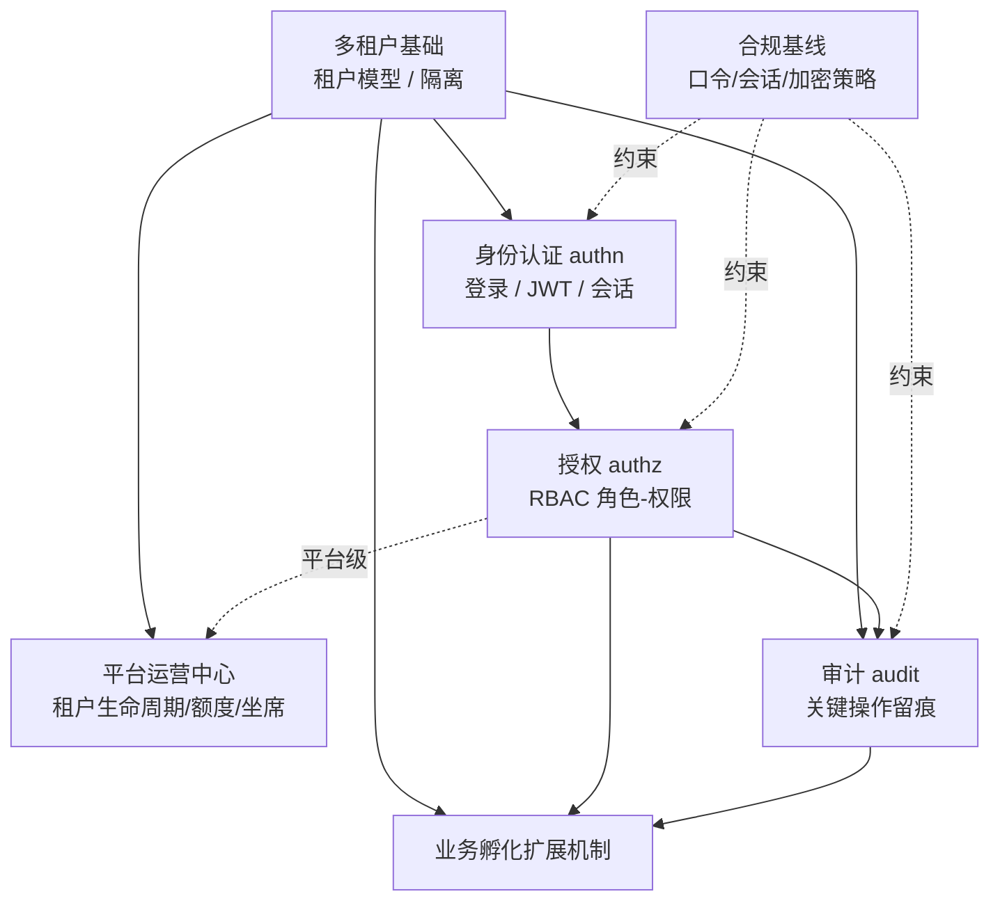
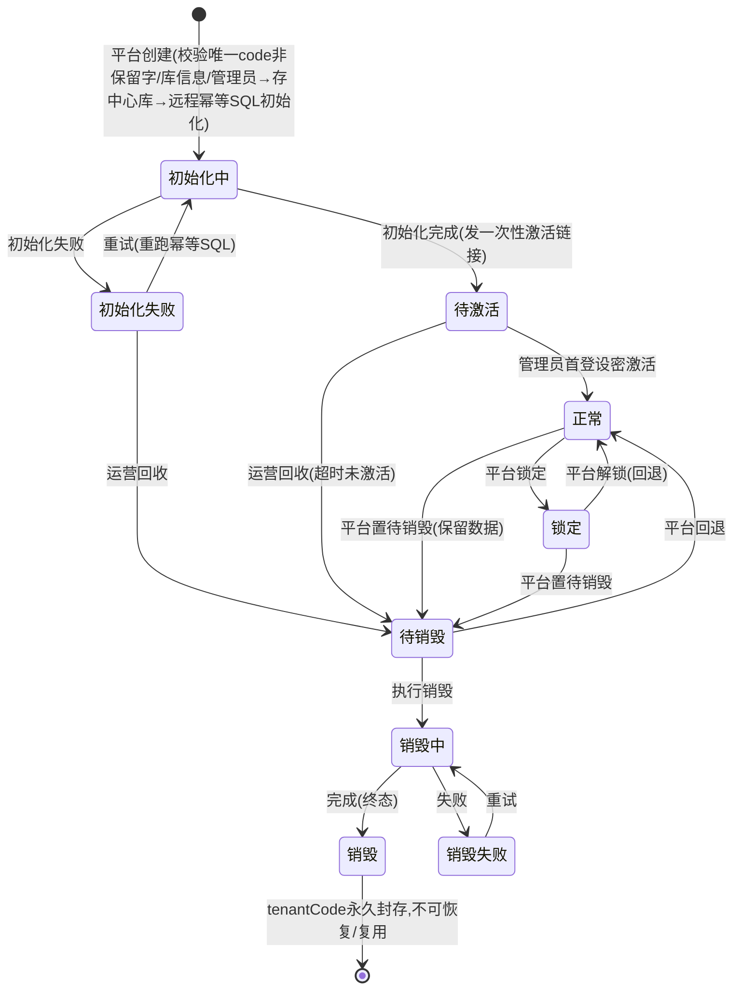

# 设计：平台底座

> 承接 [proposal.md](proposal.md)。本文档对 proposal 列出的 **4 个地基决策**做业界
> 调研，给出**取舍 + 推荐**，但**最终由用户拍板**——所有推荐均以「**决策门
> （decision gate）·待拍板**」形式呈现，未拍板前不写入 specs/ADR、不据此实施
> （见全局规则 总则「调研归调研，决策归用户」）。拍板后每个决策落一条 ADR、再拆 tasks。

## 方案概述

平台底座按"能力"分层落地，能力间依赖**单向、无环**（适配全局 4.8 的架构闸门）：

- **多租户**是地基中的地基：tenant_id 贯穿身份、授权、审计的数据模型。
- **合规基线**横切：它不是独立模块，而是对认证/会话/口令/审计/加密提出的**可配置策略约束**。
- **业务孵化机制**最后做：业务系统通过它复用上述能力（详见对应 spec，本期只定最小扩展点）。

受 [../../architecture/tech-stack.md](../../architecture/tech-stack.md) 与
[ADR-0002](../../architecture/decisions/0002-backend-framework-gale.md) 约束：
**Go + gale（gin/gorm/go-redis/NATS-JetStream/JWT）、单 PostgreSQL、仅 HTTP/JSON**。
下面所有方案都已在此硬约束内取舍。

---

## 决策门总表（待用户拍板）

| # | 地基决策 | 决策 / 推荐 | 状态 |
|---|---|---|---|
| D1 | 多租户隔离模型 | ✅**已定**：**db-per-tenant**（每租户独立库，DSN 拓扑无关）；平台**自建租户数据源管理器**、接入 gale 生命周期；控制平面中心库仍用 gale 单库；**不用 RLS**。见 [ADR-0004](../../architecture/decisions/0004-multi-tenant-db-per-tenant.md) | 已拍板 2026-06-20 |
| D2 | RBAC 粒度 | ✅**已定**：**自研** RBAC（资源+动作），各租户库自存用户/角色/权限，预留数据级权限扩展位；另设**平台运营中心**（控制平面）。见 [ADR-0005](../../architecture/decisions/0005-rbac-self-built-per-tenant.md) | 已拍板 2026-06-20 |
| D3 | 审计设计 | ✅**已定**：分层落点（租户审计入租户库、平台审计入中心库）+ **统一审计流**（JetStream、按类型区分、不丢）+ 对外只读/内部唯一写入 + 暂全量留存。见 [ADR-0006](../../architecture/decisions/0006-audit-unified-stream.md) | 已拍板 2026-06-20 |
| D4 | 合规基线 | ✅**已定**：**等保 2.0 三级**为锚点 + 预留 ISO27001/SOC2 映射；安全策略 = **全局默认基线 + 按租户可收紧不可放松**。见 [ADR-0007](../../architecture/decisions/0007-compliance-baseline-dengbao.md) | 已拍板 2026-06-20 |
| D5 | 租户定位方式 | ✅**已定**：**路径式** `主域名/{tenantCode}` 进租户、`/admin`（保留字 `platform`）进运营侧；根路径**引导页**由 邮箱域名/企业code/全名称 解析 tenantCode；直达时 tenantCode 锁死。见 [ADR-0008](../../architecture/decisions/0008-identity-login.md) | 已拍板 2026-06-20 |
| D6 | 认证/登录方式 | ✅**已定**：一期 **本地账密 + LDAP/AD**（均强制验证码）；MFA（双因素）与完整 SSO（每租户 OIDC/SAML）**二期**、预留"每租户认证配置"。⚠️等保三级双因素一期未满足、二期由 MFA 补。见 [ADR-0008](../../architecture/decisions/0008-identity-login.md) | 已拍板 2026-06-20 |
| D7 | 账号体系/跨租户身份 | 倾向：一期用户**租户内独立**，平台运营单独跨租户账号；跨租户统一身份后续 | ⏳待拍板 |

> 拍板方式：可逐条回复"D1 选行级，先不上 RLS"之类即可；有不同取向直接说，我据此改设计并落 ADR。

---

## D1 · 多租户隔离模型 ✅已定（db-per-tenant）

### 业界做法（三种经典模型）
| 模型 | 隔离强度 | 运维 / 迁移 | 租户密度·成本 |
|---|---|---|---|
| 共享库 + **行级**（每表带 `tenant_id`） | 逻辑隔离（靠查询过滤/RLS） | 最简：一套表、一次迁移 | 最高密度、最低成本 |
| **schema-per-tenant**（每租户一个 schema） | 较强（命名空间隔离） | 迁移要对每个 schema 跑；连接需切 `search_path` | 中等密度，"千级"租户 |
| **db-per-tenant**（每租户独立库/实例） | **最强（物理隔离）** | 最重：逐租户库迁移、连接动态路由 | 最低密度、最高成本 |

权威参考：AWS SaaS Lens、微软多租户架构指南把这三种列为标准谱系。三者隔离强度递增、运维成本递增、租户密度递减。

### 决策与理由
**选 db-per-tenant（每租户一个独立数据库）**，理由是它给出**最强的物理隔离**，并支撑本平台的核心诉求——**数据可驻留在客户侧（data residency / 数据主权）**：业务数据存客户自己的库、不出客户域，这是 ToB（尤其等保/数据主权敏感客户）很强的合规卖点（与 D4 呼应）。代价（迁移重、密度低）已知并接受。

### 关键设计点
1. **拓扑无关（topology-agnostic）**：租户连接以 **DSN（数据源连接目标）** 抽象，**同一套应用代码无痛兼容**三种部署形态，互不改码：
   - ① 客户自托管库，应用跨网络远程连接（数据驻留客户侧）；
   - ② 我们托管，每租户一个独立 PostgreSQL 实例/库；
   - ③ 同一实例下不同 database/schema（小客户/低成本档）。

   选哪种是**按租户的应用运维（ops）决策**，由"客户是否自维护数据库"决定，**不进入业务代码**。
2. **连接管理：平台自建租户数据源管理器**——gale 不支持动态多数据源（其 gorm 封装为单库），故**租户库连接不走 gale 的 db 管理**，由平台**自建多数据源/动态连接池**（按当前租户惰性建池并缓存），但**接入 gale 框架生命周期**（配置经 viper、日志经 zap、随服务优雅启停关闭连接池）。详见 [ADR-0004](../../architecture/decisions/0004-multi-tenant-db-per-tenant.md)。
3. **控制平面 / 数据平面分层**（见概述图的两层）：
   - **控制平面（gale 默认单库）**：租户注册表、**每租户连接配置（DSN，加密存储 + 密钥管理）**、平台级超级管理员、平台级审计、安全策略基线。
   - **数据平面（每租户独立库）**：该租户业务数据 + **租户内用户 / 角色 / 权限**（D2 已定：各租户库自存，与数据主权一致）。
4. **不需要 RLS**：物理分库天然隔离，无"忘加 `WHERE tenant_id`"的跨租户泄漏面，故不引入 PostgreSQL 行级安全。
5. **请求路由**：中间件先**定位租户**（登录上下文 / 子域 / header）→ 从数据源管理器取该租户的 DB 句柄注入 ctx → repo 用 ctx 上的句柄。**先有租户、才有库连接**（与 D2 的登录路由呼应）。

### 已知代价与待治理项（落 specs 时细化）
- **迁移**：schema 变更要**逐租户库执行**，需处理客户库**不可达 / 版本漂移**（灰度、版本协商）。
- **可用性**：某租户库 / 跨网链路故障 → **仅该租户不可用**（模型固有，已接受）。
- **安全**：跨网络连库需 **TLS / VPN / 专线**；连接串（host/账号/密码）**加密存储 + 密钥管理**。
- **与 ADR-0002 的关系**：**限定（qualify）而非推翻**——控制平面仍是 gale 单库；仅租户数据平面在 gale 门面之外自管，已在 ADR-0004 记录此例外。

---

## D2 · RBAC 鉴权粒度 ✅已定（自研 / 资源+动作 / 各租户库自存 / 平台运营中心）

> 名词：**RBAC**（Role-Based Access Control，基于角色的访问控制）= "用户→角色→权限"，权限通常表达为
> **资源 + 动作**；**数据级权限 / data scope（数据范围）**= 细到"仅本部门/本人"的行级限定；
> **ABAC**（Attribute-Based Access Control，基于属性的访问控制）= 按属性/条件写策略的更灵活模型。

### 决策
1. **自研 RBAC（不引入 Casbin）**：`用户—角色—权限`，权限 = **资源 + 动作**（可选角色继承）；
   **接口层中间件**按 `路由→(资源,动作)` 强制校验，越权直接拒（满足 proposal 验收"越权被拒"）；
   权限判定结果用 Redis 短缓存。前端按返回的权限集渲染菜单/按钮（仅 UX，不替代后端校验）。
2. **粒度一期 = 资源+动作**，预留数据级权限 / ABAC 扩展位但**不实现**（见下"扩展性评估"）。
3. **数据落点 = 各租户库自存**：每租户的用户/角色/权限存在**该租户自己的库**（与 D1 数据主权一致，账号都不出客户域）；
   登录走"先定位租户 → 连其库认证"（呼应 D1 路由）。
4. **平台运营中心（控制平面，新增能力）**：面向平台运营人员，与"租户自助管理"分属两个面。职责：
   创建租户、重置**租户管理员**密码、租户对象**生命周期**（建/停/启/注销）等。其自身权限走**平台级 RBAC**（运营/超管角色），数据在控制平面中心库。
   （**额度 / 坐席 / 套餐 / 功能权益 = 块2 的「商业化子域」**——本轮不展开其详细设计；SSOT=平台中心库。）

### 取舍 / 为什么不用 Casbin
- **Casbin**（Go 主流权限引擎，原生多租户域、可平滑升级 ABAC）本是有力候选；但在本项目 **db-per-tenant +
  各租户库自存策略 + 客户可能自托管远程库** 下，需"每租户一个 enforcer + 指向其库的 adapter + 跨实例 watcher 同步"，
  跨网 reload 复杂度高（参考 [Casbin 策略子集加载](https://casbin.org/docs/policy-subset-loading/)、[adapters](https://casbin.apache.org/docs/adapters/)）。
- **自研**在一期（仅资源+动作）很轻：核心几张表，**与业务数据同库同事务、同备份同迁移单元**，查库 + 短缓存即可，
  对客户自托管远程库更稳（[Casbin 利弊](https://authzed.com/blog/casbin)、[自建 RBAC](https://www.aserto.com/blog/building-rbac-in-go)）。故选自研。

### 扩展性评估（现在预留 vs 将来上数据级权限的工作量）
| | 现在预留（成本低） | 将来上数据级权限（有预留→局部新增） | 若现在不预留（高） |
|---|---|---|---|
| 数据模型 | 权限/角色表加可空 `data_scope` 字段；业务实体带归属属性（owner/部门） | 仅启用并填充范围字段 | 逐租户库**回填归属字段 + 数据迁移**（db-per-tenant 逐库跑） |
| 强制逻辑 | 中间件留"数据范围过滤"挂载点（一期 no-op） | 实现"角色→数据范围"解析器并填挂载点 | 改写鉴权链路 |
| 业务查询 | **统一走仓储层范围注入口**（gorm scope/统一查询构造） | 几乎不动 | **逐条改写所有业务查询** |
| 管理面 | — | 加"角色配数据范围"的运营/管理 UI | 同 |

**结论**：预留成本低，能把后期从"横切重构"降为"局部新增"，采纳。**唯一须现在就做的关键预留**：
业务数据访问的**仓储层统一范围注入口** + 业务实体**携带归属属性**——这两项跨 per-tenant 多库回填代价最大，最该提前留。

---

## D3 · 审计（audit）设计 ✅已定（独立审计模块 / 事务内写入 / 分层落点 / 统一模板 / 暂全量留存）

> 名词：审计 = 面向合规、可追责、对外不可改的业务事件记录（≠ 排障用应用日志）；
> **事务性发件箱（transactional outbox）** = 与业务变更同事务先写一条待发事件，再由中继异步发布，
> 避免"业务已提交但事件丢失"的窗口；哈希链 = 记录间用前序哈希串联以检测篡改。

### 审计作为独立模块（采纳"模块 + API/钩子 + 事务内写入"的设想，判定合理）
审计做成**独立模块**，对**内部业务模块**暴露两种接入，统一产出**统一模板**事件：
1. **编程 API / 钩子（主写入路径）**：业务代码在其**数据库事务内**调用 `audit.Record(ctx, event)`，
   审计记录与业务变更**同事务原子落库**——要么都成、要么都回滚，**天然不丢、强一致**，且自然落到
   **当前租户库**（与 D3-a 分层落点一致）。比纯异步流更稳（异步存在"业务已提交但投递失败"的窗口）。
2. **gin 中间件自动采集**：对 HTTP 操作按路由自动生成审计事件（无需 before/after 细节的那类）。
- 模块内部统一校验 / 补全字段（actor、tenant、request_id 从 ctx 取）。对外 / 前端**只读**，
  **写入与变更只能由程序内部完成**（显式事务 / 归档定时任务），无任何对外写改接口（D3-c）。

### 落点（D3-a，分层）
- **租户操作审计 → 该操作所在的租户库**（事务内同库写入，最自然，与数据主权一致）；
- **平台运营审计 → 控制平面中心库**（创建租户、重置租户管理员密码、额度/坐席/资源额度、生命周期等）。
- 代价：跨租户全局审计聚合较难——平台监管以"控制平面审计 + 按需到租户库查询/传播流汇总"为主。

### 传播：统一审计流（可选 / 二期）
平台级聚合、监控、(后续)对象存储归档等需跨库汇总时，用**事务性发件箱**：业务事务内同时写一条 outbox，
由中继发布到 **JetStream 统一审计流**（按 `event_type` 区分）。**既保留事务内强一致写入，又得到统一流用于传播**。
一期可只做事务内写入，传播流按需启用。

### 要保存哪些类型（D3-b，按你委托判定，待过目可调）
| 大类 | 事件示例 |
|---|---|
| 认证 authn | 登录成功/失败、登出、令牌刷新、改密/重置密码、MFA 变更 |
| 授权 authz | 角色增改删、权限授予回收、用户-角色分配变更 |
| 租户运营 | 租户建/停/启/注销、重置租户管理员密码、额度·坐席·资源额度变更 |
| 用户管理 | 用户建/禁用/删除、关键资料变更 |
| 数据 | 敏感数据导出、批量查询、敏感字段访问（按需标注） |
| 配置/策略 | 口令策略、会话策略、安全基线变更 |
| 业务（可选） | 业务模块按需经钩子注册要审计的关键操作 |

### 统一事件模板（字段）
`event_id`、`occurred_at`、`event_type`、`category`、`actor{id,type(用户/系统/运营),name}`、
`tenant_id`（平台级事件记 platform）、`resource{type,id,name}`、`action`、`result{ok,reason}`、
`before/after`（变更类）、`context{ip,user_agent,request_id/trace_id,source(运营中心/租户端/API)}`、`extra`（类型特定 JSON）。

### 留存与查询
- **留存（D3-d）**：当前**全量存储、不设留存期**；后续引入对象存储再划定归档 / 留存策略。
  （故暂不强制数据库物理 append-only，以便后续定时归档 / 迁移；防篡改先靠"无对外写路径 + 内部唯一写入"，
  哈希链待有明确合规要求再加。）
- **查询 / 导出**：按 `时间 / 操作人 / 动作 / 类型` 筛选 + CSV 导出；租户只见自己审计，平台运营看控制平面审计。

---

## D4 · 合规基线（compliance baseline） ✅已定（等保2.0 三级锚点 / 全局基线·按租户可收紧不放松）

### 标准定位与渐进策略
| 标准 | 是什么 / 面向谁 | 对平台的意义 |
|---|---|---|
| **等保 2.0**（GB/T 22239，网络安全等级保护） | 中国境内系统**分级合规**（常见三级），国内 ToB 多为硬门槛 | 国内市场的**基线锚点** |
| **ISO/IEC 27001** | 国际通用信息安全管理体系（ISMS）认证 | 出海 / 国际客户尽调常要求 |
| **SOC 2**（Trust Services Criteria） | 欧美客户供应商尽调常要的审计报告 | 面向欧美 SaaS 客户 |
| **PIPL / GDPR** | 个人信息保护（国内 / 欧盟） | 涉个人数据时叠加 |

**渐进建议（合理）**：**国内 ToB 先锚等保 2.0（三级），出海 / 国际客户再叠加 ISO27001 / SOC2**。这些标准在认证/口令/会话/审计/加密上**高度重叠**，平台层把共性基线做扎实，叠加新标准时多是补文档与流程而非重做系统。

### 共性安全基线（平台一次满足、业务复用）
抽取为**平台可直接落地的可配置策略**：
- **身份鉴别**：用户唯一标识；**口令复杂度/长度**（等保三级要求复杂度策略，实务常取 ≥8~12 位含多字符类）；**口令有效期/强制更换**；**登录失败锁定**（限制非法登录次数）；敏感场景**双因素 / 多因素**。
- **会话**：**非活动超时**自动结束会话；**并发会话控制**。
- **权限**：最小权限、职责分离（对接 D2 的 RBAC）。
- **审计**：覆盖每用户、记录重要事件、记录受保护并定期备份、留存合规（对接 D3）。
- **加密**：传输 **TLS**；**口令加盐哈希**（bcrypt / argon2，禁明文/可逆）；静态敏感数据加密；密钥管理。

### 平台层 vs 业务层
- **平台底座一次满足**：authn、会话、口令策略、authz、审计、传输加密、密钥基础设施。
- **业务侧配合**：业务数据分级、具体字段级加密、业务专有审计事件。

### 决策
1. **基线锚点 = 等保 2.0 三级**：以国内 ToB 常见的三级要求为**合规下限**，并把基线项**预留映射到 ISO 27001 / SOC 2 控制项**，出海 / 国际客户时叠加，不重做系统。
2. **策略作用域 = 全局默认基线（floor）+ 按租户可收紧不可放松**：平台定一套合规下限，租户只能调得**更严、不得低于基线**。db-per-tenant 下每租户策略天然独立，便于按租户收紧。
3. **可配置安全策略**（参数化，平台一次满足、业务复用）：
   - **身份鉴别**：用户唯一标识；口令复杂度/长度、有效期/强制更换；登录失败锁定；三级要求的双因素/多因素之一。
   - **会话**：非活动超时、并发会话控制。
   - **权限**：最小权限、职责分离（由 D2 的 RBAC 落地）。
   - **审计**：覆盖每用户、关键事件、记录保护（由 D3 的审计落地）。
   - **加密**：传输 TLS；口令加盐哈希（bcrypt / argon2）；敏感数据加密 + 密钥管理。
4. **业务侧配合**：业务数据分级、字段级加密、业务专有审计事件。

---

## 调研补遗：新增待拍板决策点（D5–D7）与能力补全

> 经业界调研补充（[租户路由 AWS](https://aws.amazon.com/blogs/networking-and-content-delivery/tenant-routing-strategies-for-saas-applications-on-aws)、
> [多租户身份](https://medium.com/@sayalikapse28/architecting-identity-for-the-multi-tenant-cloud-a-deep-dive-417386d1a9c2)、
> [B2B SSO](https://supertokens.com/blog/secure-multi-tenant-auth)、
> [控制平面能力](https://northflank.com/blog/multi-tenant-saas-platform-deployment)、
> [自动开通](https://kodekx-solutions.medium.com/practical-multi-tenant-saas-provisioning-and-automated-onboarding-3bb6fdd3e84f)）。
> 以下**均待拍板**（"倾向/一期 MVP"仅为倾向，未定）。**db-per-tenant 使 D5、C1 成为硬需求**。

### 身份与登录
- **D5 租户定位方式 ✅已定（路径式）**：选 **路径式 `主域名/{tenantCode}`**（一套部署、路径区分租户，为统一建模复用；
  比子域省 DNS/证书）。
  - **租户侧**：`主域名/{tenantCode}` 进入；直达该路径时 **tenantCode 在登录页锁死**，租户用户只填 账号/密码/验证码。
  - **平台运营侧**：`主域名/admin` 进入，登录默认**不带 tenantCode**，以**保留字 `platform`**（及其他保留字段）传递。
  - **根路径引导页**：用户用 **邮箱域名 / 企业 code / 全名称** 解析出自己的 `tenantCode`，再跳转到 `/{tenantCode}`。
  - 影响：租户解析中间件从**路径**取 `tenantCode`（`platform` 为保留），据此连对应库（呼应 D1 路由）；自定义域名作后续增值。
- **D6 认证/登录方式 ✅已定**：一期 = **本地账号密码 + LDAP/AD 目录登录**两种，**均强制验证码**（图形/登录验证码，防暴力破解）。
  - **MFA（TOTP/短信双因素）一期预留、二期实现**；完整企业 SSO（每租户对接自己 IdP，OIDC/SAML 联邦）二期，
    一期数据模型**预留"每租户认证配置"**（认证方式按租户可配，且受 C5 权益管控——见下）。
  - ⚠️**合规缺口（如实记录）**：验证码 ≠ 双因素；**一期对等保三级"双因素"要求暂未满足，二期由 MFA 补齐**。
  - LDAP 作为**可商业化的增值功能**，其可用性受 C5 功能权益管控（按租户/套餐开关）。
- **D7 账号体系/跨租户身份**：倾向一期用户**租户内独立**（契合各租户库自存）；平台运营单独跨租户账号；
  跨租户统一身份后续按需。

### 平台运营 / 系统设置 能力
- **C1 租户开通自动化（一期 MVP，db-per-tenant 命门）**：建租户自动**建库 / 初始化 schema / 建租户管理员 / 种子数据**，
  异步 + "准备中"状态。决策点：客户自托管库由**我们远程初始化** vs **交付脚本由客户执行**。
- **C2 系统设置 / 配置中心 + 功能开关（一期 MVP）**：全局 / 租户级参数 + 按租户/套餐**功能开关（feature flags）**；
  功能开关同时承载 **C5 商业化权益**的开 / 关（如 LDAP、欢迎页自定义）。
- **C3 套餐 / 计划分档 🏷️块2「商业化子域」**：功能权益 + 席位 + 额度打包成档位（非计费）；本轮不展开详细设计；**唯一事实源在平台中心库**。
- **C4 租户生命周期 + 注销数据处理**：试用 / 停用 / 注销的**数据导出与销毁**（客户自托管库的数据归属与销毁责任要写清）。
- **C5 功能权益与商业化管控（feature entitlement）🏷️块2「商业化子域」**：平台运营侧按租户/套餐**授予功能权益**——
  如 **LDAP 登录、欢迎页/品牌自定义**作为**付费增值功能**按租户开关；**席位（seats）调整**为盈利杠杆。**唯一事实源在平台中心库**。
  - **边界（与 proposal "计费 out of scope" 对齐）**：本期做**权益 / 授权层**（谁有权用哪些功能、多少席位/额度，平台侧**强制校验**），
    **不做计费 / 收款 / 账单**（仍 out of scope，后续单独立项）；权益层为将来计费**预留对接接口**。

### 其他底座能力（范围补全，非决策）
- **需要**：通知（邮件/短信/站内信）、密钥/凭据管理（租户库连接串加密）、按租户备份/导出、
  per-tenant DB 连接健康监控；组织/部门（一期可扁平、留扩展位，为数据级权限铺路）。
- **复用 gale 自带**：限流 / 定时任务 / i18n / 健康检查 / 分布式锁（无需新决策）。

## 租户生命周期状态机（块1/块2 核心建模）

> 遵循全局约束 B3.1（业务资源先定义状态机再定功能）。这是**租户**这个业务资源的生命周期，
> 鉴权/锁定/审计等横切逻辑均以此为准（不用散落布尔标志）。

### 状态定义
| 状态 | 含义 | 业务可用性 |
|---|---|---|
| 初始化中 | 平台已建租户记录、正按 SQL 模板初始化业务库 | 不可用 |
| 初始化失败 | 远程执行初始化 SQL 失败 | 不可用（可重试 / 删除清理） |
| 待激活 | 初始化完成、等租户管理员首次登录激活（发邀请链接） | 仅激活/登录 |
| 正常 | 已激活、正常使用 | 全可用 |
| 锁定 | 平台锁定；禁业务写入，仅放行**开放接口**（验证码/登录）与**白名单接口**（如未来续费） | 受限 |
| 待销毁 | 全局不可用，但**保留数据** | 不可用 |
| 销毁中 | 正在导出 / 物理销毁 / 解绑（可失败、可重试） | 不可用 |
| 销毁失败 | 销毁中途失败，待重试 / 人工介入 | 不可用 |
| 销毁 | 终态；数据按策略处理，**tenantCode 永久封存** | 永久不可用 |

### 状态门真值表（fail-closed：默认拒绝，仅显式放行）
> 块3/块4 的「租户状态门中间件」按此表机器判定。"平台运营写"=运营中心对该租户库/记录的高权操作。

| 状态 | 开放接口(登录/验证码/登出) | 业务读 | 业务写 | 平台运营写 |
|---|---|---|---|---|
| 初始化中 | 拒 | 拒 | 拒 | 仅 改DSN / 重试初始化 / 回收 |
| 初始化失败 | 拒 | 拒 | 拒 | 仅 重试 / 改DSN / 回收 |
| 待激活 | 仅**设密激活端点** | 拒 | 拒 | 仅 **重发设密链接** / 回收（无密码可"重置"） |
| 正常 | 放行 | 放行 | 放行 | 放行（重置密码 / 改DSN，**受双人复核**） |
| 锁定 | 放行 | **拒（默认收口）** | 拒 | 放行（重置密码 / 解锁 / 置待销毁） |
| 待销毁 | 拒 | 拒 | 拒 | 仅 回退 / 执行销毁 |
| 销毁中 | 拒 | 拒 | 拒 | 仅 重试销毁 |
| 销毁失败 | 拒 | 拒 | 拒 | 仅 重试销毁 / 人工 |
| 销毁 | 拒 | 拒 | 拒 | 拒（终态） |

### 创建输入（平台侧填写、存中心库）
唯一 **tenantCode**（前端校验**不可重复**、不可变）、租户信息、**数据库连接信息（DSN）**、**租户管理员信息**；
可**待分配资源额度**（业务资源额度 / 坐席额度等，连 C3/C5）。
**初始化执行（C1 已定）**：无论客户自托管或我们托管，均由**平台侧录入库连接信息后、远程执行内置 SQL 模板初始化**（经 gorm/工具）——同一技术、不同业务场景，不分叉。

### 流转与规则
1. **正向（不可逆）**：创建 → 初始化中 →（初始化完成）待激活 →（管理员**首登设密激活**）正常；此**正向链不可逆、不得跳转**。
2. **失败与回收**：**初始化失败**（远程执行失败 **或 看门狗超时/心跳丢失** 触发）→ 「初始化失败」态：**重试（重跑幂等 SQL）** 或 **运营回收**（→ 待销毁）。
   **长期滞留回收**：待激活/初始化失败 可被运营 → 待销毁（防 tenantCode 长期占用）。
3. **平台侧操作与回退**：正常 ⇄ 锁定；正常/锁定 → 待销毁；**待销毁 → 正常（回退）**；待销毁 → **销毁中** → 销毁；销毁中 →（失败/超时）销毁失败 → 重试。
   **回退仅后段**：只有 锁定/待销毁 能回退正常；正向链与「销毁」不可回退。
4. **tenantCode 占用（统一）**：code 一经创建即**永久占用**；所有终止路径经 待销毁→销毁中→销毁 **封存、永不复用**（删半成品库 ≠ 释放 code）。
   创建后端强校验：唯一 + **非保留字**（platform/admin/api/login/static/.well-known…）+ 格式正则。
5. **状态门（fail-closed）**：默认拒绝，仅放行**白名单常量表**（一期仅 登录/验证码/登出，**不可配置**）；放行清单见上「状态门真值表」；
   租户进入锁定/待销毁后**即时失效其 JWT**——撤销以**中心库租户状态位 + 带 TTL 缓存**为准、**连库前先判**，撤销查询失败 **fail-closed**。由**租户状态门中间件**统一拦（连块3/块4）。
6. **并发与幂等（命令级 CAS）**：每个状态变更命令**携带读取时的乐观版本号**，中心库 CAS 串行化，**版本不符即整条拒绝**并回显"状态已变更"——据此裁决互斥命令（如 *回退* vs *执行销毁* 并发，输方明确被拒、不静默覆盖）。
   **创建/激活/初始化/销毁 均须幂等可重入**：初始化 SQL `IF NOT EXISTS/upsert`、**版本基线与 schema 变更写同一租户库事务**；销毁动作对部分完成安全（库已不存在/已解绑视为推进）；重试不依赖上次进度。
7. **状态权威与对账**：状态存中心库、schema 版本基线存**租户库**；网络中断后**以租户库版本表为准、单向回写中心库**（数据平面是 ground truth）；初始化中/销毁中由**看门狗定时对账**，超时无心跳即转对应失败态（消除永久卡死）。
8. **连接管理**：所有 db / 多库连接均以 **tenantCode** 经数据源管理器取——**唯一入口 = ctx**，业务层不得显式传 tenantCode。
9. **数据源故障治理（一期基线，统一适用）**：per-tenant 池上限 + 全局 LRU、建连/查询超时、per-tenant 熔断、建池 singleflight、ctx cancel 透传；**某租户不可达只该租户失败 + 告警**。
   ⚠️交互契约（块1 specs 落）：LRU 驱逐对 in-flight 连接=**引用计数归零才关**、singleflight 用与请求 ctx **解耦的池级 ctx**、池满→有界等待（ctx 超时）→计入熔断。

### 平台对租户库的写操作（重置密码等 · 最高权限通道）
> 这是控制平面穿透到**所有**租户数据平面的**唯一高权写路径**，按最高危对待（security 复审升为 Critical）。
- **状态约束**：重置租户管理员密码**仅在 正常/锁定 允许**；**待激活**态改为**重发一次性设密链接**（尚无密码可"重置"）；初始化/待销毁/销毁链一律拒绝（见真值表「平台运营写」列）。
- **失败语义**：写**幂等**（以 `reset_request_id` 去重）；租户库不可达时返回明确**"未知/请重试"**（非泛化失败），中心库记 **pending 审计、成功后补 confirmed**。
- **凭据三拆（最小权限）**：租户库分 `migrate`（仅 DDL，初始化时取、用后即弃）/ `app`（仅业务 DML，连接池用，**无权改 password_hash**）/ `admin_reset`（仅改租户管理员口令，独立凭据 + 独立审计）。**禁一把高权账号通吃**。
- **高危操作双人复核（硬 guard）**：重置密码、**改 DSN**、锁定/解锁、置待销毁、执行销毁、改安全基线 均纳入；**发起人 ≠ 审批人且审批为独立角色**；改 DSN 额外通知租户。弥补一期无 MFA。

### 评审与处置
本状态机及块1/块2 设计经 **critic / architect / security 三方评审（两轮）**，逐条见 [review-blocks-1-2.md](review-blocks-1-2.md)。
- 关键澄清：**"客户自托管"与"我们托管"架构无区别**（都是一租户一数据源），故**故障治理为一期基线、统一适用**。
- ⚠️ **一期不做 MFA**（含超管）：已接受风险；补偿 = 上「平台对租户库写操作」的**双人复核（发起≠审批）+ 通知租户 + 凭据三拆 + 超管登录 IP 白名单/堡垒机**（等保三级管理终端）。见 [ADR-0008](../../architecture/decisions/0008-identity-login.md)。
- 📌 **交界契约**（出块1/块2、登记给对应块 specs）：故障治理并发模型（块1）、JWT 撤销载体（块1×块3）、中间件顺序（块9）、设密 token 属性（块3）、LDAP SSRF / 同源前端边界（块3/块7/块9）。
- ⏭️ 仍开放：销毁数据处理细节（块2 C4）、平台审计防篡改（块6）。

## 对契约 / 数据 / 兼容性的影响

- **契约（[../../contracts/openapi](../../contracts/README.md)，契约即真理）**：本期新增——租户管理、登录/认证（JWT 签发/刷新）、用户管理、角色与权限管理、审计查询/导出 等 API。前端据此用 openapi-typescript 生成客户端。
- **数据模型**：核心业务表统一带 `tenant_id`（D1）；新增角色/权限/用户-角色关联表（D2，或 Casbin policy 表）；独立审计表（D3）；安全策略配置表（D4）。
- **兼容性**：底座为**全新建设、无历史数据兼容负担**；但需为"业务孵化扩展机制"定义**稳定扩展契约**（业务模块如何注册路由、复用租户/鉴权/审计中间件），避免后续业务接入时反复改底座。

## 关联 ADR（待 D1–D4 拍板后落地）

每个决策拍板后各落一条 ADR（编号顺延 0004 起），不可变记录"为什么"：
- ADR-0004 多租户隔离模型（D1）
- ADR-0005 RBAC 鉴权模型与实现选型（D2）
- ADR-0006 审计设计（D3）
- ADR-0007 合规基线锚点（D4）
- ADR-0008 身份与登录（D5/D6/D7）

落地并验证后，成熟规格并回 [../../specs/](../../specs/README.md)（租户/认证/授权/审计/合规/孵化机制各一）。

## 相关
- 提案：[proposal.md](proposal.md)
- **模块拆分与边界（讨论底图）**：[breakdown.md](breakdown.md)
- **块1/块2 评审与处置**：[review-blocks-1-2.md](review-blocks-1-2.md)
- 任务拆分：[tasks.md](tasks.md)
- 愿景：[../../product/vision.md](../../product/vision.md)
- 技术栈：[../../architecture/tech-stack.md](../../architecture/tech-stack.md)
- 后端框架约束：[../../architecture/decisions/0002-backend-framework-gale.md](../../architecture/decisions/0002-backend-framework-gale.md)
