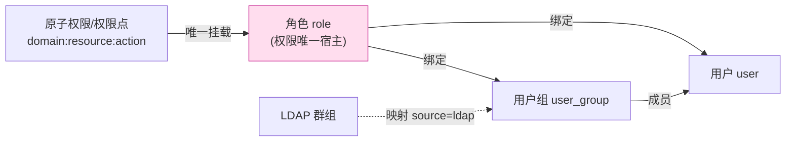
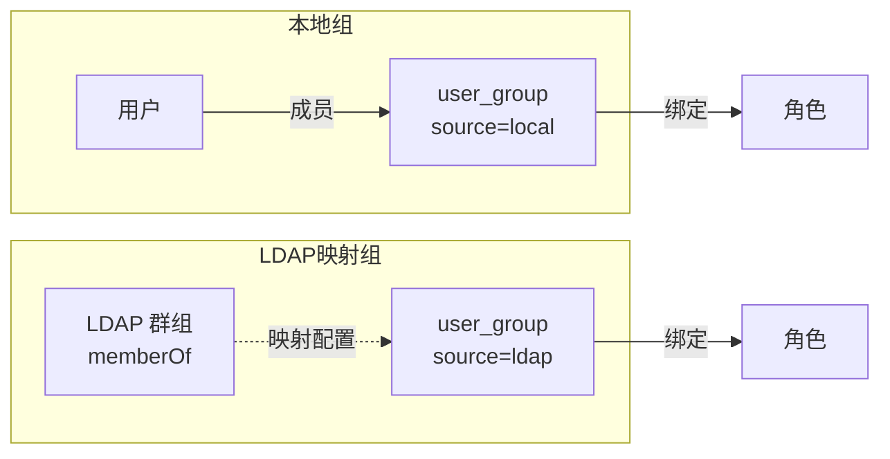
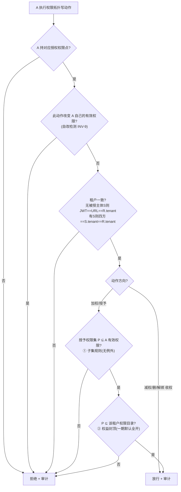

# 授权（RBAC）模块 · 设计（在途）

> 🔒 **已冻结为 RF-1（2026-06-22）**：经逻辑/架构/安全三方**两轮审计**修正后封版，汇总成自包含的
> [`specs/rbac.md`](../../specs/rbac.md)（accepted）。**以 `specs/rbac.md` 为权威基线**；
> 本在途稿仅留作设计过程记录，不再更新。要改请新开 `changes/` 变更、评审后再动。

> 在途设计：尚未冻结。标记：✅已定（已与用户拍板） · 🔶建议(待确认) · ⏭️二期/后续 · ⚠️已接受风险。
> 本文件是**块4 授权 RBAC 一期的自包含设计**，承接 [breakdown.md 块4](../2026-06-platform-foundation/breakdown.md)。
> 与认证的关系：认证（[auth.md](../../specs/auth.md)）只产出"你是谁 + 会话"；本模块判定"你能做什么"。
> **本版已纳入逻辑(critic)/架构(architect)/安全(security)三方审计的修正**（详见各节 ✅ 标注）。
> **基础框架**：gale **无任何授权能力**（已读源码核实：`security.md` 明写"❌ 不做认证/授权"，无 casbin/policy/enforce，go.mod 无授权依赖）。判定/角色/权限**全自建**，仅复用 gale 的 `Redis()`（权限缓存）、单库 gorm（存角色权限）、`JWTMiddleware`（只认证）。**底层数据库**：PostgreSQL。

> **术语**（首次出现即解释）：
> - **RBAC**（Role-Based Access Control，基于角色的访问控制）：权限挂到角色，主体绑角色而非直接绑权限。
> - **原子权限 / 权限点（permission point）**：最小的"能干某事"的许可，如 `tenant:user:create`。
> - **角色（role）**：一组权限点的集合，是权限唯一的宿主与下放媒介。
> - **plane（平面）/ domain（域）**：`platform`（平台运营面）/ `tenant`（租户面）。权限点、角色都带域，两域目录互不混用。
> - **有效权限（effective permissions）**：一个用户经所有角色（直接绑 + 经组绑）汇总、**去重**后的权限点全集。
> - **子集规则（subset rule）/ 不可提权**：授权者只能授出"自己有效权限"的子集，**无任何例外/逃生口**。
> - **自改（self-modification）**：会改变"发起人自己有效权限"的授权动作；本设计**一律禁止**。
> - **四方对齐（four-way tenant match）**：授权动作要求 JWT、URL 路径、被授主体、目标角色四者租户一致。
> - **串谋互授（collusion）**：两个各持授权权的账号互相给对方加权；禁自改挡不住它（见 §5.7 已接受局限）。
> - **entitlement（权益/权限目录封顶）**：平台下发给某租户的"最大可用权限集合"，租户内任何授权不得越出。
> - **data scope（数据范围）**：行级数据权限的范围（如 仅本人 / 本部门 / 全部），本期只留口、不实现。
> - **provisioning（开通供给）**：平台为新租户自动建库、初始化、建首个管理员账号的流程。

---

## 0. 一图看全：主体如何拿到权限



> **铁律 INV-1**：权限的**唯一宿主是角色**；`user`、`user_group` **都只能绑角色**，系统中**不存在**"用户/组直接绑权限"的任何路径。用户最终权限 = §4.3 的去重并集。

---

## 1. 硬不变量（已拍板，焊死）✅

| 编号 | 不变量 | 落点 |
|---|---|---|
| INV-1 | 权限只挂角色；用户/用户组只能绑角色 | §0 |
| INV-2 | 租户可自建角色，但**只能组合平台预定义的权限点**（自建角色为枚举式） | §3.1 |
| INV-3 | 防提权用**子集规则**：授权者只能授出"自己有效权限"的子集；**无任何逃生口** | §5.2 |
| INV-4 | **凡改变权限拓扑的写动作（建/改/删角色、绑角色、改组成员）统一过同一道闸**；"改角色"与"绑角色"是不同权限点 | §5.1/§5.2 |
| INV-5 | 审计 **append-only**（只增不改删）；权限点目录里**不存在** `*:audit:delete`/`*:audit:update` | §2.4/§8 |
| INV-6 | **永不转授**（无委派链）；"谁能授权"纯看其角色是否持有授权类权限点 | §5.4 |
| INV-7 | 权限点分**平台域 / 租户域**两套目录，互不混用；数据层强校验 | §2.1/§7 |
| INV-8 | 多角色取**去重并集**；**纯加法模型，无"拒绝(deny)"权限** | §4.3 |
| INV-9 | **禁止自改**：任何会改变"发起人自己有效权限"（增或减）的授权动作一律拒绝；加权/调权必须由另一账号执行 | §5.5 |

---

## 2. R1 · 权限的原子表示 ✅

### 2.1 权限码：`domain:resource:action`（带域，两套目录）

```
platform:tenant:freeze        # 平台域：冻结某租户
platform:tenant:reset_pwd     # 平台域：重置租户管理员密码
platform:audit:read           # 平台域：查全平台审计
tenant:user:create            # 租户域：本租户建用户
tenant:role:grant_permission  # 租户域：给角色配权限点（授权类，最敏感）
tenant:audit:read             # 租户域：查本租户审计
```

- **域（domain）**：`platform` / `tenant`。**平台内置角色只能含平台域权限点；租户角色（内置+自建）只能含租户域权限点**（INV-7）。即便概念相近（如"查审计"），平台域与租户域也是**两个独立权限点**。
- 平台与租户能力天生有差异（一期虽无具体业务，租户开通/冻结/跨租户操作等是平台独有）——故两套目录从一开始就分开。

### 2.2 三分法：菜单 / 操作 / 数据，职责不同不能混 ✅

| 类别 | 管什么 | 是不是安全边界 |
|---|---|---|
| **菜单权限（menu）** | 前端显示哪些菜单/路由 | ❌ 仅 UI 引导，**不是安全边界** |
| **操作权限（operation）** | 能否调某接口/按钮（增删改、导出…） | ✅ **真正的安全边界，服务端强制** |
| **数据权限（data）** | 能看哪些行/字段 | 本期**只留口**（见 §6） |

> ⚠️ 铁律：**菜单权限只管"看得见"，操作权限才管"做得到"**。把菜单当接口鉴权、或靠前端隐藏按钮当权限控制 = 经典漏洞。**一切授权一律服务端 fail-closed 强制**。

### 2.3 权限点注册表（permission registry）= SSOT

所有权限点集中在**注册表**登记（防拼错、防"权限点爆炸"），存**中心库**（平台是唯一定义方，租户不能新增权限点）。字段：`code`、`domain`、`resource`、`action`、`category`(menu/operation/data)、`is_sensitive`(高敏标记，仅作标注)、`deprecated`、`description`。

### 2.4 权限点生命周期：只软删、code 永不复用（✅ 修审计 M2）

跨库（租户库 `role_permission` 靠 `code` 字符串引用中心库注册表，**无物理外键**——db-per-tenant 跨库做不了外键）带来的"悬空引用 / 标识符复用"风险，用三条规约堵死：

1. **只软删、不物理删**：下线权限点 = 置 `deprecated=true`，**永不 `DELETE`、code 永不复用**——杜绝"旧引用静默复活成新含义"。`deprecated` 的点：判定恒不通过（fail-closed），不再授出。
2. **`domain` / `category` 一经创建不可变**：改语义等于新建一个点（防租户库已存绑定语义被静默改写）。
3. **SSOT 只读分发，禁跨库 JOIN**：租户侧配权校验 `perm_code` 是否存在/有效，查的是**注册表的只读缓存/分发副本**（启动时全量加载到内存/Redis），**绝不让租户库直接 JOIN 中心库**（守控制平面/数据平面分层）。

---

## 3. R2 · 角色体系、内置角色与用户组 ✅

### 3.1 角色作用域、通配最高管理员、自建边界

- **作用域**：`platform`（平台角色，管所有租户）/ `tenant`（租户角色，只管本租户）。
- **通配最高管理员（统一概念）✅**：**超级管理员（平台侧）与 租户管理员（租户侧）是同一概念——"本平面的通配最高管理员"**，各自 `is_wildcard=true`：
  - **超级管理员**：通配**平台域全部**权限。
  - **租户管理员**：通配**本租户域全部**权限（**上限 = 该租户 entitlement**，见 §5.2②）。
  - 二者**无"枚举 vs 通配"歧义、无"权限组成清单"可调**（通配就没有清单）。**解决审计 C2**：平台新增租户域权限点时，租户管理员**自动覆盖**，不会出现"租户内无人能授出新权限"的死锁。
- **系统内置角色**：平台预置，**不可删、不可改信息（名称/备注）**。"非管理类"内置角色（只读、审计员）可在子集规则内增删关联权限点；**通配的管理员无清单可调**。锁死由 **service 层强制**（`is_builtin=true` 的角色，`role:update`/`grant_permission`/`role:delete` 一律拒，不只靠前端不给按钮，✅ 修审计 L2）。
- **租户自建角色**：租户管理员可建，但只能**组合平台预定义的租户域权限点**（INV-2，自建角色为枚举式），且受 §5.2 双天花板约束。
- **角色绑定以 `(user, tenant_code)` 为键**：同一自然人在不同租户可有不同角色，绝不把角色全局挂在用户身上。db-per-tenant 下租户角色绑定天然分库隔离。

### 3.2 内置角色清单（定稿）✅

**平台面（运营面，管所有租户）：**

| 角色 | 能力 | 类型 |
|---|---|---|
| 超级管理员 | 通配平台域全部 | 通配（无清单可调） |
| 平台运营员 | 日常租户运营（开通/冻结/重置密码/配额），**不含**授权管理等系统级危险操作 | 非管理类 |
| 平台只读 | 全局只读（**不含审计**） | 非管理类 |
| 平台审计员 | 全局只读 + 审计查询 | 非管理类 |

**租户面（每租户一套，只管本租户内）：**

| 角色 | 能力 | 类型 |
|---|---|---|
| 租户管理员 | 通配本租户域全部（≤ 权益封顶） | 通配（无清单可调） |
| 租户只读 | 本租户只读（**不含审计**） | 非管理类 |
| 租户审计员 | 本租户只读 + 本租户审计查询 | 非管理类 |

> "只读"与"审计员"拆开 = 提供**职责分离的积木**。⚠️ **但底座不强制互斥**：是否禁止"同一人同时拥有只读+审计"由**业务层自定义**（✅ 修审计 C1，见 §5.6）。

### 3.3 登录基线（非角色）+ fail-closed 接缝 ✅（修审计 M4）

"改自己密码 / 看自己资料"等**自助管理**做成**登录基线**——任何登录用户**天生就有，不靠任何角色**。

- **不设"普通成员"角色**；新建用户 / LDAP 首次登录用户**默认无任何业务角色**，登录进来只能管自己、看不到业务，**等管理员分配角色**后解锁。
- **基线与 fail-closed 的接缝（必须明确，否则无角色用户改密会被误拒）**：基线类端点在路由注册时**显式标记 `baseline=true`**，RBAC 中间件见此标记**直接放行**（但仍要求**会话有效** + **强制 `resource.owner == subject.sub`**，即只能操作自己，防"借基线改他人密码"）。基线白名单是**显式注册**的，不靠在中间件里特判 URL。
- LDAP 影子账号密码在 AD、不在本地，"改密"对其不适用（由 auth 侧处理）。

### 3.4 用户组（user_group）：批量绑角色 + LDAP 映射载体



- **定位**：用户组是"角色的批量绑定载体"。给组绑角色，组内用户继承组的角色。
- **`source`**：`local`（手工建、手工拉人）/ `ldap`（由 LDAP 群组映射而来）。
- **LDAP 映射（多一跳解耦）**：配置 `LDAP 群组(DN/CN) → user_group`；LDAP 用户登录（JIT 建影子账号，见 auth.md §5）时解析其 `memberOf` → 命中映射 → 归入对应组 → 继承组的角色。**LDAP 群组不直接映射角色，而是 `ldap群组 → user_group → role`**。
- **不变量**：组也只能绑角色（INV-1），组不持有权限。
- **⚠️ 防提权关键**：往组里**加成员（`group:manage`）**、**给组绑角色（`group:assign_role`）** 都是"改变权限拓扑"的写动作，**必须过 §5.2 统一闸**（否则"把人塞进高权组"即绕道提权，✅ 修审计 H2）。
- 🔶 **排期**：一期做 user_group 实体 + 本地手工绑角色；**LDAP 自动映射同步逻辑二期落**（与 auth.md §5 一致）。

---

## 4. R3 · 运行时判定与强制 ✅

### 4.1 统一判定接缝：`Enforce`（service 层，三态留口，契约 err=Deny）

判定收口到一个**领域 service 层**接口（中间件=适配器调用它，它读 repository，依赖单向指向内核，✅ 修审计一般5）：

```go
// Effect 零值必须是 Deny（漏赋值即拒，绝不默认放行）
type Effect int
const ( Deny Effect = iota; Allow; Conditional ) // Deny=0
type Decision struct {
    Effect Effect      // 一期只返回 Deny/Allow；Conditional 为 §6 数据级权限留口，一期永不返回
    Filter *DataFilter // 仅 Conditional 用（一期恒为 nil）
}
// 契约：err != nil 时，调用方必须丢弃 Decision 并按 Deny 处理；中间件先判 err（✅ 修审计 M3）
// subject/resource 用结构体而非裸字符串，预留 attrs（owner/dept/tenant_code），一期只填 tenant_code
func Enforce(ctx, subject Subject, resource Resource, action string) (Decision, error)
```

### 4.2 强制中间件：fail-closed + 四方租户校验

- 链路：gale `JWTMiddleware`（验签，只认证）→ 业务会话中间件（查 `sess:{sid}` + **租户状态门**，见 auth.md §2 / tenant.md）→ **RBAC 中间件**：取操作所需权限点 → `Enforce` → 不通过即拒。**租户状态门在前**（锁定直接拒、不进 RBAC）。
- **fail-closed**：判定出错（`err!=nil`）、缓存缺失、权限点未登记/已 `deprecated`、用户无角色、`Decision` 零值——**一律拒绝**，绝无"出错放行/默认 allow"。
- **跨租户校验**：
  - 普通资源访问：`JWT.tenant_code == URL.{tenant_code} == 资源所属租户`，任一不一致即拒。
  - **授权类动作（绑角色/改组成员等）= 四方对齐**（✅ 修审计 H3）：`JWT.tenant_code == URL.{tenant_code} == 被授主体S.tenant == 目标角色R.tenant`；**S/R 的租户从权威存储读取后再比对，严禁只信前端 body**（防 TOCTOU 串权）。
  - **平台域操作租户库**（如 §5.3 超管经租户数据源写）是**显式例外**，单独走"平台→指定租户"的归属断言 + 强审计，不得借此绕过四方校验。

### 4.3 有效权限 = 去重并集，纯加法无 deny（INV-8）

```
有效权限(用户) = 去重( 直接绑的各角色权限点 ∪ 各所属用户组下各角色权限点 )
```

- **纯加法**：权限只有"有/没有"，多角色并集累加；**绝不引入"拒绝(deny)"负权限**。要限制就靠"不给"，而非"给一个禁止"。紧急止血靠 auth.md §2.8 的**踢人/禁用/解绑**（✅ 修审计 L4）。
- 这个"去重有效权限集"两处要用：① 判用户能否干某事；② §5.2 子集规则里"授权者自己有哪些"。
- **⭐ 通配角色特判（必须，否则功能 bug）**：`is_wildcard` 角色（超管 / 租户管理员）**没有 `role_permission` 行**——其有效权限**不能按上面的并集公式算**（会得空集 → 通配管理员反被 fail-closed 自己拒掉一切）。**通配角色有效权限 = 该 plane 注册表中当前全部 `operation` 类权限点（排除 `deprecated`）∩ entitlement(本租户)**，由判定时**专门分支动态展开**，不经 `role_permission` 枚举。`Enforce`、§4.3 并集、§5.2 子集判定遇 wildcard 主体均走此分支。
- **🔌 data_scope 留口的算法声明（✅ 修审计 M1）**：一期去重**按 `perm_code`**。**未来 data_scope 激活后，去重并集需升级为"按 `perm_code` 分组 + data_scope 取最宽并集"**（`all > dept_and_sub > dept > self`；`custom` 另定合并规则）——这是**算法升级（不是填值）**，本期显式记此留口，避免误以为"填字段即可、不改判定逻辑"。

### 4.4 缓存与即时生效（JWT 不烤权限，失效=删 key）✅

- **JWT 只带身份**：`sub` / `tenant_code` / `plane` / `sid`。**绝不把权限点烤进 token**。
  - ⚠️ **`role_id` claim 治理（✅ 修审计 H4 / 架构致命1）**：auth.md §2.4 的 `AuthClaims.RoleID` 在 RBAC 下**不承载授权语义**——单个 `role_id` 装不下"多角色"，且会诱导"读 token 角色走判权捷径"绕过即时撤销。**明令：`claims.RoleID` 仅供 UI 提示/日志，严禁作为任何 `Enforce` 判定输入**；判权一律运行时按 `(user, tenant_code)` 重算。建议加架构适应度函数扫描"禁止 `claims.RoleID` 流入 Enforce/中间件"。
- **细粒度权限运行时取**：按 `(user, tenant_code)` 算"有效权限集"，**只缓存到 `gale.Redis()`、禁进程内本地缓存**（避免 auth.md §3 `DefaultMemStore` 式进程内陷阱），key `{plane}:perm:{userId}`（含 `t:{tenant_code}` 段、无项目名）。
- **即时生效 = 失效（删 key）**（✅ 修审计 M4 / 架构严重4）：
  - **失效即删 Redis key**（单一数据源，多实例下次查落空，天然一致；不用进程内缓存广播）。
  - **失效扇出必须完整**：改某角色权限组成（`grant_permission`）影响的是"所有直接绑该角色 + 经组绑该角色的全部用户"。🔶 **失效机制主从（实现期定，推荐 `role.version` 为主）**：缓存里记下算权时各 role 的 `version`，**判定时比对版本不符即重算**——这样改角色只需 `version+1`（一次写），**无需逐个删成千上万个 key**（避免大角色变更打爆 Redis 的写放大尖峰）；"反查 `role→users`（含组展开）逐个删 key"降为**可选的主动预热**，超大扇出（>阈值）直接跳过、靠 version 自然失效。
  - 用户禁用/踢人复用 auth 会话中心化撤销（删 `sess:{sid}`），权限缓存随 TTL 自然过期即可（会话已没，无害）。
- 🔶 缓存 TTL 建议 30–60s + 变更主动失效；具体值实现期定。
- **`role_id` 适应度函数用正向白名单（✅ 修审计 L-NEW-2）**：扫描规则应是"`Enforce`/中间件的判权入参**只能来自运行时 `(user, tenant_code)` 重算结果**"（正向白名单），而非"禁字段名 `claims.RoleID`"（黑名单）——后者可被 `rid := claims.RoleID; enforce(..., rid)` 的中间变量绕过。

### 4.5 ⚠️ 改角色的权限传导（已接受、显式声明）

角色是**可变共享对象**：有人对角色 R 执行 `grant_permission` 把它改大，**所有绑 R 的用户即时获得新权限**（缓存失效后立即扩散）。这是 RBAC 共享角色的**固有语义**，本设计**显式接受**，防护靠：① `grant_permission` 是高敏授权动作、过 §5.2 统一闸（加入的权限必 ⊆ 改角色者有效权限）；② **全审计可回溯**；③ 通配管理角色锁死、不可被改。读者须知：缓存即时失效会让这种传导**立即生效**（是特性不是 bug）。

---

## 5. R4 · 委派授权与防提权（核心）✅

### 5.1 授权动作 = 同构权限点，读写分离、配权与绑角分离

```
tenant:role:read            tenant:role:create   tenant:role:update   tenant:role:delete
tenant:role:grant_permission     # 给角色配/改权限点（改"角色长什么样"）
tenant:user:assign_role          # 把已有角色绑到人（改"谁拥有这个角色"）
tenant:group:assign_role         # 给用户组绑角色
tenant:group:manage              # 管理组成员（建组/删组/拉人进组/移除）
（平台域同理：platform:role:* / platform:user:assign_role …）
```

- **"改角色"vs"绑角色"是两件事**：前者改"角色里装哪些权限"，后者把"已存在的角色挂到人身上"。拆成不同权限点，可做到"能分配现成角色但不能改角色权限组成"。
- `tenant:group:manage` 含"拉人进组"——它**改变组成员的有效权限**，故同属"权限拓扑写动作"，必过 §5.2 统一闸。

### 5.2 统一防提权闸：覆盖一切"改变权限拓扑的写动作"（✅ 修审计 H1/H2）

> **要害（设计自身教训）**：很多系统只防"绑角色"漏了"建角色/改组成员"，留后门。本设计**不逐动作列举，而把所有改变权限拓扑的写动作收口到同一道闸**：建/改/删角色、绑角色（给 user / group）、改组成员，**全部**过下面的判定。

> **🔑 按方向分裂（✅ 修审计 S1）**：① 通用前置（持授权点 + 非自改 + 租户一致）对**所有动作**都查；② 子集规则①与权益封顶②**只对"加权方向"（授予/新增权限）施加**——"减权方向"（删角色 / 改角色减权 / 解绑 / 移除组成员）是**收权、不产生新权力**，**不套子集与封顶**（否则正当的"清理越界权限/降权"会被防提权闸误拒，且与 §5.6"清理越界点"自相矛盾）。



**各动作的方向与"授予权限集 P"取法**（统一判定，无遗漏）：

| 动作 | 方向 | 授予权限集 P（仅加权方向过 ①②） |
|---|---|---|
| 建角色 / 改角色加权（含 `grant_permission`） | 加权 | 新增的权限集 |
| 绑角色给 user（`assign_role`） | 加权 | 该角色的权限集 |
| 绑角色给 group（`group:assign_role`） | 加权 | 该角色的权限集 |
| 拉人进组（`group:manage` 拉人） | 加权 | 该组当前绑定角色的权限并集 |
| 改角色减权 / 删角色 | 减权 | —（不过 ①②；**内置角色禁删** §3.1） |
| 解绑角色 / 移除组成员 / 删组 | 减权 | —（不过 ①②） |

**自改检测（所有动作统一，精确对齐 INV-9，✅ 修审计 S2/S3）**：判据是"**此动作是否改变 A 自己的有效权限（差集非空，增或减）**"，而非"A 是否绑了该角色"。判定"A 是否经此动作受影响"时，**A 与角色/组的关系按全部路径展开**——直接绑 + 经组绑（含未来 LDAP 映射入组，与 §4.3 有效权限展开口径一致）。
> 实现期**允许用保守近似**"凡 A 直接/间接持有(绑/属)该角色或组即拒"代替精确差集计算（更严、可能误拒纯维护，作为已接受取舍）；但**文档以 INV-9 精确语义为准**。

判定式（按方向）：
```
通用前置(所有动作): A 持对应授权权限点
                  ∧ ¬自改(此动作不改变 A 的有效权限)   # INV-9
                  ∧ 租户一致(无被授主体S则 JWT==URL==R.tenant；有S则四方 ==S.tenant==R.tenant)
加权方向额外:      ∧ P_授予 ⊆ A.有效权限               # ① 子集规则（无任何逃生口）
                  ∧ P_授予 ⊆ entitlement(A.租户)      # ② 权益封顶（一期默认全集，见 §5.6）
减权方向(收权不提权): 无 ①② 封顶（删/减/解绑只需通用前置）；内置角色禁删
# 有效权限按"动作那一刻"实时计算（不用历史缓存判定），防时序绕过
```

> **无 escalate 逃生口（✅ 决策 17）**：子集规则是应用层**绝对铁律、无例外**。平台搭建初始数据走 **DB 账号执行 SQL 的运维通道（应用之外、不经 Enforce）**，不在 RBAC 判定体系内——在应用层留"提权豁免口"等于开后门，故**永不做**。

### 5.3 权威根、bootstrap 与首个管理员账号 ✅（修审计 H4-架构严重2 / L1）

- **权威根**：超级管理员是平台侧权威根（provisioning/DB 直写内建，不靠"被授予"，否则无限递归）。
- **bootstrap 种子归属**：**块4 提供"内置角色 + 初始权限组成"的种子定义；块2 在租户开通（provisioning）时执行**（随租户库 schema 初始化一起灌）。种子灌入**必须幂等可重入**，失败纳入 [tenant.md](../../specs/tenant.md) "初始化失败 → 看门狗重试"语义。
  - **bootstrap 直写 ≠ 运行时判定**：种子是 provisioning 的 SQL 直写（数据层），不经 `Enforce`，与"子集规则/逃生口"是两个层面，不可混谈。
  - **⚠️ 风险归属声明（✅ 修审计 M-NEW-2）**：子集规则做成"无逃生口"后，**这条 DB 直写通道成为系统唯一绕过全部 RBAC、不留 Enforce 审计的权力源**。其访问控制（凭据按 `migrate`/`app`/`admin_reset` **三拆最小权限** + 高危操作**双人复核** + 堡垒机/IP 白名单 + 操作审计）是**硬要求**，归 [tenant.md](../../specs/tenant.md) §9 / 块7；RBAC 侧确认**不在应用层为其留任何等价能力**。🔶 建议推动 tenant.md §9 的"凭据三拆 + 双人复核"由 🔶 升为 ✅（属块2/块7 决策，RBAC 侧只点名依赖）。
- **首个管理员账号（✅ 决策 18）**：租户侧**仅** provisioning 创建"**第一个默认管理员账号**"（一个**普通账号 + 通配租户管理员角色**），走 auth §4 的**激活/设密一次性 token**（**无默认口令、无硬编码后门**）。平台侧超管账号同理。**系统不留任何后门/隐藏/特殊账号**——"管理员账号"就是个持通配角色的普通账号，受全部规则约束、全程审计。

### 5.4 永不转授（INV-6）✅

- **不提供"再转授"机制**（无 SQL `WITH GRANT OPTION` 委派链）——回收是噩梦（连锁撤销、孤儿授权），两层足够。
- **"谁能授权"纯看其角色是否持有授权类权限点**：要让某人也能授权，由上级给他配上授权类权限点（成"二级管理员"），照样被子集规则 + 禁自改兜底——**显式、可见、可审计**。

### 5.5 禁止自改（INV-9）✅ 决策 19

- **任何会改变"发起人 A 自己有效权限"（增或减）的授权动作一律拒绝**；加权/调权必须由**另一个账号**执行。三条路全堵：① 给自己绑角色；② 改"自己持有的角色"加/减权；③ 把自己加进高权组 / 改自己所在组的角色。判定见 §5.2 的"自改检测"列。
- **理由是治理而非防提权**（提权已由子集规则封死）：四眼原则 + 清晰"他授链"（权力授予永远"别人→我"，可追溯问责）。
- **不死锁**：通配管理员开局即拥有本平面全部、**永不需要自改**；二级管理员"由上级授予"正是正确模式；首个管理员由平台创建。

### 5.6 权益封顶（②天花板）= 运行时持续不变量 ✅（修审计 M3/M5）

- **一期默认全开**：当前是通用底座、无具体业务，所有租户域权限对所有租户开放。`tenant_entitlement` **无该租户行 ⟺ 全集放行**（明确判定约定，避免"空表=空集"误拒）。
- **未来按租户开通**：CMDB / 数据看板等业务功能出现时，在 provisioning 给该租户填 entitlement 清单，门自动收紧。
- **持续封顶（不只准入）**：entitlement **收紧**时存量可能越界，故 `Enforce` 运行时也叠加 **`有效权限 ∩ entitlement`** 做持续过滤（不只在授权动作时校验），收紧即生效；并提供"收紧时扫描该租户角色、标记/清理越界权限点"的运维动作。
- **热路径缓存（✅ 修审计 N2，守分层）**：entitlement 同样**只读缓存到 `gale.Redis()`**（对齐 §2.4 SSOT 只读分发，**禁租户请求热路径直连中心库**），key 如 `entitlement:{tenant_code}`。**一期无该租户行 → ∩ 短路跳过（∩ 全集=自身，零成本）**；未来收紧时失效该租户 entitlement 缓存。
- **数据层强校验 INV-7（✅ 修审计 M5）**：`tenant_entitlement` 与租户角色 `role_permission` **只接受 `domain='tenant'` 的 code**，写入时强校验；平台域权限点绝不进租户侧。

### 5.7 内置管理角色锁死 + 已接受局限 ✅

- 通配管理角色无清单可调（§3.1）；内置角色不可删不可改信息，锁死由 service 层强制。
- **读/改授权动作分离**（`role:read` ≠ `role:update`/`grant_permission`），默认只给读。
- **互斥（SoD）归业务层**（✅ 决策 16）：底座只提供可拆分的角色，**不强制互斥**；是否禁"同一人兼只读+审计"等由业务层自定义。
- ⚠️ **已接受局限：串谋互授（✅ 决策 20）**：禁自改挡"单人自我加权"，**挡不住"两个各持授权权的账号互相给对方加权"**——但被 ① 子集规则封顶（不产生两人原有之外的新权力，系统总权力不增）+ ② 全审计可见 兜底。彻底防串谋需业务层 SoD（底座不做）。

### 5.8 授权动作全审计 ✅

配权 / 绑角 / 改组成员 / 建删角色 / **被拒的尝试** / **跨租户尝试（即便被拒）** / 自改尝试 / 平台跨租户写 → **全部进块6 审计**（who / when / 对谁 / 改了什么 / 哪个租户）。审计 append-only（INV-5），权限点目录无 delete/update；**物理不可改归块6/块7**（DBA 直连篡改不在 RBAC 防护范围，✅ 修审计 L3）。

---

## 6. R5 · 数据级权限留口（本期只留口，不实现）🔶

目标：一期纯 RBAC（布尔判定），但接缝与数据模型对齐"未来三态条件式授权"，加行级/字段级时不推倒重来。五处留口：

1. **三态 `Decision`**（§4.1）：`Deny/Allow/Conditional`，一期永不返回 Conditional。
2. **资源标识规范化** `Resource = {kind, id, tenant_code, attrs}`：未来行级条件引用 `resource.attrs.dept_id`，**不像若依 `@DataScope` 硬编码列名**。
3. **角色绑定预留 `data_scope` + `constraint(JSONB)`**：挂 `user_role`/`user_group_role`，一期全 `all`（不生效）；未来填值即激活，不改表结构。`data_scope` 枚举：`all`/`dept`/`dept_and_sub`/`self`/`custom`（其中 `dept`/`dept_and_sub` **依赖块8 组织模型**，一期仅 `all` 生效，其余值随块8 落地再定，✅ 修审计一般6）。**注意 §4.3 的去重并集算法届时需升级（不是纯填值）**。
4. **数据访问层"过滤注入点"**：列表查询走统一 repository，预留授权过滤挂载点（一期 no-op）；未来 `Conditional` 时把条件翻成**参数化 WHERE** 注入。
   - **🔒 必须防"标识符注入"（✅ 修审计 M6）**：`constraint(JSONB)` 未来翻 WHERE 时，**值走参数绑定，但列名/操作符不能参数化**——故必须经 **字段白名单 + 操作符白名单 + 用 `resource.attrs` 规范化的列映射**（列名只能取自后端登记的允许列集，绝不取自 JSONB 自由字段名）；`constraint` 写入时即按 JSON Schema 校验。**不只防值注入，还要防列名注入**。
5. **字段级可见性钩子**：DTO 序列化层预留钩子（一期全可见），未来按判定做字段脱敏。

> ⏭️ **PostgreSQL RLS（行级安全）** 为未来可选项：db-per-tenant 已物理隔离租户，RLS 的价值是"租户库内部部门/owner 行级过滤"，非租户隔离。采用与否待数据级权限正式立项评估（注意复合索引 `(dept,id)`、`SET LOCAL` 连接池泄露、勿用 `BYPASSRLS`）。

---

## 7. R6 · 存储分布（贴合 db-per-tenant）✅

| 数据 | 存哪 | 理由 |
|---|---|---|
| 权限点注册表（全局，含平台域+租户域所有点） | **中心库** | 平台唯一定义方，全局唯一 SSOT |
| 平台角色 + 平台角色↔权限 + 平台用户↔角色 | **中心库** | 平台运营面主体 |
| 租户内置/自建角色 + 角色↔权限 + 用户↔角色 + 用户组及成员 | **各租户库** | 租户私有，随租户库走，天然隔离 |
| 租户 entitlement（权益封顶清单） | **中心库** | 平台维护、租户不可改（一期无行=全集） |

> 跨库引用靠 `code` 字符串约定（无物理外键），由 §2.4 的"软删 + SSOT 只读分发"保证一致。

### 7.1 数据模型草案（PostgreSQL · DDL 骨架）🔶

> 仅结构骨架，索引/约束实现期细化。键内不含项目名。**`role.scope` 与库归属必须一致**（中心库恒 `platform`、租户库恒 `tenant`，由 provisioning 保证，防平面漂移）；**`user_id` 始终指向本库用户表**（租户内独立）。

```sql
-- ===== 中心库 =====
CREATE TABLE permission_point (
  code         TEXT PRIMARY KEY,              -- domain:resource:action（永不复用）
  domain       TEXT NOT NULL,                 -- platform | tenant（创建后不可变）
  resource     TEXT NOT NULL,
  action       TEXT NOT NULL,
  category     TEXT NOT NULL,                 -- menu|operation|data（创建后不可变）
  is_sensitive BOOLEAN NOT NULL DEFAULT false,
  deprecated   BOOLEAN NOT NULL DEFAULT false,-- 软删（永不物理 DELETE）
  description  TEXT,
  created_at   TIMESTAMPTZ NOT NULL DEFAULT now()
);
CREATE TABLE tenant_entitlement (             -- 无某租户行 ⟺ 该租户全集放行
  tenant_code  TEXT NOT NULL,
  perm_code    TEXT NOT NULL REFERENCES permission_point(code),  -- 强校验 domain='tenant'
  PRIMARY KEY (tenant_code, perm_code)
);

-- ===== 角色与绑定（中心库存 scope=platform；各租户库存本租户，表结构同构）=====
CREATE TABLE role (
  id           BIGSERIAL PRIMARY KEY,
  code         TEXT NOT NULL,
  name         TEXT NOT NULL,
  scope        TEXT NOT NULL,                 -- platform | tenant（与库归属一致）
  is_builtin   BOOLEAN NOT NULL DEFAULT false,-- 内置(不可删/不可改信息)
  is_wildcard  BOOLEAN NOT NULL DEFAULT false,-- 通配最高管理员(超管/租户管理员)；仅内置可为 true
  version      BIGINT  NOT NULL DEFAULT 1,    -- 权限组成变更自增，供缓存失效比对
  remark       TEXT,
  created_at   TIMESTAMPTZ NOT NULL DEFAULT now(),
  UNIQUE (scope, code),
  CHECK (NOT is_wildcard OR is_builtin)       -- 通配只能是内置（防自建通配角色）
);
CREATE TABLE role_permission (
  role_id      BIGINT NOT NULL REFERENCES role(id),
  perm_code    TEXT NOT NULL,                 -- 引用注册表(跨库靠 code)；强校验 domain 与 scope 一致
  PRIMARY KEY (role_id, perm_code)
);
CREATE TABLE user_role (                      -- 用户↔角色(直接绑定)；租户库内 tenant 隐含于库
  user_id      BIGINT NOT NULL,
  role_id      BIGINT NOT NULL REFERENCES role(id),
  data_scope   TEXT NOT NULL DEFAULT 'all',   -- 留口: all|dept|dept_and_sub|self|custom
  constraint_  JSONB,                         -- 留口: 未来 ABAC 条件
  granted_by   BIGINT,                        -- 授权者(审计/复查)
  granted_at   TIMESTAMPTZ NOT NULL DEFAULT now(),
  PRIMARY KEY (user_id, role_id)
);

-- ===== 用户组（各租户库）=====
CREATE TABLE user_group (
  id           BIGSERIAL PRIMARY KEY,
  name         TEXT NOT NULL,
  source       TEXT NOT NULL DEFAULT 'local', -- local | ldap
  ldap_ref     TEXT,                          -- source=ldap 时的 LDAP 群组 DN/CN
  created_at   TIMESTAMPTZ NOT NULL DEFAULT now()
);
CREATE TABLE user_group_member (
  group_id     BIGINT NOT NULL REFERENCES user_group(id),
  user_id      BIGINT NOT NULL,
  PRIMARY KEY (group_id, user_id)
);
CREATE TABLE user_group_role (                -- 组↔角色(组只能绑角色)
  group_id     BIGINT NOT NULL REFERENCES user_group(id),
  role_id      BIGINT NOT NULL REFERENCES role(id),
  data_scope   TEXT NOT NULL DEFAULT 'all',   -- 留口
  constraint_  JSONB,                         -- 留口
  PRIMARY KEY (group_id, role_id)
);
```

> **存量绑定处理**：自建角色 `role:delete` 时，先校验/清理其 `user_role`、`user_group_role` 存量绑定（拒删或级联，实现期定，🔶）；内置角色禁删。并发改同一角色权限组成用 `role.version` 乐观控制（🔶）。

---

## 8. R7 · 与其他模块的衔接面 ✅

| 模块 | 衔接点 |
|---|---|
| **块3 认证（auth.md）** | 认证只产身份+会话；本模块判权。`claims.RoleID` 不入判权（§4.4）。LDAP 群组→user_group 映射（一期预留、二期落）；用户禁用/AD 禁用 → 删 `sess:{sid}`（复用会话中心化撤销）。紧急止血靠 auth §2.8 踢人/禁用 |
| **块6 审计** | 授权动作全审计含被拒尝试（§5.8）；审计 append-only（INV-5）、**物理不可改归块6/块7** |
| **块5 业务数据访问底座** | 数据级权限"过滤注入点"落块5 仓储统一 scope（§6 留口，通过 `Decision.Filter` 返回值解耦，无环）；业务实体 owner/dept 归属属性由块5 提供 |
| **块2 运营中心** | 租户 entitlement 由平台维护（一期全集）；**内置角色/权限种子由块4 定义、块2 provisioning 执行（幂等、失败重试）**；未来业务功能在"创建租户"环节按租户开通 |
| **块8 组织/部门** | data_scope 的"部门"维度依赖块8 组织模型（一期扁平/预留，仅 `all` 生效） |
| **登录基线** | 自助管理（改密/看己料）不走 RBAC、显式标记豁免 + 强制 owner==self（§3.3） |

---

## 9. 一期 做 / 不做

**一期做**：
- 权限点 `domain:resource:action` + 三分法 + 中心库注册表（软删、code 永不复用、SSOT 只读分发）。
- 角色体系（平台/租户作用域、内置角色清单、通配最高管理员、租户自建枚举角色）。
- 用户、用户组（本地）、绑定（user↔role、group↔role、user↔group）；有效权限去重并集。
- `Enforce`（service 层、三态预留、err=Deny 契约）+ fail-closed 中间件 + 四方租户校验 + Redis 缓存（失效=删 key + 扇出反查）。
- 委派授权：**统一防提权闸覆盖一切权限拓扑写动作**（建/改/删角色、绑角色、改组成员）+ 子集规则（无逃生口）+ 权益封顶接缝（运行时持续 ∩）+ 永不转授 + **禁自改** + 内置管理角色锁死 + 授权全审计。
- 数据级权限**五处留口**（不实现）。

**一期不做 / ⏭️二期**：
- ⏭️ 数据级权限（行级/字段级）实际实现、RLS。
- ⏭️ LDAP 群组→user_group 自动映射同步。
- ⏭️ entitlement 的实际权益管理界面（一期默认全集）。
- ❌ **escalate 逃生口（永不做）**；❌ 转授链（永不做）；底座层**互斥/SoD（归业务层）**。

---

## 10. 🔶 待确认清单（实现期逐项定）

1. 缓存 key/TTL 具体值（建议 `{plane}:perm:{userId}`，30–60s）；**失效机制主从**（推荐 `role.version` 为主、扇出删 key 为可选预热，超大扇出跳过，见 §4.4）。
2. 高敏权限点（`is_sensitive`）的具体清单（仅标注用）。
3. 权限点完整清单（平台域 + 租户域逐条）——随功能点补全，注册表为准。
4. 内置角色 `code` 与初始权限组成种子数据（块4 定义、块2 执行）。
5. 自建角色 `role:delete` 的存量绑定处理（拒删 vs 级联）；**`role.version` 自增时机**：仅在角色权限组成（`role_permission`）变更时自增；绑定关系（`user_role`/`user_group_role`）变更走各自 user key 失效、**不动** `role.version`（✅ 修审计 N3）。
6. **授权动作"读权威存储→比对四方→写"须在单事务内 + 关键行加锁**（`SELECT … FOR UPDATE` 或复用 `role.version` 乐观锁），消除比对后写入前的极窄 TOCTOU 竞态（✅ 修审计 L-NEW-1）。

---

## 11. 关联决策与外部出处

**ADR**：D2 [ADR-0005] 运营中心与 RBAC 定位；待补 RBAC 专项 ADR（统一防提权闸 + 禁自改 + 永不转授 + 数据级留口）。

**外部权威出处**：
- NIST RBAC：[CSRC RBAC FAQ](https://csrc.nist.gov/projects/role-based-access-control/faqs)、[职责分离术语](https://csrc.nist.gov/glossary/term/separation_of_duty)
- 管理型 RBAC / 防提权：[ARBAC97 (Sandhu et al.)](https://www.profsandhu.com/cs6393_s16/SBM-1999.pdf)、[Kubernetes RBAC（escalate/bind 子集规则）](https://kubernetes.io/docs/reference/access-authn-authz/rbac/)、[K8s RBAC Good Practices](https://kubernetes.io/docs/concepts/security/rbac-good-practices/)、[AWS IAM PassRole](https://aws.amazon.com/blogs/security/how-to-use-the-passrole-permission-with-iam-roles/)
- 多租户 RBAC：[WorkOS](https://workos.com/blog/how-to-design-multi-tenant-rbac-saas)、[Permit.io 多租户授权](https://www.permit.io/blog/best-practices-for-multi-tenant-authorization)
- 数据级权限：[Cerbos Query Plans](https://www.cerbos.dev/blog/filtering-database-results-with-cerbos-query-plans)、[若依 @DataScope 剖析](https://www.cnblogs.com/kisshappyboy/p/17980084)、[Postgres RLS 局限](https://www.bytebase.com/blog/postgres-row-level-security-limitations-and-alternatives/)
- JWT 不烤权限：[Permit.io JWT 授权](https://www.permit.io/blog/how-to-use-jwts-for-authorization-best-practices-and-common-mistakes)、[Cerbos 反 token 授权](https://www.cerbos.dev/blog/the-case-against-token-based-authorization)

---
↑ [返回 changes 索引](../README.md)
