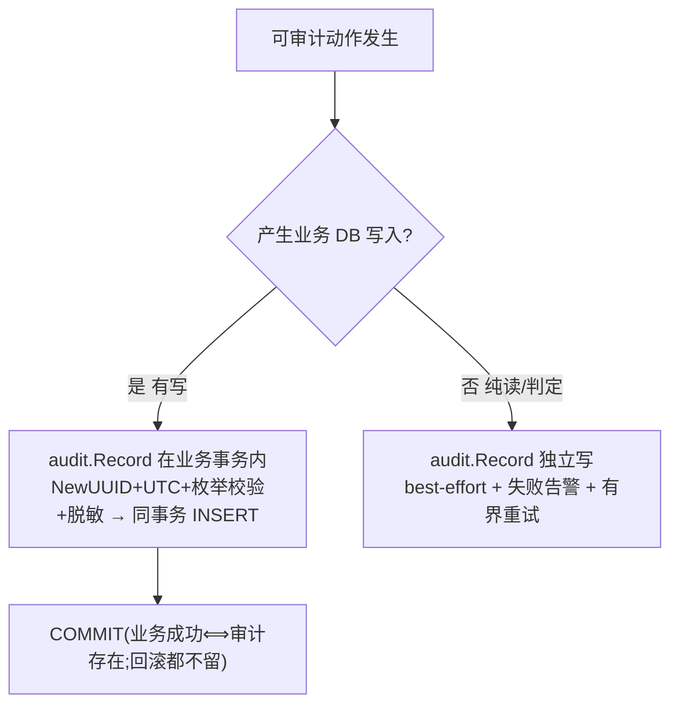

# 审计（Audit）模块设计

> 🔒 **设计冻结 AUF-1（Audit Freeze 1 · 2026-06-22）**：块6「审计」一期设计在此**封版冻结**。
> - **冻结即基线**：经逻辑(critic)/架构(architect)/安全(security)**三轮三方审计**修正后封版。
> - **🔶建议保持"建议"**：标 🔶 的项不在冻结时强制拍成"已定"，作为推荐保留、留待实现期逐项确认。
> - **解冻方式**：要改审计设计，在 `changes/` 新开一条变更说明动机、评审后再改，并更新本冻结版本号。
> - **命名提示**：冻结标记 **AUF-1** 与正文不变量编号 **AU-1…AU-9** 是两回事（前者=封版版本，后者=设计不变量）。

> 本文件是**块6 审计 一期的自包含设计**（已确认 / 冻结），承接 [breakdown.md 块6](../changes/2026-06-platform-foundation/breakdown.md)、落实 [ADR-0006](../architecture/decisions/0006-audit-unified-stream.md)。
> **定位铁律**：审计 = **面向合规、可追责、对外不可改的"谁何时对谁做了什么"业务事件**；**≠ 排障应用日志**（后者用 gale `log`）。
> 标记：✅已定 · 🔶建议(待确认) · ⏭️二期/后续 · ⚠️已接受风险。
> **基础框架**：gale **无业务审计模块**（已核实）；本模块自建，复用 gale：`log`（旁路排障）、`trace_id`（关联，`GetTraceIDFromCtx`）、`genx.NewUUID`（`event_id`）、`SHA256/HMAC`（未来哈希链）。**底层数据库**：PostgreSQL。

> **术语**（首次出现即解释）：
> - **审计记录**：一条不可篡改的合规事件记录。**可追责性**：把动作唯一追溯到责任主体。
> - **STI（单表继承）**：所有事件存一张表，`event_type` 判别 + `JSONB` 放专属字段。
> - **W5H 六要素**：who/when/what/object/outcome/source —— 合规审计核心。
> - **同事务强一致**：审计与业务变更绑一个 DB 事务，要么都成、要么一起回滚。**best-effort**：尽量写、写不成不阻断业务，只告警 + 重试。
> - **append-only（只追加）**：表只插新行、不改不删。**哈希链**：每条指纹含上一条指纹，改历史即可检测。
> - **audit 自有 outbox**：审计模块**自己**的"待镜像/待传播"发件箱 + 轻量中继（≠ Dispatch 的 outbox，不构成环）。
> - **PII**：能识别到自然人的信息。**plane**：`platform`（中心库）/ 租户面（各租户库）。

---

## 1. 硬约束 / 不变量（已拍板，焊死）✅

| 编号 | 不变量 | 落点 |
|---|---|---|
| AU-1 | **单表 STI**：所有事件入 `audit_log`，`event_type`（`域.对象.动作`）判别 + `details JSONB` | §3/§4 |
| AU-2 | **统一写入封装层**：业务**禁止裸写审计表**，一律走 `audit.Record`（生成 id / UTC / 枚举校验 / 脱敏 / 控制字符过滤的唯一落点） | §5/§6 |
| AU-3 | **写入分级**：判据 = **该动作是否已在某业务 DB 事务边界内**（写 Redis/缓存**不算**）。**在事务内 → 审计同事务强一致**（绝不丢）；**纯判定/读、或写只落 Redis/缓存 → best-effort 独立写 + 告警 + 有界重试**（写失败不回滚业务，解"审计=业务 DoS 单点"）。事件档位对照见 §5 | §5 |
| AU-4 | **对外只读**：审计对前端/外部只读；写入只由程序内部完成；**查询/导出同样走绑定连接 + 归属断言、租户面绝不跨库** | §5/§8 |
| AU-5 | **应用层 append-only**：封装层**只 INSERT、永不 UPDATE/DELETE**；**状态推进（如重置密码 pending→confirmed）用追加新行**（共享 `correlation_id`）**而非 UPDATE**；适应度函数扫描禁止对 `audit_log` 改删 | §6.x/§7 |
| AU-6 | **敏感脱敏（白名单 + 值扫描双层）**：`details` 只允许**登记字段**入库（未登记拒入/脱敏）+ **值级模式扫描**（JWT/密钥前缀/长串/邮箱/手机）；`reason_message`/`target_name` 等自由文本**不豁免**；**密码/令牌/密钥绝不入**；PII 存内部 `actor_id` | §6.3 |
| AU-7 | **时间一律 UTC**（`timestamptz`） | §3 |
| AU-8 | **落点以"变更实际发生在哪个库"为唯一锚**：租户库变更→租户库审计；中心库变更→中心库审计；平台影响某租户→**双写**（变更所在库同事务、另一平面镜像 best-effort） | §6 |
| AU-9 | **防注入**：入库拒绝控制字符 `\r\n\0`（防伪记录）；CSV 导出防公式注入；`source_ip` 不裸信 `X-Forwarded-For` | §6/§8 |

---

## 2. 落实 ADR-0006（地基，已 accepted，不重议）

ADR-0006 已定并本设计承接：① 独立审计模块（**一期审计只走"编程钩子"；ADR-0006 的"gin 中间件自动采集"是"可选接入"，一期不启用**——HTTP 访问归 gale `access.log`，避免把访问日志灌进审计表），统一模板；② 落点分层；③ 对外只读、程序内部唯一写、一期不强制物理 append-only、哈希链待合规要求再加；④ 一期全量存储；⑤ 传播（二期）outbox→JetStream。
**本设计在其上补齐**：字段模型、`event_type` 分类法、合规必备字段、**写入分级**、防篡改一期边界、**跨平面双写**、脱敏与防注入机制。

---

## 3. 统一事件模型：字段清单 ✅

合规交集 = **W5H 六要素**（等保2.0三级 §8.1.4.3 五要素 + PCI-DSS 10.2.2"来源/对象"）。

### 🔴 合规强制必备

| 字段 | 含义 | 要素 |
|---|---|---|
| `event_id` | 唯一主键，**服务端 `genx.NewUUID()` 生成**（§5 时机） | 标识 |
| `event_time` | 发生时刻，**UTC `timestamptz`**，DB 时钟（统一 NTP，跨库以中心库时钟为参照基准） | when |
| `event_type` | `域.对象.动作`（已合并 action） | what |
| `actor_id` | 发起人内部 ID（不存明文身份） | who |
| `actor_name` | 发起人登录名 | who |
| `tenant_code` | 所属租户（平台面 = `platform`；**系统事件填 `platform`**） | who/范围 |
| `outcome` | `success`/`failure`/`unknown`（独立列，见 §4 填写规则） | outcome |
| `source_ip` | 来源 IP（**仅信可信代理剥离后的真实 IP**，不裸取 XFF，AU-9） | source |
| `target_type` / `target_id` | 被操作对象类型 / ID | object |

### 🟠 强烈建议

| 字段 | 含义 |
|---|---|
| `reason_code` / `reason_message` | 失败原因码 + 描述（**过脱敏器,不豁免**，AU-6） |
| `session_id` | **存 `HMAC(sid, 服务端密钥)`**（密钥不入库、复用 §7 哈希链密钥管理；明文会话 id 不入，§6.3）—— 防无盐哈希被低熵 sid 枚举/彩虹表反推 |
| `trace_id` | 复用 gale `trace_id`（`GetTraceIDFromCtx`）：关联用，**非主键、可重复、可缺失（取不到为空串）** |
| `target_name` | 对象可读名（**过脱敏器**，含 PII 时掩码或仅存 `target_id`） |
| `read_only` | 是否只读操作 |
| `details` (JSONB) | 类型专属字段（**白名单登记结构**）：`{before, after}`（敏感已脱敏）等 |
| `prev_hash` / `record_hash` | 哈希链预留（一期留空、不实算，§7） |

### ⚪ 可选
`user_agent`（可伪造仅参考，**仍过控制字符/值扫描**）、`actor_type`（`user`/`service`/`system`）。**已删 `request_id`**：gale 刻意只留 `trace_id`（据 gale `trace` 模块文档），唯一性由 `event_id` 兜底。

> **`event_id` vs `trace_id` 分工**：`event_id`=服务端生成、严格唯一、永远有、不可篡改 →主键；`trace_id`=请求入口 gale 生成、一链路复用（MQ/poller 重投也复用）、可空 →关联。一请求 N 条审计 = N 个 `event_id` 共享 1 个 `trace_id`。聚合分析用 `trace_id`（非去重维度），精确去重用 `event_id`。

---

## 4. event_type 分类法 + outcome 填写规则 ✅

**命名 `域.对象.动作`，成败放独立 `outcome`**；枚举集中定义、评审准入；已用类型名语义不可变。

| 域 | 典型 event_type | 对应 |
|---|---|---|
| `auth` | `auth.login` / `auth.logout` / `auth.mfa.challenge` | 登录日志 |
| `authz` | `authz.permission.denied`（越权尝试）/ `authz.role.granted` / `authz.role.revoked` | 操作权限日志 |
| `data` | `data.record.read` / `data.export` | |
| `config` | `config.setting.updated` / `config.smtp.updated` | |
| `admin` | `admin.user.created` / `admin.user.disabled` / `admin.tenant.created` / `admin.password.reset` / `admin.quota.updated` | |
| `security` | `security.account.locked` / `security.bruteforce.detected` / `security.rate_limit.exceeded` | |
| `system` | `system.startup` / `system.audit.initialized` | |

**outcome 填写死规则（消歧）**：`outcome` 表示"**该审计所记动作的判定结果**"。
- 越权拒绝 `authz.permission.denied`、被锁定等"否定类"事件：`outcome = failure`（动作被拒）。
- 正常完成的动作：`success`。
- **`unknown`**：仅用于结果**真不可知**的少数场景（如异步操作记录时结果尚未可知）。编程钩子在业务流程内记录、结果通常已知，应尽量填 `success`/`failure`，**`unknown` 不滥用**。下游统计把 `unknown` 单列、不计入成败率。

---

## 5. 审计写入路径（单一：编程钩子）+ 分级 + event_id 时机 ✅



> **审计只走"编程钩子"（✅ 决策：砍掉 gin 旁路）**：业务代码在关键动作处显式调 `audit.Record`，**永不启用 gin 中间件自动采集**——HTTP 访问日志归 gale `access.log`（排障），**不把访问日志灌进审计表**（否则只剩 method/path/status 的粗记录 = 噪音、且模糊审计/日志边界）。覆盖完整性靠各模块"审计接入清单" + code review（§12）。同时**消除了"主路径/旁路双重审计"问题**（无旁路即无重复）。

- **分级（AU-3）**：判据 = **该动作是否已在某业务 DB 事务边界内**（写 Redis/缓存**不算**进入 DB 事务，故不触发强一致档）。
  - **在业务 DB 事务内** → `audit.Record` **同事务 INSERT**（强一致，绝不丢）。
  - **纯读/判定、或写只落 Redis/缓存** → **独立写**，**best-effort + 失败告警 + 有界重试**，**写失败不回滚业务**。审计 INSERT 一律设**语句级超时**。
  - **关键事件→档位对照**（消歧，避免实现者按"事件类别"误判）：失败登录=best-effort（无 DB 写）；账号锁定 `security.account.locked`=best-effort（锁标记写 Redis，见 auth.md §6）；**禁用用户 `admin.user.disabled`=强一致**（写 DB `disabled`）；越权拒绝/限流=best-effort；改配置/改角色/重置密码/建删角色=强一致。
- **event_id 生成时机**：写这条审计的那一刻（`audit.Record` 内 `genx.NewUUID()`），**每调一次一个新 id**；非请求入口、非写排障日志时。**跨平面镜像写的 event_id 须在主事务内预生成**（随镜像意图带走，供未来幂等，§6.2）。
- **来源 IP 采集（AU-9）**：`source_ip` 由封装层从请求上下文提取，**只取可信代理出口白名单剥离后的真实 IP**（不裸信 `X-Forwarded-For`，防伪造，§12）；token/敏感 query 绝不随 URL 入审计（§6.3）。
- **有界重试与兜底**：无写档的"有界重试"= **进程内即时重试 ≤N 次（不阻塞业务请求线程，超时即放弃），非持久队列**（一期不引入 outbox）；**重试耗尽 → 落本地持久兜底文件 + 高优先告警，绝不静默丢弃**（等保"重要安全事件不丢"底线）。
  - **兜底文件防护（防"弱旁路存储"被攻击者偏好抹除）**：兜底文件**与排障 `log` 分开**，必须 **`O_APPEND` 只追加（禁 truncate/seek 重写）+ 权限最小化（仅审计进程 owner 可写、运维只读）+ 纳入 §7 独立信任域 + 不可变备份（Object Lock/WORM）采集范围**；其条目是"**待回灌主表的暂存证据**"——**告警驱动人工/补偿任务回灌 `audit_log`（带原 `event_id` 幂等）**，回表前不视为已满足合规留存；**不得就地删除"清理"**（靠备份+轮转，防当抹证手段）。此路径与 §7"持库特权主体改历史"同属**已接受风险域**，运维补偿（最小权限/堡垒机/操作审计）同样覆盖。
- **写失败处理**：有写档失败=事务回滚=业务不成立（强一致，不会"业务成审计丢"）；无写档失败走上述兜底，**绝不静默吞**。

---

## 6. 落点分层 + 跨平面双写 + 脱敏 ✅

### 6.1 落点（AU-8，唯一锚 = 变更发生在哪个库）

| 操作 | 审计写哪 |
|---|---|
| 变更发生在**租户库**（登录、改数据、租户管理员配角色…） | 该租户库 `audit_log` |
| 变更发生在**中心库**（平台配置、平台级 RBAC，不触及具体租户） | 中心库 `audit_log` |
| **平台影响某租户的操作**（重置租户管理员密码、调坐席/额度、冻结/解冻、销毁） | **双写**：变更所在库（同事务强一致）+ 另一平面（镜像 best-effort） |

> 判定锚统一为"**数据变更实际发生在哪个库**"（与 §6.2 镜像锚一致），不再用"操作性质"作分类维度（消除边界操作落点不一致）。

### 6.2 跨平面双写：平台侧可靠记录 + 租户侧记录 ✅

平台影响某租户的操作（重置密码、调坐席/额度、冻结/销毁），**两平面各记自己的视角**：

- **平台侧（中心库）= 合规权威记录，始终可靠**：平台在中心库按 **pending → confirmed/failed 追加行**（不 UPDATE，AU-5）记录全程，**共享 `correlation_id`**（= `reset_request_id` 等业务请求 id）。平台审计员据此见权威轨迹（对齐 tenant.md §9"中心库记 pending、成功后补 confirmed"，**细化为追加行**）。
- **租户侧（租户库）= 租户透明记录**：
  - **有租户库写可绑**（如重置密码，密码变更落租户库）→ **与变更同事务、强一致、绝不丢**（租户侧权威）。
  - **无租户库写可绑**（如调坐席/额度，变更只在中心库）→ **best-effort 镜像 + 告警**，⚠️ **已接受风险**：极端情况镜像短暂缺失，靠告警人工补；**合规权威记录在平台侧（中心库）不丢**。
- **`correlation_id` 作用域 = 单库内**：索引 `(correlation_id)` 只在**单库内**聚合有意义（如中心库内 pending+confirmed）。**跨平面两库的同 `correlation_id` 行禁跨库 JOIN**（db-per-tenant 铁律）；**跨平面双写两库行必须填入同一业务请求 id 作 `correlation_id`**（取值一致，否则跨库轨迹断裂）；要看完整跨库轨迹，业务层按 `correlation_id` **分别查两库**，或二期经 audit 自有 outbox 汇聚到统一视图（**二期统一视图物理落点须评估 ADR-0004 数据主权，倾向联邦查询/索引、而非把租户审计行复制进中心库**）。
- **判最终态读语义**：给定 `correlation_id`——**存在 `outcome=success` 的 confirmed 行 = 成功**；**无 confirmed 行**则分两种：① 操作的**同步失败分支**（如 auth.md §4 租户库不可达那一刻）**就地追加一条 `failed` 终态行**（`actor` 为发起平台主体、每阶段至多一行、`ON CONFLICT` 幂等、并发重试不写多条 pending）；② **进程崩溃等"连追加都没发生"的孤儿 pending** → **查询时惰性判定**：`无 confirmed 且 now()-最新行 event_time > 阈值` 则**读侧呈现为 `timed_out`**（纯读计算、**不写新行**，与 AU-5 append-only 最顺，且避免伪造 actor 不明的行）。⚠️ **已接受风险**：一期无后台扫描器，孤儿 pending 靠惰性判定 + §7 进程中断告警人工核，二期 outbox 扫描兜底。
- **不依赖 Dispatch**：用 Dispatch 兜底会形成 `audit↔dispatch` 循环依赖 + 初始化死锁 + trace_id 断链，故**不引入**。⏭️ 二期用 **audit 自有 outbox→JetStream**（ADR-0006 §5 传播流，审计专属、非 Dispatch）做最终一致；镜像 `event_id` 主事务内预生成、消费侧 `INSERT ... ON CONFLICT(event_id) DO NOTHING` 幂等（防 at-least-once 重复）。
- **跨平面写安全**：① **复用 tenant.md §9 既有平台→租户库跨平面写通道**（不在审计模块新开连接获取逻辑）；② 经**权威绑定连接**（中心库连接固定 `platform`、租户库连接绑定该 `tenant_code`）；③ **行内容断言**（对齐 dispatch §16）：写入行 `tenant_code` == 连接权威归属（租户库 ≠ `platform`、中心库 == `platform`），不符 = `tenant_mismatch` → 拒绝 + 记安全事件。

### 6.3 敏感脱敏：白名单 + 值扫描双层 ✅

仅靠"字段名黑名单"会被 `details.extra`、自由文本字段绕过，故**双层**：
1. **白名单准入**：每个 `event_type` 的 `details` 结构在登记表集中定义（§12 待确认2，**冻结前起草首版**）；**未登记字段 → 值替换为 `***UNREGISTERED***` 入库 + 告警**（保留 key 痕迹、可事后补登记，**不静默丢弃**）；登记表每个允许字段须标"过值扫描"或"仅结构化非自由文本"，**禁"整段自由文本原样入库"**。
2. **值级模式扫描**：封装层对所有文本值（含 `reason_message`/`target_name`/`details` 各层）正则扫描——疑似 JWT(`eyJ...`)、密钥前缀(`sk-`/`AKIA`)、长 base64/hex、邮箱、手机号——命中即脱敏 + **告警定位漏点**。**只用 Go `regexp`（RE2，线性时间无回溯，天然免疫 ReDoS）+ 单值长度上限**（超长截断+标记，不全量扫），禁第三方 PCRE 回溯引擎；**白名单为主、值扫描为补网**。
3. **绝不入审计**：密码、访问令牌、**激活/重置 token**（含 URL 里的 query，URL 先剥 query）、密钥、DB 连接串、持卡数据。**会话 id 存 `HMAC(sid, 服务端密钥)`**（密钥不入库、复用 §7 哈希链密钥管理；不用无盐 `SHA256`，防低熵 sid 被枚举/彩虹表反推）。
4. **PII**：存内部 `actor_id`，不存明文姓名/邮箱/手机；需展示则掩码（`1****5678`）。`source_ip`/`user_agent` 在 GDPR 下属个人数据——**声明留存依据(安全合规义务)**，🔶 是否按区域脱敏(如只存 /24)实现期定。
5. **`before/after` 快照**：敏感字段整体 `***REDACTED***`、只记"已变更"事实。
6. **统一落点**：脱敏 + 控制字符过滤都在 `audit.Record` 封装层内，业务禁止裸写（AU-2）。

---

## 7. 防篡改：一期边界 ✅

**合规事实**：等保2.0三级（GB/T 22239-2019 §8.1.4.3）要求三项——**防未预期删改覆盖 + 定期备份 + 防审计进程中断**——**不强制哈希链/WORM/签名**。

| 措施 | 一期 | 说明 |
|---|---|---|
| **应用层 append-only** | ✅ | 封装层只 INSERT、永不 UPDATE/DELETE；状态推进用追加新行（AU-5）；适应度函数扫源码禁止 `audit_log` 改删 + 约束所有写经唯一函数 `audit.Record`。⚠️ **达标边界**：对**非特权应用路径**满足等保"防删改"；对**持库特权主体**（恶意 DBA / 被夺取统一账号）—— DB 级强制 append-only 落不了（表 owner 绕过、统一账号）——为**已接受风险**，依赖运维侧补偿（最小权限、堡垒机、操作审计、双人）+ 推迟哈希链 |
| **防审计进程中断**（等保硬项） | ✅ | 审计写入**健康探针 + 失败告警 + 写入延迟指标**（封装层统一落点）；**一期告警 = 最小信号（ERROR 日志 + 自审计事件，复用 dispatch 同款），非独立告警系统**；"中断"判定阈值（无心跳时长/延迟超阈）实现期定（§12）；审计写失败不得静默 |
| **定期备份** | ✅ 写入方案（运维） | **必须独立信任域 + 不可变**：异地 / 对象存储 **Object Lock(WORM)**，**应用账号 / DBA 无权删改备份**（否则同一攻击者可连备份一起改，备份不计入有效防篡改） |
| **预留哈希列** | ✅ 留空 | 将来加哈希链不改表 |
| **HMAC 哈希链（实算）** | ⏭️ 推迟 | 等保不强制；待更强合规再上：`record_hash=HMAC(本行+prev_hash, 服务端密钥)`，密钥不存库→持库者也伪造不出；代价=写入串行化定序。⚠️ 在此之前"防持库者改历史"为已接受风险 |
| WORM 审计表 / 每条签名 / RFC3161 | ⏭️ 不做 | 成本高、等保不强制 |

---

## 8. 留存与查询 / 导出 ✅

- **留存**：一期全量库内留存、**永不删**（对齐 ADR-0006；不删自然 > 等保+网安法 ≥6 月）。归档/分区/冷热分层 = ⏭️二期（数据生命周期功能包）。
- **查询/导出对外只读**（AU-4）；**查询同样走绑定连接 + 归属断言**，**租户面查询绝不跨库**（租户审计员经租户绑定连接查本库，不凭请求 `tenant_code` 拼查别库）。
- **平台审计可见范围边界**：`platform:audit:read` 能看"中心库的平台操作 + 跨平面镜像的高敏操作"，**不等于能读各租户库的租户内操作**（那些数据驻留租户库，符合 ADR-0004 数据主权）。
- **CSV 导出**：导出动作本身记审计（`data.export`）；导出内容经脱敏；**防 CSV 公式注入**（AU-9）：单元格以 `= + - @ \t \r` 开头者前置 `'`/转义 + 引号包裹。
- **审计读取留痕**：高敏审计查询/导出本身记审计（防"内部人翻看审计无痕"，等保亦视为重要行为）；**"读取留痕"事件自身不再递归记审计**（防无限递归）。

---

## 9. 数据模型（PostgreSQL · DDL 骨架，中心库 + 每租户库同构）🔶

```sql
CREATE TABLE audit_log (
  event_id       UUID PRIMARY KEY,                    -- 服务端 NewUUID
  event_time     TIMESTAMPTZ NOT NULL DEFAULT now(),  -- UTC
  event_type     TEXT NOT NULL,                       -- 域.对象.动作（枚举集中准入）
  outcome        TEXT NOT NULL,                        -- success | failure | unknown
  actor_id       BIGINT,                               -- 系统事件可空
  actor_name     TEXT,
  actor_type     TEXT,
  tenant_code    TEXT NOT NULL,                        -- 平台面/系统事件=platform
  target_type    TEXT,
  target_id      TEXT,
  target_name    TEXT,                                 -- 过脱敏器
  source_ip      INET,                                 -- 可信代理剥离后真实 IP
  user_agent     TEXT,
  session_id     TEXT,                                 -- 存 HMAC(sid, 服务端密钥)，非明文
  trace_id       TEXT,                                 -- 复用 gale，关联用、可空
  read_only      BOOLEAN NOT NULL DEFAULT false,
  reason_code    TEXT,
  reason_message TEXT,                                  -- 过脱敏器
  correlation_id TEXT,                                  -- 关联同一逻辑操作的多行（如重置 pending/confirmed）
  details        JSONB,                                -- 白名单登记结构、已脱敏
  prev_hash      TEXT,                                 -- 哈希链预留（空）
  record_hash    TEXT                                  -- 哈希链预留（空）
);
CREATE INDEX ON audit_log (tenant_code, event_time DESC);
CREATE INDEX ON audit_log (event_type, event_time DESC);
CREATE INDEX ON audit_log (actor_id, event_time DESC);
CREATE INDEX ON audit_log (correlation_id);
-- 高频 JSONB 单键用表达式索引（按需）
```

> 重置密码等"状态推进"用**追加行**：`pending`/`confirmed` 各一行，共享 `correlation_id`（= `reset_request_id`），**不 UPDATE**（AU-5；细化 tenant.md §9"补 confirmed"为"追加行"）；无 confirmed 且超时则**惰性判定 `timed_out` 或同步失败分支追加 `failed` 行**（§6.2 判最终态）；**`correlation_id` 仅单库内聚合、禁跨库 JOIN**（§6.2）。`session_id` 存 HMAC（AU-6）。应用账号对 `audit_log` 应仅 INSERT/SELECT（统一账号下 DB 级落不了，靠应用层 + 适应度函数，§7）。

---

## 10. 与其他模块的衔接面 ✅

| 模块 | 衔接点 |
|---|---|
| **gale `log`/`trace`/`genx`/`encryption`** | 排障走 `log`（`WithCtx` 带 trace_id）；审计走本模块。`event_id`=`genx.NewUUID`、未来哈希链=`HMAC`。**trace_id 在 Dispatch handler（PG-poller 协程）场景需 Dispatch 从 `headers` 读出后 `WithValue` 注回 handler ctx**（否则 `GetTraceIDFromCtx` 取空），poller 重投时 trace_id 可空。**此注回为 dispatch 侧实现期接缝**（dispatch headers 已透传 trace_id，需补 poller 调 handler 前注回 ctx），在 dispatch 实现 backlog 记一条 |
| **块3 认证** | 写 `auth.*`、`security.account.locked`；失败登录=无写档 best-effort |
| **块4 授权** | 写 `authz.*`（含被拒尝试,无写档 best-effort）；rbac §5.8 授权全审计 |
| **Dispatch / 通知** | 写发送成功/失败、拦截、改渠道、测试邮件。⚠️ 审计**不反向依赖 Dispatch**（§6.2，避免环）；Dispatch 是审计的写方（上层消费者） |
| **块2 运营 / 租户** | 平台对租户高敏操作 → 跨平面双写（§6.2），镜像写**复用 tenant §9 跨平面写通道** |
| **块5 业务底座** | 业务经 `audit.Record` 钩子在事务内接入（AU-2/AU-3） |

---

## 11. 一期 做 / 不做

**一期做**：单表 STI（中心库 + 每租户库同构）+ `event_type` 分类法 + `details` JSONB（白名单结构）；🔴必备 + 🟠建议字段；**写入分级**（有写同事务 / 无写 best-effort+告警+重试）；统一 `audit.Record` 封装层（id/UTC/枚举/脱敏白名单+值扫描/控制字符过滤）；**审计只走编程钩子（gin 旁路自动采集永不启用，HTTP 访问归 gale access.log）**；落点分层（变更所在库为锚）+ **跨平面双写**（主写同事务、镜像 best-effort + 告警、复用 tenant §9 通道 + 内容断言）；防篡改（应用层 append-only + 防进程中断告警/探针 + 独立不可变备份 + 预留哈希列）；全量留存不删；脱敏 CSV 导出（防公式注入）+ 审计读取留痕；对外只读 + 查询走绑定连接。

**一期不做 / ⏭️二期**：归档/分区/冷热分层；HMAC 哈希链实算、WORM、签名、RFC3161；**audit 自有 outbox→JetStream**（镜像最终一致 + 传播流）。
**❌ 不做**：用 Dispatch 兜底镜像写（循环依赖）。
**⚠️ 已接受风险**：统一账号下"防持库特权主体改历史"未技术落实（运维补偿兜底）；镜像副本一期极端情况可能短暂缺失（权威主记录不丢）；孤儿 pending 一期靠惰性判定 + 人工核（二期 outbox 兜底）。

---

## 12. 🔶 待确认清单（实现期逐项定）

1. `details` 各 event_type 的**白名单字段结构登记**（AU-6 依赖，冻结前需起草首版）。
2. 值级脱敏扫描的正则集与误伤权衡。
3. 各模块**"显式审计接入清单"**（无 gin 旁路兜底，覆盖完整性靠各模块在关键动作处显式 `audit.Record` + code review）。
4. `source_ip` 按**可信代理出口 IP 白名单**校验（非单纯跳数 count，防多塞 header 绕过）；`source_ip`/`user_agent` 是否按区域脱敏（GDPR，如只存 /24）。
5. 索引细化（JSONB 表达式索引按高频查询补）。
6. event_type 完整枚举清单（随各模块事件补全，集中登记准入）。
7. 备份的独立信任域 / 对象存储 Object Lock 具体方案 + **"应用账号/DBA 删除被拒"的可验证测试证据**（运维 + 块7）。
8. 防审计进程中断的**"中断判定阈值"**（无心跳时长 / 延迟超阈）；有界重试的 N 次/超时上限具体值。
9. **架构适应度函数：禁第三方 PCRE 回溯正则库**（锁死 §6.3 值扫描只用 RE2，防后人引入 ReDoS）；兜底文件的留存期 / 回灌责任与频率（运维）。

---

## 13. 关联决策与外部出处

**ADR**：[ADR-0006](../architecture/decisions/0006-audit-unified-stream.md)（落实之）。

**外部权威出处**：
- 等保2.0三级：[GB/T 22239-2019](https://openstd.samr.gov.cn/bzgk/gb/newGbInfo?hcno=BAFB47E8874764186BDB7865E8344DAF)（§8.1.4.3 安全审计三项）；网安法第二十一条（日志留存≥6月）。
- 字段：[PCI-DSS Req 10](https://blog.basistheory.com/pci-dss-requirement-10)（10.2.2）、[NIST SP 800-53 AU-3](https://csf.tools/reference/nist-sp-800-53/r5/au/au-3/)、[NIST SP 800-92](https://nvlpubs.nist.gov/nistpubs/legacy/sp/nistspecialpublication800-92.pdf)。
- 事件模型：[CADF / DMTF DSP0262](https://www.dmtf.org/sites/default/files/standards/documents/DSP0262_1.0.0b.pdf)、[Elastic Common Schema · Event](https://www.elastic.co/docs/reference/ecs/ecs-event)、[AWS CloudTrail](https://docs.aws.amazon.com/awscloudtrail/latest/userguide/cloudtrail-event-reference-record-contents.html)、[K8s Audit](https://kubernetes.io/docs/reference/config-api/apiserver-audit.v1/)。
- 标准/最佳实践：[ISO 27002 Control 8.15](https://www.isms.online/iso-27002/control-8-15-logging/)、[OWASP Logging Cheat Sheet](https://cheatsheetseries.owasp.org/cheatsheets/Logging_Cheat_Sheet.html)、[OWASP CSV Injection](https://owasp.org/www-community/attacks/CSV_Injection)、[GDPR Art.5](https://gdpr-info.eu/art-5-gdpr/)。

---
↑ [返回 specs 索引](README.md)
