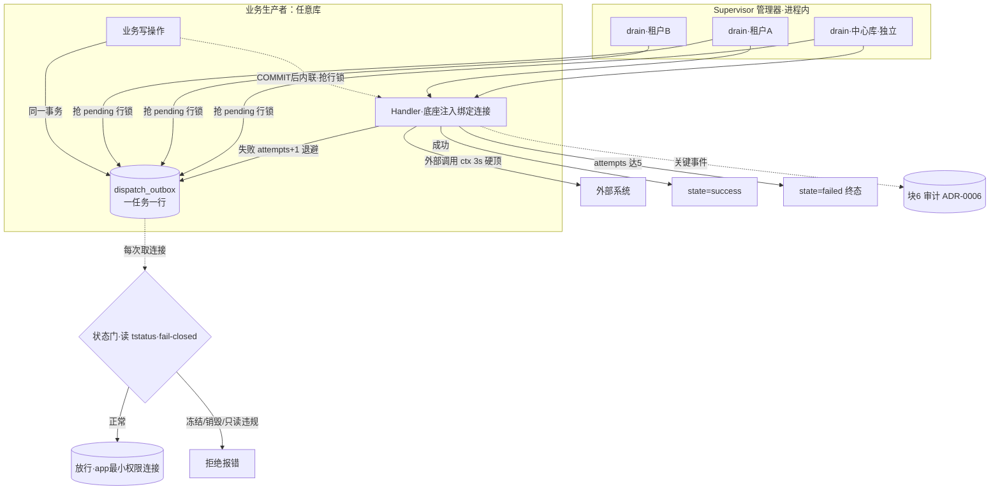
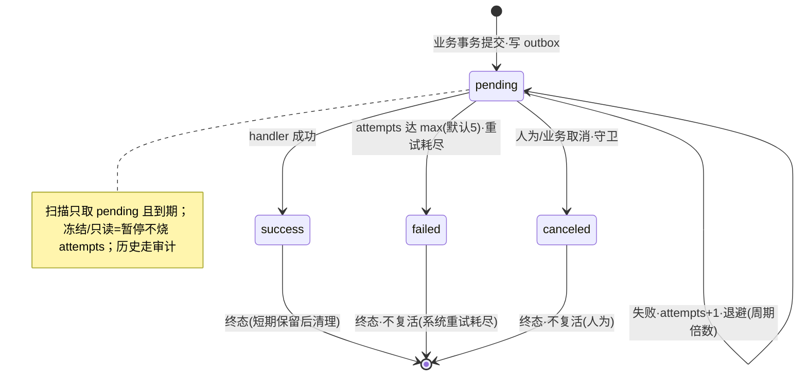
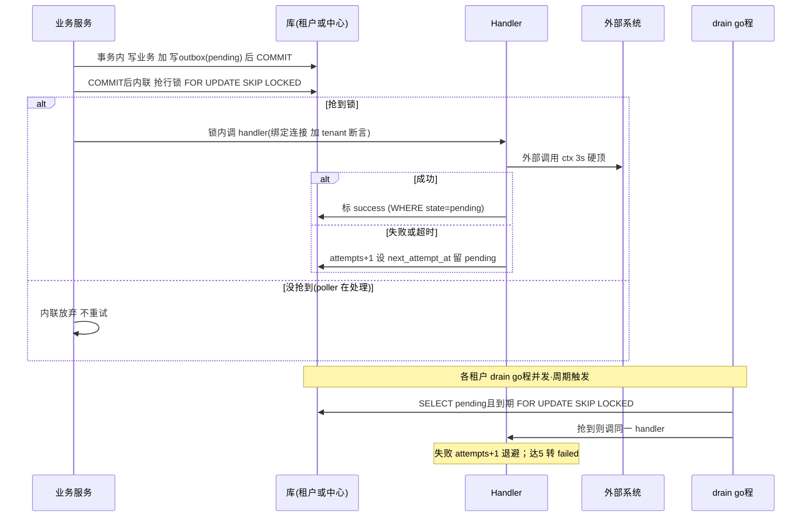

# Dispatch · 可靠异步投递底座设计

> 🔒 **设计冻结 DF-1（Dispatch Freeze 1 · 2026-06-21）**：可靠异步投递底座的设计在此**封版冻结**，经逻辑/架构/安全三方独立审计修正后定稿。
> - **冻结即基线**：本版作为后续实现的稳定依据；非经"解冻 / 变更"不再改动。
> - **🔶建议保持"建议"**：标 🔶 的项不在冻结时强制拍成"已定"，作为推荐保留、留待实现期逐项确认。
> - **解冻方式**：要改本设计，在 `changes/` 新开一条变更说明动机、评审后再改，并更新本冻结版本号。

> 本文件是**Dispatch 底座的自包含设计**（已确认 / 冻结），不引用在途的 `changes/`。
> **本设计只做"底座机制"本身**——不含具体应用功能（邮件、provisioning、审计外发都是它**后续的消费者**）。
> 标记：✅已定 · 🔶建议(待确认) · ⏭️后续。

> **术语**：**outbox(发件箱)**＝与业务数据同事务写入的"待办任务"表，**一任务一行、原地改状态**；
> **handler**＝真正执行副作用的封装函数；**行锁(row lock)**＝数据库给某一行加的锁，别人改它要排队；
> **`FOR UPDATE SKIP LOCKED`**＝取行时加锁并跳过已被别人锁住的行（多 worker 不抢同一行）；
> **幂等(idempotent)**＝同操作执行多次效果等于一次；**幂等键**＝去重用的唯一标识，本设计用 `outbox.id`；
> **at-least-once**＝至少投递一次(可能重复，故需幂等)；**go程(goroutine)**＝Go 轻量并发单元；
> **supervisor(管理器)**＝按租户增删/启停 go程的协调者；**信号量(semaphore)**＝限制同时最多 N 个在跑的计数器；
> **DSN**＝数据库连接串(host/库/账号密码)；**fail-closed**＝判定不了就拒绝；
> **日志(log)**＝排障用的运行细节；**审计(audit)**＝合规问责用、不可篡改的"谁何时对谁做了什么"。

---

## 1. 定位
- **一句话**：把"不能丢、要重试、要幂等、状态可观测"的**异步副作用**，可靠地交给某个 Handler 执行的**通用底座**。
- **地位**：独立横切地基模块，与"多租户数据源(DB 连接)模块"同等级。
- **消费者**(后续，不在本设计)：多渠道通知(含邮件)、Webhook、provisioning、审计外发、数据销毁、导出等。
- **gale 关系**：用 `Transaction`(事务写 outbox) + `scheduler`(拉起 supervisor) + `Redis`(状态门缓存) + `Encrypt`(DSN)。**一期不上 NATS**——PG + 进程内 go程足够。

---

## 2. 核心机制：outbox-always + 内联优先 + 行锁兜底（✅ 已定）
> 体量预估 ≤50 租户。模型 = 同步先行、失败才落兜底；**内联与 poller 共用同一把行锁，绝不双发**。

**主路径**：
```
1. BEGIN; 写业务数据; 写 dispatch_outbox 一行(state=pending, next_attempt_at=now()+1周期); COMMIT
2. 【COMMIT 后】内联抢该行的行锁：SELECT … WHERE id=? FOR UPDATE SKIP LOCKED
   - 抢到 → 锁内调 handler；成功标 success(带守卫 WHERE state='pending')；失败 attempts+1+退避，留 pending
   - 抢不到 → 说明 poller 已在处理，内联直接放弃、不重试
```

**三条铁律**：
1. **顺序不可换**：outbox 写在事务内，内联在 **COMMIT 之后**（反了→给不存在的数据发通知）。
2. **内联与 poller 共用行锁，且全程同一事务**：内联也走 `FOR UPDATE SKIP LOCKED`。**【命门·必守】抢锁 → 调 handler → 标 success 必须在同一个事务里、行锁持有至 COMMIT**——绝不可"抢锁确认后 COMMIT 释放锁、再另起事务标 success"，否则 poller 会在 handler 执行期间抢到同一行→双发回归。
3. **取消/标 success 都带守卫**：`WHERE state='pending'`，防非法覆盖终态。
4. **handler 连接由底座注入 + 归属真值权威绑定**：handler 用"扫到该行的那个库连接"，**禁止凭 `tenant_code` 字符串重新取库**。断言"行内 `tenant_code` == 当前物理库归属"，其中**"物理库归属"必须是建池时从中心库注册表权威绑定到该连接对象上的值（用注册表内部主键，对齐 tenant.md），生命周期内不可被任何载荷/运行时输入改写**——否则断言退化为"字符串==自己推导的字符串"的同义反复。**双向校验**：中心库连接归属固定为 `platform`，租户库扫到的行 `tenant_code` 必≠`platform`、中心库扫到的行必==`platform`；任一不符=tenant_mismatch→拒绝+审计。

**全程留痕**：① **日志**(排障：谁执行=内联/poller+实例、抢锁/跳过、结果、耗时、错误)；② **审计**(合规：见 §12，接块6)。

---

## 3. 触发机制 + 并发模型

| 触发 | 机制 | 抓住什么 |
|---|---|---|
| **T1 内联即时**(主路径) | COMMIT 后抢行锁、锁内调 handler | 低延迟 happy path |
| **T2 兜底轮询**(安全网) | 各租户 drain go程周期扫 **`pending` 且到期**，抢锁后调同一 handler | 内联失败/崩溃/漏网 |
| **T3 失败退避** | 失败仅 `attempts+1` + 退避前推 `next_attempt_at`，**仍留 pending** | 瞬时失败退避后再试 |
| **T4 重试耗尽** | `attempts` 达 `max_attempts`(默认5) → 自动转 `failed` 终态 | 永久失败收敛 |
| **取消** | 守卫 `pending → canceled` | 业务作废/运维止血 |

**并发模型(✅ 不用单串行 DurationJob)**：
- 进程内 **supervisor** 为**每个租户拉起一个常驻 drain go程** + **中心库一个独立 go程**；
- **跨租户并行**；**同一租户内串行**(一个 go程顺序处理，**天然防自重叠**)——一个慢租户不拖累别人，避免"上轮没跑完下轮又到"；
- **信号量限总并发(✅ 拆两份预算，不共用一个)**：租户库共享 `max_concurrency_tenant`(如 6)+ **中心库独占 `max_concurrency_central`(如 2)**——否则中心库 go程会和 50 个租户 go程抢同一个全局名额，§3"中心库独立"被抵消(架构 H1)。防 50×2 把 CPU/下游打爆。
- 行锁兜底：即便偶发同租户重叠，`SKIP LOCKED` 也不双发。
- **中心库 go程独立**，不被租户库遍历阻塞(中心库是平台任务热点，见 §14)。

> 崩溃恢复：只有 `pending` 一个未完成态，进程崩→行锁释放→行仍 pending→下轮重扫(延迟下限约一个 `poller_interval`)。
> **hang 的覆盖边界**：外部调用 hang 由 **3s 硬超时(§10)**斩断；但 handler 在外部调用**之外**的阻塞(写 success 时 DB 卡住、handler 自身死循环)3s 兜不住，会持锁 + 占信号量名额不放。故 handler 调用应再套一个**整体 ctx deadline / worker 看门狗**兜底，防并发名额被无限占用。
> 多实例：各实例各自的 supervisor + go程，靠 `FOR UPDATE SKIP LOCKED` 不重复，**无需分布式锁**。

---

## 4. 架构总览


> NATS 一期不上。将来要"消费者横向扩展/happy path 异步"再把 T2 换成"发 JetStream+消费者"，**handler 接口不变**。

---

## 5. 两类 DB 连接（彻底区分，策略相反）

| | **类型A·业务池**(块1，前端请求) | **类型B·Dispatch 池**(本模块，内部投递) |
|---|---|---|
| 平台库 | 常驻 | 常驻(持久小池) |
| 租户库 | 动态：懒加载 + 不活跃关闭(淘汰) | **持久**：每租户固定 2 条，**无懒加载、无空闲关闭** |
| 淘汰 | 有 | **无**，只定期关闭重建 |
| 连接数 | 随活跃度伸缩 | ≈ 租户数 × 2，稳定 |

> 为何相反：业务访问稀疏→该淘汰；Dispatch 周期性必访→淘汰了下轮又重连，故持久不淘汰。两池分开化解"轮询 vs 淘汰"矛盾。同一租户库的 `max_connections` 要给两者一起留预算，顶上限上 PgBouncer。**中心库需单列连接预算**(实例数 × 各池)。

### 5.1 Dispatch 连接管理器(类型B)
- **DSN 配置存中心库 `tenants` 注册表**(密文，见 §16)；**连接池对象 `*sql.DB` 在进程内存 `map[tenant_code]*pool`**。
- **每池**：`MaxOpen=MaxIdle=2`、`ConnMaxLifetime=30~60min`(定期回收重建)、`PingContext` 健康检查。
- **只用 `app` 级最小权限账号**(仅业务 DML，无 DDL/改口令——缩小爆炸半径，见 §16)。
- **加载/重启**：冷启动从中心库全量建池；重启重建(任务在 DB 不丢)；多实例各建各的。
- **新租户动态入 map**：事件驱动(建/销租户代码直接 `AddTenant/RemoveTenant`) + **低频对账兜底**(如 5min)；**任务 drain go程不参与对账**，只处理 map 内已有租户。
  - ⚠️ 盲区：新租户在本实例对账补池前、若其**自己库**即产生任务，最长等一个对账周期才被处理。缓解：开通流程产生的首批任务走中心库，或开通成功时**同步保证已 AddTenant**。
- **DSN 路由(host/库)不可变**(迁移才动，走受控流程)；**凭据(密码)轮换 + 加密密钥管理 → 归块7(合规)，后期同步**；Dispatch 只留"凭据变更→刷新该租户池"的机制占位。

---

## 6. 零信任状态门（取连接前必过，✅ 已定）
> Dispatch 跑在 HTTP 请求链路**之外**，上层中间件管不到——连接层这道门是后台路径的**唯一**门。

- 业务池(A) 与 Dispatch 池(B) 取连接前都调 `gate.Check(tenant_code, 读/写意图)`；读 Redis `tstatus:{tenant_code}` 短 TTL 缓存，**fail-closed**(查不到/出错→拒绝)，与 [tenant.md](tenant.md) 状态门一致。

| 租户状态 | 业务池(A) | Dispatch 池(B) |
|---|---|---|
| 正常 | 放行 | 放行 |
| 只读 | 读放行、写拒绝 | 写型 handler 暂停；**只读用 DB 层强制**(只读账号 / `SET TRANSACTION READ ONLY`，不靠 handler 自觉) |
| 冻结/锁定 | 拒绝 | **暂停≠失败**：保持 pending、**不推进 attempts**，解冻继续 |
| 销毁中/已销毁 | 拒绝 | 拒绝 + 移除池；⚠️ **缓存 TTL 窗口**：销毁态 handler **执行前再做一次权威复查**(查中心库状态)，防 30–60s 窗口内写已销毁库 |

---

## 7. 数据模型（一任务一行，原地改；历史走审计）
```sql
CREATE TABLE dispatch_outbox (
  id              UUID PRIMARY KEY DEFAULT gen_random_uuid(),  -- 同时作幂等键
  tenant_code     TEXT NOT NULL,                 -- 平台任务用保留值 platform
  dispatch_type   TEXT NOT NULL,                 -- 路由到哪个 handler
  payload         JSONB NOT NULL,                -- 业务载荷(不可信输入，见 §16)
  headers         JSONB,                         -- 透传(trace_id 等，白名单)
  state           TEXT NOT NULL DEFAULT 'pending', -- 四态：pending|success|failed|canceled
  attempts        INT  NOT NULL DEFAULT 0,
  max_attempts    INT  NOT NULL DEFAULT 5,        -- 达上限→自动 failed
  next_attempt_at TIMESTAMPTZ NOT NULL DEFAULT now(), -- 不可空：插入即到期，退避时前推
  last_error      TEXT,                          -- 落库前脱敏(禁含 DSN/口令，见 §16)
  cancel_reason   TEXT,
  created_at      TIMESTAMPTZ NOT NULL DEFAULT now(),
  success_at      TIMESTAMPTZ,
  ended_at        TIMESTAMPTZ                    -- failed/canceled 时间
);
-- poller 只扫 pending 且到期
CREATE INDEX ON dispatch_outbox (next_attempt_at, created_at) WHERE state = 'pending';
```
- **退避按"周期倍数" + jitter**(与 poller 周期绑定，非固定秒)：失败第 N 次 `next_attempt_at = now() + backoff_cycles[N] × poller_interval × (1 ± jitter)`(如 `[1,2,4,8,16]`、jitter ±15%，到顶恒定)。**jitter(随机抖动)** 削平"大量任务同次失败→同一时刻一起重试"的惊群尖峰(尤其中心库热点)。
- **两条写入路径的 `next_attempt_at` 初值约定**(不可统一用 DEFAULT)：① 经业务事务的**主路径**写 `now()+1×poller_interval`(让新行一个周期内 poller 不可见，内联独占首投)；② **enqueue 直接入口**(无内联路径)写 `now()`(立即可被 poller 取)。DDL 的 `DEFAULT now()` 仅兜底。
- **去重**：无总线，**outbox 行状态即去重**(poller 只扫 pending)，**不另设 dispatch_done 表**。
- **取消守卫**：`UPDATE … SET state='canceled' WHERE id=? AND state='pending'`(0 行=已终态)。**取消是 best-effort**：与正在执行的 handler 并发时，取消会被行锁阻塞至 handler 事务 COMMIT——若副作用已成功发出(已转 success)则取消返回 0 行，**调用方不得假设"取消成功=副作用未发生"**；要强一致止血须在 handler 执行前反查业务状态(§13)。
- **清理**：终态行(`success`/`failed`/`canceled`)**短期保留后删除**(保留期 config，默认 7 天)；**历史/中间状态全在审计(块6)**，删行不丢历史。实现用**限批 DELETE**(`WHERE state<>'pending' AND ended_at < now()-retention`，每批 N 行、避高峰，防死元组堆积；**按终态时间 `ended_at` 删、非 `created_at`**)——**不用时间分区**(与纯 `id` 主键 DDL 冲突)。⚠️ **前提**：**审计(块6)未接通前禁止启用物理删除**(否则 outbox 删了、审计没接上=取证真空)；块6 就绪前保留期视为无限。中心库 `dispatch_outbox` 是写入/删除最频繁的表，应**单表调低 autovacuum(自动垃圾回收)阈值**(per-table `autovacuum_vacuum_scale_factor`)，防 DELETE 死元组堆积拖慢热点表。

---

## 8. 投递状态机（四态）

- `failed`(系统重试耗尽) 与 `canceled`(人为) **两个独立终态**，保留不同失败原因，**均不复活**；要重发→新建任务(新 id)。
- 两层状态：底座层(上图) + Handler 层(各消费者自建，如邮件 delivered/bounced)。

---

## 9. 端到端时序


---

## 10. Handler 抽象（可插拔，底座只定契约）
```go
type Handler interface {
    Type() string                                  // dispatch_type
    Handle(ctx context.Context, msg Message) error // 错误三分类，见下
}
type Message struct {
    ID         string          // = outbox.id = 幂等键
    TenantCode string          // 仅信息用；handler 不得据此重新取库
    Payload    json.RawMessage // 不可信输入，handler 必须校验/参数化
    Headers    map[string]string
    Attempt    int
}
```
- **绑定连接由底座注入**：handler 从 ctx 拿到"扫到该行的库连接"，**禁止凭 TenantCode 重新取库**(防跨租户串扰)。
- **错误五分类契约**(poller 据此分支，不能只看"是否 error"；**注意判定来源**：`Paused`/`InfraUnavailable` 多由底座在**调 handler 之前**——状态门/取连接失败——直接判定并分支，**无需进入 handler**；`Retryable`/`Permanent` 才是 handler 的返回值；`Timeout` 由看门狗触发)：
  - `Paused`(**租户状态门暂停**：冻结/只读写，底座前置判定) → **不推进 attempts、不改退避**，下轮重试；
  - `InfraUnavailable`(**基础设施故障**：Redis fail-closed、连不上库，底座前置判定) → 同样不推进 attempts，但**单独计"连续 infra-fail 时长/次数"**，超阈值打 WARN 日志(留可巡检信号)。**⚠️ 已接受风险**：Redis 长期故障期间，状态门 fail-closed 会让**全租户全任务停摆且不收敛**(无主动告警，本期靠 Redis/登录链路同时报警间接暴露)，恢复后自动续投——冻结评审者须知此特性，不藏在 Paused 里。
  - `Retryable`(可重试业务失败，handler 返回) → `attempts+1` + 退避；
  - `Timeout`(**`handler_deadline` 触发**：handler 整体超时、疑似 hang) → **ctx cancel → 事务回滚 → 行锁随回滚释放 → 行留 pending → 按 Retryable 处理(`attempts+1`+退避)**，使稳定 hang 的任务也在 5 次后收敛为 `failed`；deadline 事件**单独打 WARN**(区别于业务 Retryable)。
  - `Permanent`(永久错误，如载荷非法，handler 返回) → 直接转 `failed`(不耗满次数)；未注册 `dispatch_type` 同此(+审计)。
- **外部调用 3s 硬超时**：handler 对外的调用走底层封装(内置 `context.WithTimeout(ctx,3s)`，见项目约束)，**handler 自己不设超时**。**内联路径** handler 的**总外部耗时**由调用方 ctx 统一封顶(防 handler 串多个 3s 调用→内联阻塞累加到 9s+ 拖慢业务请求)；**内联路径的调用方 ctx 上限即 `handler_deadline`(§15)**，不另设更松的内联超时。

---

## 11. 幂等与"精确一次 vs 至少一次"边界（务实，不假装）
- **DB 型副作用**：handler 的 DB 写 + 标 `success` 在**同一事务**(用注入的绑定连接) → **精确一次，无窗口**。
- **外部副作用(自实现发邮件/webhook)**：发送不在 DB 事务里，"发了但没标 success 就崩溃"的**毫秒级窗口本地无法闭合** → 定为 **at-least-once(宁重发)**：
  - 压窗口：send 成功后**立刻**标 success；
  - 给外发设 **`Message-ID = outbox.id`**(收件方 MTA 可能据此去重 + 可追溯)；
  - **接受偶发重复**(通知类可接受)。
- **本项目无外部服务商、纯自实现** → **不依赖第三方 Idempotency-Key**，无法严格精确一次，如实承认。
- §13 明示："纯本地外部发送 = at-least-once，可能偶发重复，消费者须容忍或自带对账"。

---

## 12. 留痕：日志 vs 审计
- **日志(log)**：排障用，记每次尝试的执行者(内联/poller+实例)、抢锁/跳过、结果、耗时、错误。`gale.Log()`。
- **审计(audit，接块6 ADR-0006，事务内写、租户操作→租户库/平台→中心库)**：记录——
  ① handler 成功执行的高权写(对哪个租户库)；② 运维/前台手动取消；③ 自动 `failed`/`canceled`(原因)；④ **跨租户串扰拦截**(tenant_mismatch 安全事件)；⑤ 状态门拒绝；⑥ **直接 enqueue 入队**(绕过业务事务的高权动作，见 §16)。
- **`failed` 终态最小主动信号(✅ 冻结前必备，近零成本)**：任务转 `failed` 时，**打一条 ERROR 日志 + 写一条审计事件**(复用上面 ③ 通道)——把"静默积累、靠人想起来查"变成"有迹可循"，消除与"不能丢"定位的矛盾。
- ⏭️ **完整主动监控告警系统本期不做**(靠上面的 ERROR 日志/审计 + 需要时查 outbox)；后续再加。

---

## 13. 无法覆盖的场景（如实推理）
| 盖不住 | 为什么 | 逃生口 |
|---|---|---|
| 没有业务写的纯定时任务 | outbox 靠业务事务顺带写 | 给 supervisor 一个**直接 enqueue 入口**(内部鉴权，见 §16) |
| 跨多库的单个原子任务 | outbox 只与单库事务原子 | Saga：拆每库子任务 |
| 严格全局有序 | at-least-once+幂等不保证序 | 按 key 单分区串行(牺牲吞吐) |
| 纯本地外部发送精确一次 | 无第三方幂等键，崩溃窗口本地不可闭 | at-least-once + 接受偶发重复 + 对账 |
| 毫秒级实时 | 轮询有间隔 | 本就该同步调用 |
| 超大 payload | 表不适合放大对象 | payload 放对象存储引用 |
| 已执行任务撤回 | 已发出撤不回 | handler 执行前反查业务状态 |
| 下游限速/背压 | 一直重试打爆下游 | 3s 超时 + per-type 限速(底层封装层做) |

---

## 14. 规模边界（实事求是）
- ≤50 租户：内联优先 + 每租户 go程并发 + 持久 2 连接，简单够用。
- **中心库是热点**(平台任务 50:1 汇聚 + N 实例集中扫)：中心库 go程独立、独占信号量、终态行清理、连接预算单列。中心库扫描压力 ≈ **实例数 × (1/poller_interval) × 扫描成本**；一期假设**实例数 ≤3**(N 实例的中心库 drain 仍在同表并发 `SKIP LOCKED`，`SKIP LOCKED` 保不双发、但扫描压力随实例数线性增长)。
- 拐点按**三维 + 实例数**(不只租户数)：① 租户数；② **中心库平台任务事件率**；③ handler 延迟；④ 实例数。任一维触顶再优化(PgBouncer / 标记优化 / 引 NATS，handler 不变)。

---

## 15. 配置（启动期静态，置 config 文件，非热加载）
> 时序/连接是基础设施参数，启动固定、改了重启(gale scheduler 不支持运行时改 Job)；业务策略才进 C2。
```yaml
dispatch:
  poller_interval:    30s              # drain go程周期
  reconcile_interval: 5m               # 租户对账兜底
  backoff_cycles:    [1,2,4,8,16]      # 退避=倍数 × poller_interval
  backoff_jitter:     0.15             # 退避随机抖动 ±15%，削惊群
  max_attempts:       5                # 达此自动 failed
  conn_pool_size:     2                # 每库持久连接
  conn_max_lifetime:  45m              # 连接回收重建
  max_concurrency_tenant:  6           # 租户库共享并发上限(信号量)
  max_concurrency_central: 2           # 中心库独占并发(不与租户共抢，见 §3 H1)
  handler_deadline:   5s               # handler 整体 ctx 上限(兜外部调用之外的阻塞)
  terminal_retention: 7d               # 终态行保留期，到期清理(审计接通后才启用)
# 外部调用 3s 硬超时不在此——写死在底层调用封装(见项目约束)
```

---

## 16. 安全要点
- **跨租户断言**：行内 `tenant_code` == 当前物理库归属，不符=拒绝+审计(对齐 tenant.md 句柄断言纪律)。
- **最小权限**：Dispatch 持久连接只用 `app` 级账号，缩小"进程被攻陷=全租户库失守"的爆炸半径。
- **状态门攻陷后不防**：状态门是业务层，攻陷进程后直接用内存连接绕过它 → 安全靠**最小权限+进程加固**(不暴露入站、出站 egress 限制)，**别误以为有状态门就安全**。
- **DSN 密钥(✅ 本模块冻结硬约束，不全推块7)**：密文存中心库，密钥管理虽归块7，但 Dispatch 冻结即定**4 条最低要求**——① **密钥绝不与密文同库**；② 密钥**绝不入代码仓库 / config 文件 / 日志 / 错误 / 进程 dump**；③ 加密算法下限 **AES-256-GCM**(认证加密，防密文篡改；禁 ECB/无认证模式)；④ 块7 信封加密落地前的**临时方案也必须满足 ①–③**，并**预留 `key_id` 字段**以便平滑切换。块7 只能在此之上加强、不得突破。
- **只读 DB 层强制**：只读态用只读账号/`SET TRANSACTION READ ONLY`，不靠声明。
- **enqueue 直接入口(高权投递面，须收紧)**：**仅限进程内函数调用、不暴露任何网络端点**(若确需暴露→独立强鉴权 + IP 白名单，参照 tenant.md 高权通道纪律)；调用方必须显式传 `tenant_code` 且过状态门 + 受 §2 归属绑定约束；对 payload 大小/`dispatch_type` 白名单校验；**入队动作记审计(§12 第⑥类)**。🔶 若将来确需暴露为端点，是否纳入"发起人≠审批人双人复核"(对齐 tenant.md §9 高权通道)留实现期定。
- **SSRF 出站收口(✅ 底座层强制，不靠 handler 自觉)**：底座**提供并强制 handler 走**统一出站校验封装——协议白名单 + 私有网段黑名单(RFC1918/loopback/link-local) + **连接时再解析校验 IP(防 DNS 重绑定)**，复用 [auth.md](auth.md) §5 已定的同一套 SSRF 纪律。**+ 进程级 egress 兜底**：handler 即便绕过封装自起出站，亦在网络层(出站防火墙/代理白名单)被拦——使"强制"从约定升为机制。
- **payload 不可信**：handler 必须参数化查询/转义(出站走上面的 SSRF 封装)；`last_error` 落库前脱敏(禁 DSN/口令)；`headers` 白名单透传。

---

## 17. 依赖与归口
- **块6 审计(ADR-0006)**：关键事件留痕。
- **块7 合规**：DSN 加密**密钥管理**、**凭据轮换策略**(后期同步)。
- **块1 数据源管理**：DSN 注册表、`app` 账号、凭据变更通知。
- **块2 C2**：仅业务策略；底座时序/连接走 config 不进 C2。

---

## 18. 范围
**做**：outbox-always + 内联优先 + 行锁兜底、每租户 go程并发 + 信号量、四态状态机 + 周期退避 + 5 次自动 failed、幂等(outbox.id) + at-least-once 边界、两类连接分离 + 持久连接管理、零信任状态门(+销毁复查+只读DB层)、跨租户断言 + 最小权限 + 脱敏、Handler 错误三分类 + 绑定连接 + 3s 外部超时、日志+审计双留痕、终态行清理。
**不做(后续/消费者)**：⏭️ 具体 handler；⏭️ 多步 Saga；⏭️ Handler 层业务状态；⏭️ NATS/横向扩展；⏭️ **主动监控告警**；⏭️ per-type 限速细化；⏭️ 密钥管理/凭据轮换(归块7)。

---

## 19. 出处（权威）
- Outbox / Polling Publisher：[microservices.io](https://microservices.io/patterns/data/transactional-outbox.html)、[Polling Publisher](https://microservices.io/patterns/data/polling-publisher.html)
- db-per-tenant outbox 难题：[ABP #10036](https://github.com/abpframework/abp/issues/10036)
- 幂等消费：[SoftwareMill](https://softwaremill.com/microservices-101/)
- Go Outbox 实现：[FreeCodeCamp](https://www.freecodecamp.org/news/how-to-implement-the-outbox-pattern-in-go-and-postgresql/)
- 任务队列/工作流对照：[River](https://riverqueue.com/)、[Temporal Saga](https://temporal.io/blog/saga-pattern-made-easy)

---
↑ [返回 specs 索引](README.md)
