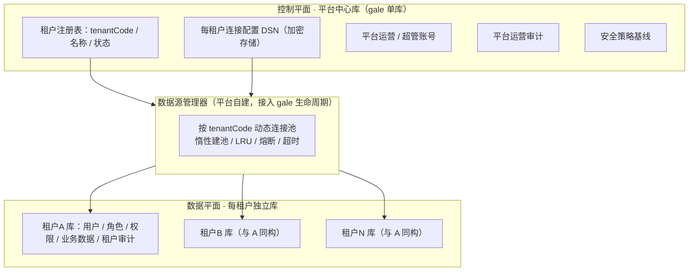
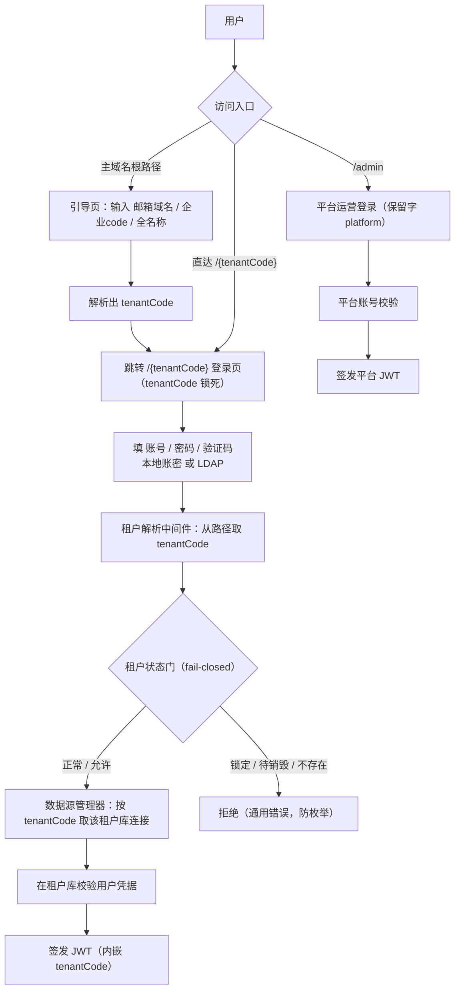
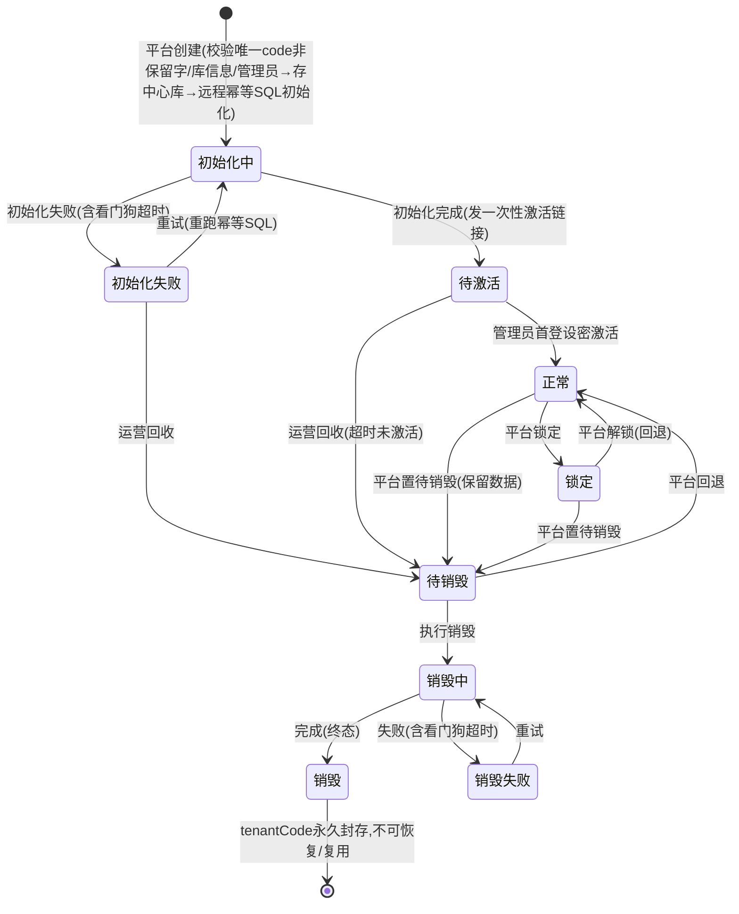

# 租户（Tenant）模块设计

> 🔒 **设计冻结 TF-1（Tenant Freeze 1 · 2026-06-20）**：租户相关功能模块（多租户内核 + 平台运营中心 + 租户生命周期状态机 + 身份登录中与租户相关部分）的设计在此**封版冻结**。
> - **冻结即基线**：本版作为后续实现的稳定依据；非经"解冻 / 变更"不再改动租户设计。
> - **🔶建议保持"建议"**：标 🔶 的项不在冻结时强制拍成"已定"，作为推荐保留、留待实现期逐项确认。
> - **解冻方式**：要改租户设计，在 `changes/` 新开一条变更说明动机、评审后再改，并更新本冻结版本号。

> 本文件是**租户模块的自包含设计**（已确认 / 冻结），按模块汇总，不引用在途的 `changes/`。
> 标记：✅已定（已拍板 / 有 ADR） · 🔶建议(待确认) · ⏭️后续 · ⚠️已接受风险。

---

## 1. 定位：租户是什么、归哪几块

- 一个**租户（tenant）= 一家客户**，在系统里**对应一个独立的数据库**（db-per-tenant，见 [ADR-0004](../architecture/decisions/0004-multi-tenant-db-per-tenant.md)）。
- 租户的**内核**（建模、隔离、连库、定位）= 多租户内核与数据源；租户的**管理**（开通、生命周期、运营）= 平台运营中心。
- "客户自托管库"与"我们托管库"在**代码层面没有区别**——都是"一租户一数据源（一个 DSN：数据库连接串）"，由部署运维决定放哪。

## 2. 架构分层：控制平面 vs 数据平面

- **控制平面（中心库）**：平台自己的数据，gale 默认单库即可。
- **数据平面（每租户库）**：租户自己的业务与账号数据，物理隔离。
- **数据源管理器**：因 gale 只支持单库、不支持动态多数据源，故由平台**自建**——按 `tenantCode` 动态取对应租户库的连接池，但接入 gale 的启动 / 关闭生命周期。

## 3. 租户数据放哪（两层，完整对照）

| 数据 | 放在 | 说明 |
|---|---|---|
| 租户注册表（tenantCode / 名称 / 状态） | 中心库 | tenantCode 唯一、不可变、永久占用 |
| 每租户数据库连接配置（DSN） | 中心库 | 加密存储 + 密钥管理 |
| 平台运营 / 超级管理员账号 | 中心库 | 跨租户 |
| 平台运营审计 | 中心库 | 运营动作留痕 |
| 安全策略基线（口令 / 会话 / 锁定） | 中心库 | 全局默认 + 按租户收紧 |
| 额度 / 坐席 / 套餐 / 功能权益（事实源） | 中心库 | 属**平台运营中心的商业化子域**，本轮不展开详细设计 |
| 租户的用户 / 角色 / 权限 | **租户库** | 各租户库自存（[ADR-0005](../architecture/decisions/0005-rbac-self-built-per-tenant.md)），数据主权一致 |
| 租户业务数据 | **租户库** | — |
| 租户操作审计 | **租户库** | 平台运营审计入中心库 |

## 4. 隔离模型（db-per-tenant，✅已定）

- **每租户一个独立数据库**，物理隔离（隔离最强），并支撑"业务数据可驻留客户侧（数据主权）"。
- **拓扑无关**：租户连接用 **DSN** 抽象，同一套代码无痛兼容三种部署形态，互不改码：
  1. 客户自托管库，平台跨网络远程连接；
  2. 我们托管、每租户独立实例 / 库；
  3. 同一实例下不同 database / schema。
- **不用 RLS（行级安全）**：物理分库已天然隔离，无"忘加 WHERE tenant_id"的泄漏面。
- **代价（已接受）**：迁移要逐库执行；某租户库 / 链路故障只影响该租户；跨网连库需 TLS / VPN / 专线。

## 5. 登录与租户定位路由（✅已定）

- **路径式定位**：`主域名/{tenantCode}` 进租户；`/admin`（保留字 `platform`）进平台运营侧；根路径**引导页**用 邮箱域名 / 企业code / 全名称 解析出 `tenantCode`。
- **一期认证**：本地账密（口令加盐哈希 bcrypt/argon2）+ LDAP/AD，均强制验证码。**MFA 与完整 SSO 二期**（一期预留"每租户认证配置"）。见 [ADR-0008](../architecture/decisions/0008-identity-login.md)。
- **账号体系**：用户**租户内独立**（同邮箱跨租户=不同账号）；平台运营是单独的跨租户账号。
- ⚠️**一期无 MFA**（含超管）为已接受风险；补偿见第 9 节。

## 6. 租户生命周期状态机（✅已定骨架；🔶部分机制为建议）

### 状态定义
| 状态 | 含义 | 业务可用性 |
|---|---|---|
| 初始化中 | 平台已建租户记录、正远程执行 SQL 模板初始化业务库 | 不可用 |
| 初始化失败 | 远程执行初始化 SQL 失败（或看门狗超时） | 不可用（可重试 / 回收） |
| 待激活 | 初始化完成、等租户管理员首登设密激活（发一次性链接） | 仅设密激活端点 |
| 正常 | 已激活、正常使用 | 全可用 |
| 锁定 | 平台锁定；默认拒绝，仅放行登录 / 验证码 / 登出 | 受限 |
| 待销毁 | 全局不可用，但保留数据 | 不可用 |
| 销毁中 | 正在导出 / 物理销毁 / 解绑（可失败、可重试） | 不可用 |
| 销毁失败 | 销毁中途失败，待重试 / 人工介入 | 不可用 |
| 销毁 | 终态；数据按策略处理，tenantCode 永久封存 | 永久不可用 |

### 关键规则
1. ✅**正向链不可逆**：初始化 → 激活 → 正常，不得跳转。
2. ✅**回退仅后段**：只有 锁定 / 待销毁 能回退到正常；销毁是终态、不可回退。
3. ✅**tenantCode 永久占用、永不复用**：所有终止路径都经 待销毁→销毁中→销毁 封存。创建时后端强校验：唯一 + 非保留字 + 格式正则。
4. ✅**锁定态 fail-closed**：默认拒绝，仅放行白名单常量表（一期仅 登录 / 验证码 / 登出），见第 7 节真值表；进入锁定 / 待销毁即时失效该租户 JWT。
5. 🔶**并发与幂等（建议）**：状态变更用乐观版本号 CAS（比较并交换，即带版本条件更新、版本不符则整条拒绝）串行化，据此裁决"回退 vs 执行销毁"等互斥命令；创建 / 激活 / 初始化 / 销毁 均幂等可重入。
6. 🔶**看门狗（建议）**：定时巡检卡在"初始化中 / 销毁中"超时无心跳的租户，转对应失败态，避免永久卡死。
7. 🔶**状态权威（建议）**：状态存中心库、schema 版本基线存租户库；网络中断后以租户库版本表为准、单向回写中心库。

## 7. 状态门真值表（fail-closed：默认拒绝，仅显式放行）

| 状态 | 开放接口(登录/验证码/登出) | 业务读 | 业务写 | 平台运营写 |
|---|---|---|---|---|
| 初始化中 | 拒 | 拒 | 拒 | 仅 改DSN / 重试初始化 / 回收 |
| 初始化失败 | 拒 | 拒 | 拒 | 仅 重试 / 改DSN / 回收 |
| 待激活 | 仅设密激活端点 | 拒 | 拒 | 仅 重发设密链接 / 回收 |
| 正常 | 放行 | 放行 | 放行 | 放行（重置密码 / 改DSN，受双人复核） |
| 锁定 | 放行 | 拒（默认收口） | 拒 | 放行（重置密码 / 解锁 / 置待销毁） |
| 待销毁 | 拒 | 拒 | 拒 | 仅 回退 / 执行销毁 |
| 销毁中 | 拒 | 拒 | 拒 | 仅 重试销毁 |
| 销毁失败 | 拒 | 拒 | 拒 | 仅 重试销毁 / 人工 |
| 销毁 | 拒 | 拒 | 拒 | 拒（终态） |

## 8. 连接管理与故障治理（一期基线）

- **取连接唯一入口 = 请求 ctx**：中间件按 `tenantCode` 取该租户库句柄注入 ctx，业务层**不得显式传 tenantCode**；repo 执行前断言"句柄租户 == ctx 租户"；连接池缓存键用注册表内部主键、非外部字符串。
- 🔶**故障治理（建议，统一适用所有租户）**：每租户连接池上限 + 全局 LRU 淘汰、建连 / 查询超时、每租户熔断、建池防惊群、ctx 取消透传；**某租户不可达只该租户失败 + 告警**，不拖垮平台。
- 🔶**DSN / 密钥（建议）**：信封加密（外部 KMS 管主密钥 + 每租户数据密钥）、按租户轮换；DSN / 口令**禁入日志 / 审计 before-after / 错误 / 配置 dump**。

## 9. 平台对租户库的写操作（重置密码等 · 最高权限通道）

> 这是控制平面穿透到所有租户库的**唯一高权写路径**，按最高危对待。

- ✅**状态约束**：重置租户管理员密码**仅在 正常 / 锁定 允许**；待激活态改为**重发设密链接**；初始化 / 待销毁 / 销毁链一律拒绝。
- 🔶**失败语义（建议）**：写幂等（按 `reset_request_id` 去重）；租户库不可达返回明确"未知 / 请重试"；中心库记 pending 审计、成功后补 confirmed。
- 🔶**凭据三拆（建议，最小权限）**：租户库分 `migrate`（仅 DDL，用后即弃）/ `app`（仅业务读写，无权改口令）/ `admin_reset`（仅改租户管理员口令，独立凭据 + 独立审计）。
- 🔶**高危操作双人复核（建议）**：重置密码、改 DSN、锁定 / 解锁、置待销毁、执行销毁、改安全基线 均纳入；**发起人 ≠ 审批人**；超管登录加 IP 白名单 / 堡垒机（弥补一期无 MFA）。

## 10. 边界对照表（什么归哪块）

| 租户相关的东西 | 归属 | 落在哪 | 一期 |
|---|---|---|---|
| 租户模型 / 隔离 / 连库 / 定位 | 多租户内核 | 中心库 | ✅ |
| 租户开通自动化（建库 + SQL 初始化） | 运营中心 | 平台远程幂等初始化 | ✅ |
| 租户生命周期（建 / 激活 / 锁定 / 销毁） | 运营中心 | 中心库状态机 | ✅ |
| 租户用户 / 角色 / 权限 | 认证 + 授权 | 各租户库自存 | ✅ |
| 额度 / 坐席 / 套餐 / 功能权益 | **运营中心 · 商业化子域** | SSOT=中心库 | 本轮不展开 |
| 租户操作审计 | 审计模块 | 租户库；平台审计→中心库 | ✅ |
| 租户连接串 / 密钥管理 | 多租户内核（方案细化在合规模块） | 中心库，信封加密 | ✅原则 |
| 租户通知渠道配置（飞书 / 钉钉 / 邮件） | 对外集成模块 | per-tenant 渠道配置 | 🔶范围待定 |
| 租户安全策略（口令 / 会话 / 锁定基线） | 合规模块 | 全局基线 + 按租户收紧 | ✅ |
| 租户组织 / 部门 | 通用能力模块 | 租户库 | 🔶一期扁平 + 扩展位 |

## 11. 一期 做 / 不做（租户范围）

- ✅**做**：建租户、开通自动化、9 态生命周期、物理隔离、路径定位、本地 + LDAP 登录、状态门、连接管理与故障治理、账号租户内独立、首登设密激活、登录失败锁定、JWT 租户绑定。
- 🔶**二期**：MFA、完整 SSO、IM 扫码登录、自定义域名（BYOD）。
- ⏭️**仍开放**：销毁数据处理细节（导出 / 物理销毁 / 解绑 / 加密粉碎）；本轮不展开商业化子域详细设计。

## 关联决策（ADR）
- [ADR-0004](../architecture/decisions/0004-multi-tenant-db-per-tenant.md) — 多租户隔离采用 db-per-tenant
- [ADR-0005](../architecture/decisions/0005-rbac-self-built-per-tenant.md) — 授权自研 RBAC、各租户库自存、平台运营中心
- [ADR-0008](../architecture/decisions/0008-identity-login.md) — 身份与登录：路径式租户定位 + 本地/LDAP + 验证码
